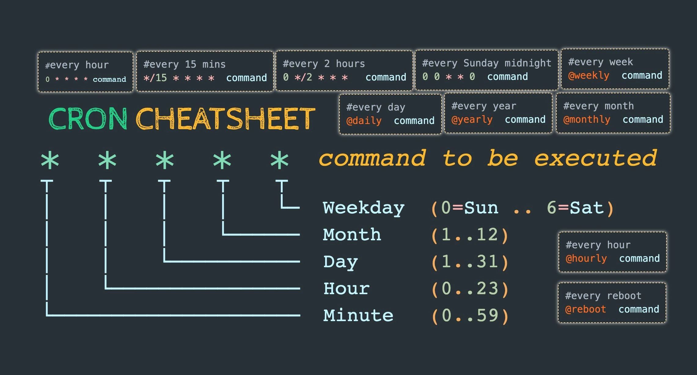

В этой заметке мы рассмотрим, как нам автоматизировать скучные и рутинные задачи в linux через Cron.

## Cron, ну-ка, повтори!

Привет, лентяй, сегодня будем углубляться в тему автоматизации и разберем мы все это на примере
автоматизации бекапов MS SQL Server (_это же будет валидно для бекапов PostgreSQL, разве что 
будет использоваться более простой синтаксис самого бекапа в psql_). Поможет нам с этим Cron.

Сron oэто демон использующийся для периодического выполнения заданий в определённое время. Он 
умеет запускать нужные нам процессы и ничего более. Unix-way, помним, да?

Проверим, установлен ли у нас Crontab

```bash
crontab -V

# ➜ cronie 1.6.1
```

Если не установлено, ставим и погнали играться.

## Crontab, наш интерфейс для управления Cron

Cron имеет файл с заданиями, который называется crontab, для его редактирования существует такая 
конструкция:

```bash
crontab [ -u user ] file
crontab [ -u user ] [ -i ] { -e | -l | -r }
```

В простом случае для добавления задания нужно вызвать `crontab -e`, будет задан вопрос, в каком 
редакторе открывать файл с заданиями, после чего можно приступить к добавлению новых строк с 
заданиями.


Важно: После каждой строки с заданием нужно вставлять пустую строку, даже после последней строки 
в файле, иначе Cron может посчитать файл не валидным, что может стать причиной неисполнения заданий.


Краткое описание всех ключей:
|Ключ|Значение|Описание                  |
|----|--------|--------------------------|
|-e  |	edit  | Изменить файл с заданиями|
|-l	 |  list  | Отобразить задания       |
|-r	 | remove | Удалить все задания      |

### Создание задачи

Ниже удобный Cheatsheet, сохраняй себе, что бы не ломать каждый раз голову, а в тексте ниже мы 
подробно разберемся что где и как, что бы глядя на эту подсказку мы не терялись.



В общем случае структура задачи выглядит следующим образом: 

```bash
<MIN HOUR DOM MON DOW> <CMD> <PATH>
```

|Поле|	Описание	|Допустимое значение                         |
|----|--------------|--------------------------------------------|
|MIN | Минуты	    | 0-59                                       |
|HOUR| Часы	        | 0-23                                       |
|DOM | День месяца  | 1-31                                       |
|MON | Месяц        | 1-12                                       |
|DOW | День недели  | 0-6                                        |
|CMD | Команда      | Любая команда, которую требуется выполнить |
|PATH| Путь до файла| Абсолютный путь до файла (если требуется)  |

Пример задачи, которая выполняется каждую минуту и сохраняет вывод в log:

```bash
* * * * * sh /bin/script/anyscr.sh >>/tmp/logs/log.log 2>&1
```

Здесь `* * * * *` время выполнения, где, слева направо  Минуты Часы Дни Месяц Неделя.

Формат записи может быть таким:

- `*/10 * * * *` — каждые 10 минут
- `30 15 * * *`  — каждый день в 15:30
- `30 15 * * 6` — каждую субботу в 15:30 (Понедельник считается первым днем, воскресенье - это 
седьмой или нулевой день.)
- `5,35 16  * * *` — запускать команду в 16:05 и в 16:35
- `0 7-19  * * *` — каждый час, с семи утра до семи вечера

Вместо номера недели можно использовать сокращение sun, mon,  и тд. Так же есть удобные алясы для 
формирования времени задачи, такие как:

| Ключевое слово   | Эквивалент       | Описание           |
|------------------|------------------|--------------------|
|@yearly, @annually| `0 0 1 1 *`      | Первый день в году |
|@monthly          | `0 0 1 * *`      | Первый день месяца |
|@weekly           | `0 0 * * 0`      | Первый день недели |
|@daily            | `0 0 * * *`      | Ежедневно в 0 : 0  |
|@hourly           | `0 * * * *`      | Каждый час в * : 0 |
|@reboot           | После загрузки   |                    |

Ну и накидаем простой файл с задачами, для примера:

```bash
#Crontab task file

@daily apt update

* 12 * * * sqlcmd -S serv -U user -P 'pswd' Q- "exec sp_databaseBackup" >>/tmp/logs/log.log 2>&1

* * * * * any_task
```

Сразу давай оговоримся о проблемах, с которыми можно сталкиваться и как их решить.

### Решение проблем с Cron

#### Скрипт в задаче не выполнился и в логах пусто

Задание не выполняется и ничего не происходит, в логах `grep CRON /var/log/syslog` ничего нет, 
либо после строки с выполнением задания есть следующее:

```bash
(alexandr) CMD (sh /bin/scripts/backup.sh >&/tmp/cron_log)
(CRON) info (No MTA installed, discarding output
```

Причина в том, что не был установлен пакет postfix, через который Cron отсылает отчет на почту. 
Мне отсылать отчеты на почту не нужно, но хочется все же смотреть логи, почему падает задача. 

Решение банальное -- нам нужно перенаправить вывод лога в нужный файл, добавив 
`>>/tmp/cron_log 2>&1` после команды:

```bash
0 6 * * * sh /bin/scripts/my_scr.sh >>/tmp/cron_log 2>&1
```

Теперь наш лог с ошибками будет лежать в `/tmp/cron_log`. Можно выяснять, что там в скрипте 
вызывало ошибку.

#### Скрипт в задаче не выполнился и в логах **command not found**

Бывает так, что наша программа не прокинула в `$PATH`, не получается найти по ее имени её 
исполнительный файл. 

В качестве примера возьмем `sqlcmd`. У меня в скрипте есть вызов этой программы, но в логах явно 
видно, что шелл не знает, что это такое, хотя если в терминале выполнить `sqlcmd`, мы видим, что 
программа то вызывается...

Тут тоже решение достаточно простое -- нам нужно указать полный путь до исполнительного файла 
`/opt/mssql-tools/bin/sqlcmd` в нашем скрипте или в теле команды нашей задачи, тогда 100% мы 
дернем нашу программу и передадим ей нужный аргументы:

```bash
/opt/mssql-tools/bin/sqlcmd -S srv -U usr -P 'pswd' -Q "USE $db; EXEC sp_updatestats;"
```

## Автоматизируем создание бекапов

От слов к делу, попробуем применить наши знания на практике.

Первым делом накидаем пару скриптов, которые будут выполняться по расписанию:

Скрипт, который сбрасывает статистику базы данных (~~хз зачем он мне нужен был, но для примера 
пойдет~~):

```bash
#!/bin/bash

currentdate=$(date '+%Y-%m-%d__%H_%M_%S')
host='<db_host>'
username='<db_username>'
password='<db_password>'

# Обновление статистики. Помогает избежать возможных таймаутов.
db='<db_name>'
/opt/mssql-tools/bin/sqlcmd -S $host -U $username -P $password -Q "USE $db; EXEC sp_updatestats;"
```

Скрипт, кторый делает бекапы и складывает их в архив:

```bash
#!/bin/bash

# Запускать данный скрипт следует после экспорта переменных окружения, например:
# export ANY_PASSWD=123qwerty && export ANY_USER=admin && export ANY_HOST=localhost && sh <script_name>.sh
#
# Если скрипт используется только на локальной машине и только вами,
# то просто захардкодите ваши данные для входа в базу данных

currentdate=$(date '+%Y-%m-%d__%H_%M_%S')
host='<db_host>'
username='<db_username>'
password='<db_password>'

# Обновление статистики. Помогает избежать возможных таймаутов.
db='<db_name>'
/opt/mssql-tools/bin/sqlcmd -S $host -U $username -P $password -Q "USE $db; EXEC sp_updatestats;"

# Бекап базы данных <db_name_1>
db='<db_name_1>'
path='./Backup/'$db'-'$currentdate'.bak'
/opt/mssql-tools/bin/sqlcmd -S $host -U $username -P $password -Q "BACKUP DATABASE $db TO DISK = N'$path' WITH NOFORMAT, NOINIT, NAME = N'$db-full', SKIP, NOREWIND, NOUNLOAD, COMPRESSION, STATS = 10"

# Бекап базы данных <db_name_2>
db='<db_name_2>'
path='./Backup/'$db'-'$currentdate'.bak'
/opt/mssql-tools/bin/sqlcmd -S $host -U $username -P $password -Q "BACKUP DATABASE $db TO DISK = N'$path' WITH NOFORMAT, NOINIT, NAME = N'$db-full', SKIP, NOREWIND, NOUNLOAD, COMPRESSION, STATS = 10"

# Создание папки для бекапа и перенос бекапов в ту папку

backup_folder='backup-'$currentdate
path='/var/opt/mssql/data/Backup/*'
path2='/samba/urb106/Archive/Backups/Database/'$backup_folder

mkdir $path2

#Перенос бекапов в папку samba
mv $path $path2

# Архивирование и сжатие бекапов
cd $path2 && cd ..  && tar -czvf $backup_folder'.tar.gz' $backup_folder

# Удаляем несжатые бекапы
rm -rf $backup_folder
```

Crontab файл будет таким:

```bash
0 12,18 * * * sh /bin/scripts/update_stats.sh >>/tmp/cron_log 2>&1

0 6 * * * sh /bin/scripts/archive.sh >>/tmp/cron_log 2>&1
```

Первая задача будет выполняться каждый день в 12:00 и в 18:00, а вторая каждый день в 6 часов утра.

Таким образом мы буквально одним-двумя скриптами при помощи cron сняли с себя рутинную задачу.
При должном желании и воображении можно автоматизировать вообще что угодно __только__ благодаря cron.

## Благодарности серому волшебнику

Если текст был полезен и ты не можешь усмирить желание быть благодарным, то можешь: 

Воспользоваться моей реферальной ссылкой на TimeWeb:



Воспользоваться моей реферальной ссылкой на DigitalOcean:



Или же закинуть монету в мой кошелёк (USDT и TRX кошельки одинаковые, да, это не ошибка):

**Tether (TRC-20, USDT):**

```markdown
TYvFYUV3h5HwqfyTxskGQK7nDbUHTcwPn2
```

**Tron (TRX):**

```markdown
TYvFYUV3h5HwqfyTxskGQK7nDbUHTcwPn2
```

**Monero (XMR):**

```markdown
4AbxbT9vrNQTUDCQEPwVLYZq2zTEYzNr9ZzTLaq9YcwVfdxwkWjZ6FsewuXVDXPk7x2rE6FZACmLePPgJEcY4rm1GSHkwTZ
```
