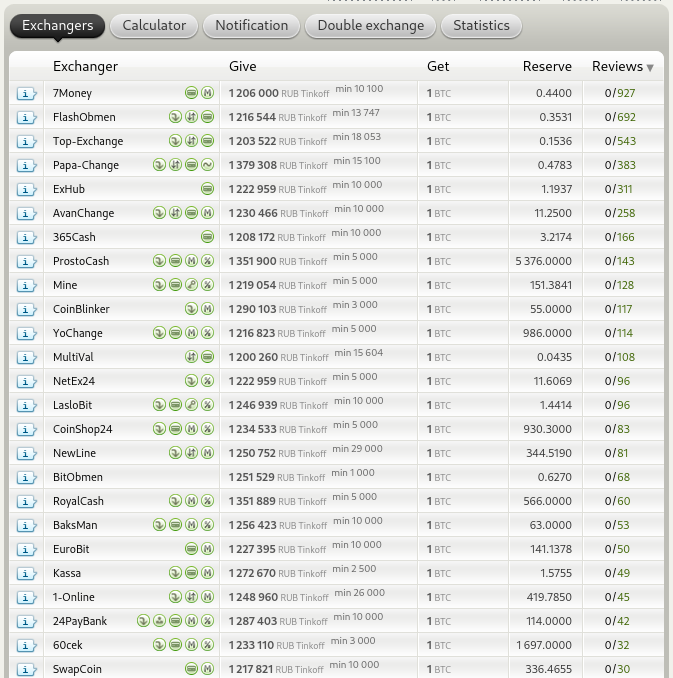
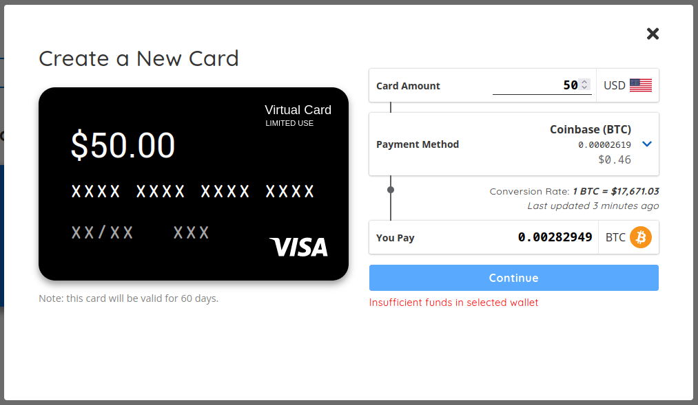
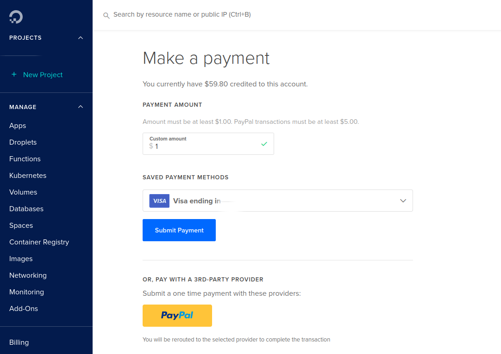
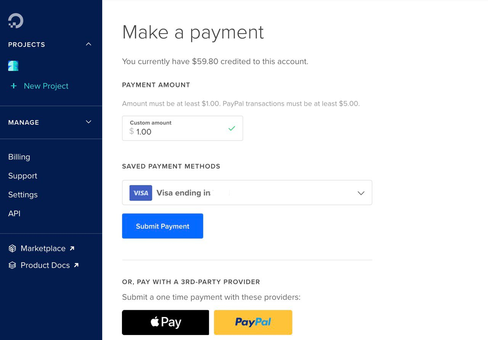
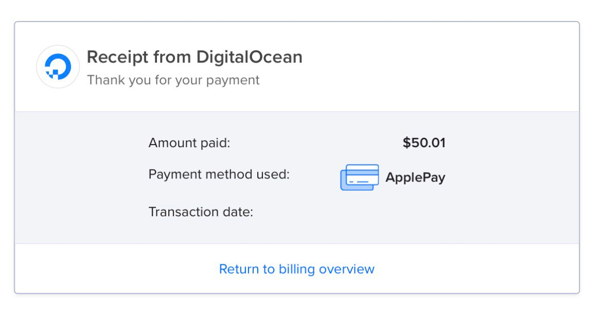
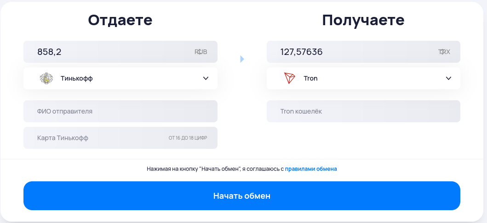
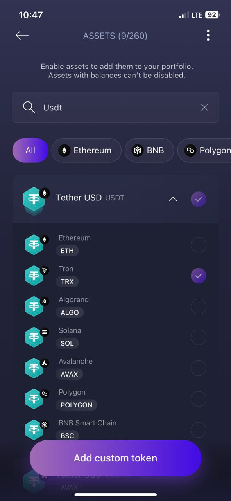
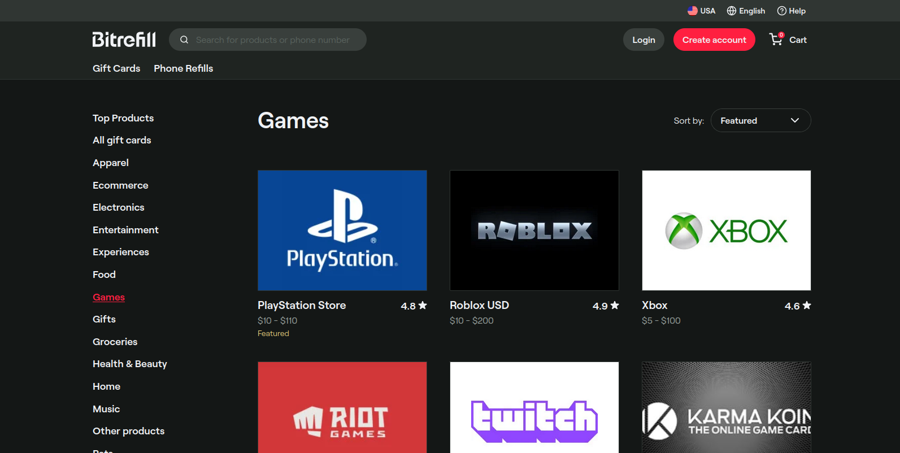
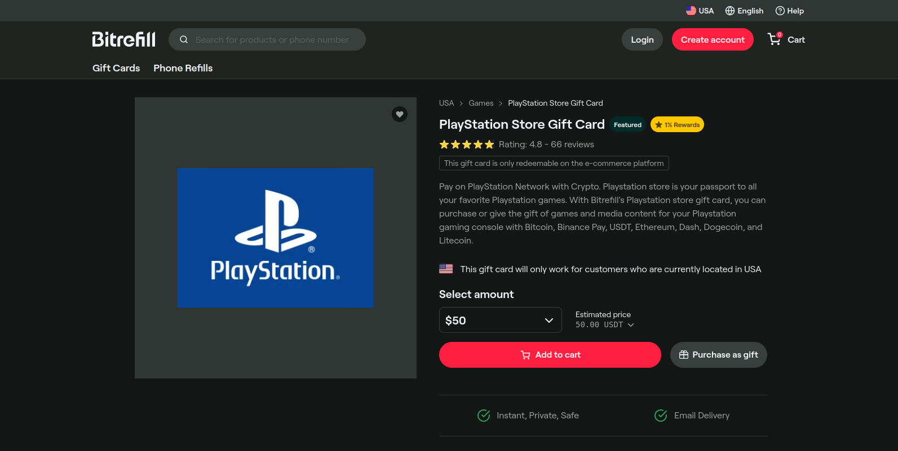
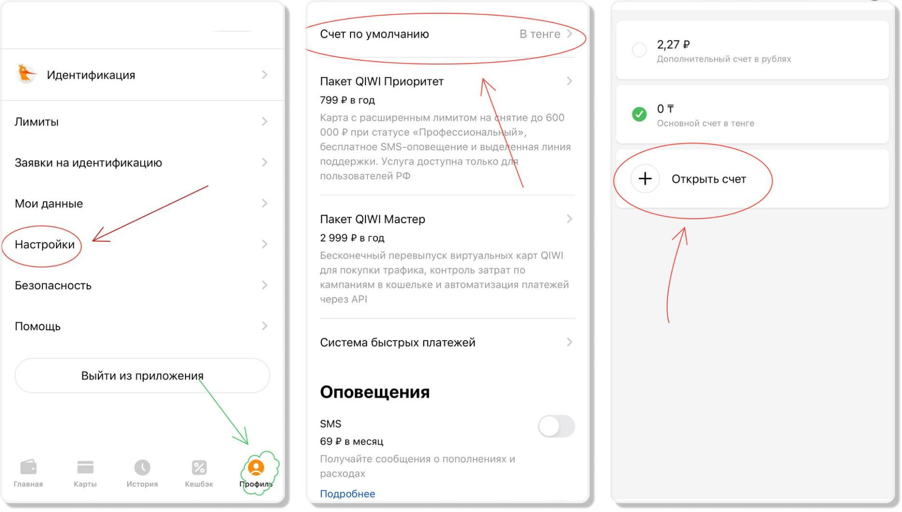

Разбераемся, что такое клиптовалюты и что делать в 2022-2023,
если нам требуется оплатить что-то в интернете, но наши карточки _не работают_.

Разберем способы, как через криптовалюты, так и через посредников.


**Дисклеймер!** Автор не несет ответственность за ваши средства, которые вы
переводите куда-либо. Я не получаю никаких бонусов от coinbase, paywithmoon или обменников.
Все, что я опишу ниже сработало для меня, но вы делаете это на свой страх и риск.


## Вводная

- Кто мы?
- Потребитель из интернета!
- Чего мы хотим?
- Отдать деньги тем, кто их не берет!

Звучит как шутка, но такова реальность. Наша цель сегодня — научиться оплачивать сервисы,
которые не могут или не хотят принимать платежи с нашим _не работающих_ карт.

Сегодня мы научимся:

- Платить за сервер DigitalOcean, на котором будет наш VPN;
- Платить за подписку на Netflix, Distrokid и тд;
- Покупать игры в американском PSn за крипту и в турецком за рубли и USDT;
- Покупать игры в Steam за рубли.

Для реализации наших целей будем использовать целый арсенал сервисов,
[стейблкоинов](https://en.wikipedia.org/wiki/Stablecoin), криптовалют и просто посредников.

## Сервисы для работы через криптовалюту

[Moon](https://paywithmoon.com/) — сервис, который выпускает предоплаченные
карты visa на срок 3 месяца без возможности дополнительного пополнения. Открывать
(делать первое пополнение) мы будем через Coinbase.

[Coinbase](https://www.coinbase.com) — биржа, а также vault (_wallet_, _keeper_) для ваших
монет. Хранить свои монеты там категорически не рекомендую, но как сервис-прокси coinbase
самый подходящий под наши задачи. Покупать там **мы** ничего не сможем, так что вооружимся
сервисом-агрегатором-обменником BestChange.

[BestChange](https://www.bestchange.com/) — сервис, агрегирующий обменники. Именно сюда
мы будем нести свои рубли, который будем на выбранном обменнике менять на нужную монету.

[Bitrefill](https://www.bitrefill.com/) — сервис, на котором можно купить предоплаченные
карты для разных сервисов 1 к 1 за Tether, например, для US-аккаунта [PlayStation Store Gift Card](https://www.bitrefill.com/buy/sony-playstation-usa/?hl=en) на $50 за 50 USDT.

[Bitlaunch](https://bitlaunch.io/) — сервис для покупки серверов за криптовалюту. Не сказать,
что это анонимно, так как просит ввести email, но можно использовать всякие temp-mail сервисы и
Monero, например.

## Криптовалюты, которые нам понадобятся

[Tether, USDT](https://tether.to/) (TRC-20, [Tron](https://tron.network/)) — это фиатная
криптовалюта, так называемый [stablecoin](https://en.wikipedia.org/wiki/Stablecoin).
Использовать мы будем её TRC-20 версию, т.е. все транзакции будут идти через сеть Tron.
В Tron комиссия ниже, чем в [Ethereum](https://ethereum.org/) сети, да и Tron купить проще,
как мне показалось.

[Bitcoin](https://bitcoin.org/ru/) — в представлении не нуждается, я думаю.
Первая и самая ликвидная крипто-монетка. При этом с кучей своих недостатков и достаточно
медленными транзакциями.

[Monero](https://www.getmonero.org/) — это анонимная криптовалюта. Все транзакции в этой
сети анонимны и достаточно быстрые. Благодаря этой монетке можно анонимно покупать серверы
через [bitlaunch](https://bitlaunch.io/), например, менять Monero на USDT и прч.

## Инструменты для хранения и обмена

Пошли мы покупать монетки, а куда их класть то? Для хранения будем использовать Exodus.

### Exodus, дом для наших монет

[Exodus](https://www.exodus.com/) — мультивалютный [крипто-кошелек](https://en.wikipedia.org/wiki/Cryptocurrency_wallet). Он мне понравится тем, что имеет клиент почти под всё:

Список клиентов

1. [iOS клиент](https://apps.apple.com/app/apple-store/id1414384820?pt=118366236&ct=download&mt=8)
2. [Android клиет](https://play.google.com/store/apps/details?id=exodusmovement.exodus)
3. [Linux клиент](https://downloads.exodus.com/releases/exodus-linux-x64-22.4.12.zip)
   (но я ставил через [flathub](https://flathub.org/apps/details/io.exodus.Exodus))
4. [Mac клиент](https://downloads.exodus.com/releases/exodus-macos-22.4.12.dmg) (можно через Brew)
5. [Windows клиент](https://downloads.exodus.com/releases/exodus-windows-x64-22.4.12.exe)

Имеет большой список поддерживаемых крипто-валют, и вообще... красивенький.

Exodus это не холодный кошелек. Он является компромисом между вашей безопасностью и удобством,
но это все ещё лучше использования для хранения крипто-бирж, хоть и не так безопасно, как
холодные или hardware-кошельки, типа [Ledger](https://www.ledger.com/), которые в России вы
не сможите купить.

Начнем с установки клиента и первых необходимых манипуляций.

Установим клиент на нужное устройство. Я ставил на свой iOS смартфон, затем уже на Fedora Linux.
Как установить на смартфон — объяснять не нужно: App Store ⇒ Exodus.

При первом запуске приложение немножко призадумается (генерирует вам первые кошелечки), потом
вы увидите перед собой главный экран. Нам нужно добавить 2 валюты для наших делишек: Tron (тикер:
TRX) и Tether (тикер: USDT, со значком TRX). Для этого листаем вниз наш экран, затем нажимаем
кнопочку “Add Mode”. В поиске пишем нужный тикер и рычажком включаем.

Валюты добавлены. Tether нам пока недоступен, потому что мы не провели ни одной транзакции по
Tron-сети. Как только мы купим немного TRX, Tether сразу разблокируется.

Нам надо озаботится нашей безопасностью. Чтобы мы могли, например, поставить клиент еще и на
PC или Mac и восстановить наши кошельки. Ну или в целом, чтобы мы могли восстановить наши
кошельки. Для этого нажимаем на 4 квадратика в нижнем баре → Security → Backup → View Secret
Phrase, зажимаем Press and Hold to Reveal и переписываем куда-нибудь на листочек 12 фраз именно
в том порядке в котором идут. Очень важно сделать это без ошибок, так как иначе вы потеряете
доступ ко всем своим кошелькам при утере доступа к этому приложению.

При установке клиента на другие устройства просто следуем в настройки и давим Restore from
Backup, вводим последовательность.

Приложение поставили, подключили 2 нужных валюты, выписали и надежно сохранили кодовую фразу
— you are breathtaking! Можно покупать свою первую криптомонетку! Но для начала сделаем еще
один обязательный шаг — заведем Coinbase аккаунт, что бы подружить нашу крипту с Visa, а
не просто перекладывать рубли в биты.

### Coinbase, крипто-биржа

Так как нам в первую очередь нужно делать Visa-карты, а не просто развлекаться с криптой при
огромных комиссиях на конвертация, то нам нужна будет учетка на Coinbase. Собственно сделаем её.

Идем на сайт **с выключенным VPN**, что бы вы регистрировались как RU-регион. Это нужно для того,
чтобы не попасть под анальную модерацию документов как в германии, например. Вы попросту не сможете
валидировать свою учетную запись. Первый раз я именно на этом и накололся, так что обратите
внимание.

Регистрация простая, так что описывать её нет смысла. После регистрации просто валидируйте
личность в кабинете, там потребуется указать адрес и цель, с которой вы пришли на coinbase.
При регистрации через мобильное приложение вас сразу об этом спросят.

Собственно... все! Теперь мы можем брать свой номер Bitcoin кошелька (в моб. приложении
Pay ⇒ Receive ⇒ BTC address ⇒ copy).

## Делаем Visa-карту с USD

### BestChange или как выменять плащ на пинту эля в “Гарцующем Пони”

Начинаем двигаться в сторону валидной Visa-карты.

Сразу оговоримся почему мы не покупаем крипту на биржах:

1. [CoinBase](https://www.coinbase.com/) или [Binance](https://www.binance.com/) требует
   паспортных данных, а мы не хотим их передавать.
2. Процесс ввода-вывода средств для России сейчас, по понятным причинам, слегка не возможен.

Наш вариант [BestChange](https://www.bestchange.com/). Это площадка с очень строгой модерацией,
так что все обменники там как минимум подвергаются тщательным проверкам. Никакой регистрации
не требуется.

В левом столбике выбираем, чего мы хотим заплатить (я, например, в Online Banking, выбрал
там Tinkoff), справа выбираем, что хотим получить.

Для начала прикупим немножечко Bitcoin. Замечу, чем меньше сумма, которую вы покупаете,
тем дороже может стоить обмен.

Выбираем, например, Tinkoff → Bitcoin и наблюдаем примерно следующую картину:



Выбираем понравившийся нам обменник, обращая внимание на значки возле названия. Нам нужно
чтобы мы погли купить монетки без валидации карточки и прч. фигни, так что ищем обменник, где
нет плашки _"This exchanger can require verification of client's bank card."_ Обмен будет дороже,
зато без лишнего головняка.

Если хочется просто быстро менять денюжков на монетки и вы не стесняетесь присылать фото своей
карточки сервису, то я бы даже мог посоветовать [Kassa](https://kassa.cc/).

Когда вы выбрали обменник, сам обмен будет проходить по сценарию "ты мне — я тебе". Вы вводите
сколько хотите купить, вам расскажут, сколько это будет стоить, после чего вы указываете свой BTC
кошелек, который взяли с Coinbase и проводите оплату.

В случае с обычными обменниками вам просто скажут номер карты, куда отправить нужно точную сумму
и нажать кнопку на сайте, что вы отправили, после чего через 10-15 минут вам поступят средства на
ваш крипто-кошелек.

В случае с кассой, вроде как, все автоматизировано и платеж вы проводите прям на сервисе, а не в
ручном режиме.

Когда вы получили монеты на свой кошелек, можно приступать к созданию Visa-карты.

### Moon, превращаем вино обратно в воду

Идем на сервис [Moon](https://paywithmoon.com/), регистрируемся там и привязываем свой coinbase
аккаунт (Settings ⇒ Connect to Coinbase). Это нужно сделать для того, чтобы сервис мог видеть
наш баланс и запрашивать Bitcoin из нашего кошелька.

Теперь самое интересное — создаем новую карточку.

Жмем `Create a new card`, выбираем `Payment Method` — Coinbase (BTC), вводим в `Card Amount`
сколько мы хотим зачислить и нажимаем `Continue`. _Я обычно ничего на coinbase не оставляю, так что
у меня висит предупреждение_.



После чего сервис вам покажет вашу новую карту, где будет номер, дата и cvs-код.

Теперь вы можете добавить эту карту в Apple Pay, Google Pay, использовать для оплаты любых
сервисов и тд.

_Везде, где потребуется указывать конкретный адрес плательщика, нужно будет взять любой
рандомный адрес с тех же гугл-карт. Для нашей карточки нудно брать US адрес._

### Оплачиваем сервер на DigitalOcean

Почему разбираем пример с DigitalOcean? Потому что после июня 2022 года нельзя просто добавить
карту как платежное средство. DigitalOcean перестал принимать предоплаченные карты и это хороший
пример для разбора подобных ситуаций.

Если мы не можем указать предоплаченную карту в качестве платежного средства, то у нас есть 2
варианта:

1. Использовать PayPal в качестве прокси-платежки, если у вас есть аккаунт не в России;
2. Добавить карту в Apple Pay, Google Pay и тд.

Я буду пользоваться вторым вариантом, потому что у меня с PayPall не прокатило: не дали
сменить регион.

Проходим процедуру добавления карточки в Apple Pay, для этого заблаговременно находим нам
фейковый платежный адрес, например, на Google Map, просто ткнув в понравившейся дом, строение или
гараж какой-нибудь, и ищем ZIP-code для него, например [тут](https://opengovus.com/). Я выбрал
штат Nashville, конкретный адрес публиковать не буду по понятным причинам.

Когда карточка будет успешно добавлена в Apple/Google Pay, заходим в личный кабинет через Safari,
если у вас iOS и через chrome, если Android. Это важно, так как вам просто не отобразится в ином
случае оплата через <...> Pay:

Вот пример из браузера на PC или Firefox на iOS



Вот пример из Safari, _появилась оплата Apple Pay_:



Нажимаем оплату ApplePay, производим оплату и все, успех:



Пользуясь этой информацией можно пробовать оплачивать всякие подписочные сервисы, которые не
принимают предоплаченные карту.

В любом другом случае просто указываете свою карточку в качестве основного платежного средства
и все, все будет работать. Я проверял это на сервисе [Distrokid](https://distrokid.com/),
годовая подписка без проблем списалась с этой карточки.

С прямыми оплатами понятно, а теперь посмотрим, что можно сделать через всякие прокси-сервисы.

## Bitrefill, покупаем gift-карты для PSN, Netflix и тд.

Теперь упростим задачу. Мы не хотим регистрировать Coinbase аккаунт. Мы не хотим возиться с
Visa-картами. Мы просто хотим принести крипту, которую купили и забрать код / gift / или что-то
еще.

### И снова в обменники

Первым делом закупимся криптой, на этот раз будем покупать USDT и Tron. Вспомним про наш Exodus,
а точнее про первые шаги, описанные [здесь](#exodus-пристанище-новоявленного-крипто-барона).
Нам требовалось добавить новые валюты, TRX и USDT.
Можно сразу ответить на немой вопрос, зачем два если будем покупать за один? Все просто, для
транзакций USDT использует сеть Tron (TRC-20), за каждую транзакцию мы обязаны оставлять "чаевые".
И вот чтобы оплачивать такую комиссию — нужны TRX.

Для покупки повторяем шаги, описанные
[здесь](#bestchange-или-как-выменять-плащ-на-пинту-эля-в-гарцующем-пони), только выбираем не
Bitcoin, а Tron (TRX).

Я свои TRX покупал на [coinstar](https://coinstart.cc/). Ценник высоковат, зато можно купить
минимальной порцией чуть ли не от 800-900 рублей, но мы же здесь попробовать, верно? Так что за
любопытство заплатим немножко больше.



Заполняем необходимые поля. Номер своего Tron (TRX) кошелька можно скопировать из Exodus. На
главном экране нажимаем на TRX → Стрелочка, направленная вниз → Your TRX Address (тапни, что
бы копировать).

Далее вам выдадут номер карты на которую нужно совершить перевод и после нажмете соответствующую
кнопочку на сайте. 5-10 минут и TRX будут зачислены.

После этого у вас разблокируется и USDT, потому что у вас будет проведена транзакция по Tron
сети и будут TRX для оплаты tee за переводы (1 перевод 3-8 TRX).

Я также еще покупал [Monero](https://www.getmonero.org/). Это анонимная криптовалюта и анонимный
блокчейн. А так же его легко конвертировать в USDT, например [вот тут](https://fixedfloat.com/).
Но это вовсе не обязательно. USDT (TRC-20) вы можете купить и за рубли используя всё тот же
BestChange.


**Важно!** Всегда проверяйте, что вы покупаете или переводите средства через TRC-20 сеть, потому
что мы используем Tron, иначе монетки не попадут к вам на счет и никто не вернет вам деньги.
Если вы хотите использовать другую сеть, то для начала добавьте в Exodus нужные ассеты, пример
на скриншоте ниже.




### Покупаем gift

Теперь у нас есть USDT и мы хотим купить себе gift-карту, например, для американского PSN, пусть
будет на $50.

Идем на [Bitrefill](https://www.bitrefill.com/), [выбираем сверху USA, проваливаемся в раздел
Gift Cards и категорию Games](https://www.bitrefill.com/buy/usa/games/).



Далее находим интересующий нас gift. В нашем случае PlayStation Store, выбираем, сколько нам
нужно и средство оплаты указываем USDT.



Дальше просто следуем инструкции. На экране оплаты должен появиться QR-код. Сканируете его через
Exodus, оплачиваете и ждете подарок на почту.

## Покупаем игры на турецкий PSN-аккаунт

До недавнего времени можно было сделать себе карту в каком-нибудь Ozan, переводить деньги на счёт
через Swith и тд и тп. Теперь такой возможности нет, но есть лазейки.

Это часть заметки для тех, кто не хочет переплачивать посреднику, если вы не из таких, смело
листайте ниже до раздела покупки через третьих лиц.

### Виртуальная карта OlduBil + USDT

Устанавливаем на свой смартфон приложение OlduBil ([iOS](https://apps.apple.com/us/app/oldubil/id1508532550), [Android](https://apkcombo.com/ru/oldubil/com.colendi.oldubil/)). При регистрации
указывайте регион "Казахстан", у них код тоже +7 и смс будут приходить без проблем.

Полностью описывать процесс я не буду, так как пользователь DTF —
[Йети](https://web.archive.org/web/20220706201305/https://dtf.ru/s/yeti) сделал это за меня в
[этой большой статье](https://web.archive.org/web/20220726080523/https://dtf.ru/s/yeti/1248511-kak-pokupat-igry-v-ps-store-v-turcii-s-kart-oldubil-i-iyzico).

Надо отметить, что в его способе используется Binance. Как сейчас обстоит дело не могу сказать, но
зато вы не сильно переплатите при покупки таким способом.

~~Этот способ я лично не проверял, но включать в эту заметку ссылку на этот способ стоило. Кто
пользовался этим методом, вроде как, все отзываются положительно. Сам я не буду проверять, т.к. не
хочу регистрироваться на Binance~~.

UPD: Этот способ я проверил, на моммент 02.2023 все работает хорошо, проверку документов на Binance проводят чуть ли
не за 10 минут после отправки. С покупкой через P2P по гайду из статьи **Йети** не возникло никаких проблем, все
работает.

Курс **~3.85** рублей за лиру выходит. PSN-кошелек у меня пополнить не вышло, какая-то ошибка постоянно выскакиевает, но
игры покупаются без проблем. Для сравнения при покупке через посредника цена лиры минимум **4.5** рублей.

Если вы хотите, чтобы я подробно описал весь процесс покупки через Binance, оставляйте комментарии под
[этой записью](https://t.me/owlpawgram/8) в [telegram-канале](https://t.me/owlpawgram).

### Покупка через посредника

Тут будет все **гораздо** проще, ну и заметно **дороже**.

Я покупал непосредственно через [этих ребят](https://t.me/PSNTurkishRussiaPublic).

Процесс очень простой, вы закидываете в свою карзину все, что хотите купить, умножаете
получившийся ценник на 5, что бы понимать, сколько это будет вам стоить, пишете
[ему](https://t.me/Revecor), передаёте логин и пароль от турецкого аккаунта и ждете дальнейших
указаний.

Продавец услуги вам скажет, что сейчас можно нажать "купить". Всё. Дальше вы просто оплачиваете
ему услугу. Т.е. сначала он покупает вам все, что нужно, после вы оплачиваете.

Вы ничем не рискуете. Но не надо пытаться обмануть как-то продавца, это плохо кончится, т.е. там
есть большой чат единомышленников, который просто закидает ваш аккаунт репортами, с пометкой, что
вы оплачиваете товар краденной картой.

## Steam — переезд в Казахстан

Из ру-региона ушли многие издатели, страница в steam очень победнела, а купить игры, те, которые
еще не успели уйти, стало проблематично.

Сервисы пополнения кошелька steam есть и их много, но что покупать-то?

Решим проблему проще — мы едем в Казахстан.

### Предварительные приготовления

Я советую сделать вам перечень следующих действий перед тем, как мы отправимся к продавцу услуги:

- Зайти [сюда](https://steamcommunity.com/dev/apikey) и проверить, что бы было пусто. Если что-то
  есть — удаляем;
- Сменить пароль за пару дней до процедуры;
- За пару дней до смены региона не проводить никаких сделок на площадке и не покупать игры;
- Подключить, если не была подключена, двухфакторная авторизация.

Все это позволит свести к минимуму откат региона.

### Переезжаем

- Идем за услугой [сюда](https://plati.market/itm/3384463). Никаких VPN включать не нужно. Не
  лишним будет почитать FAQ, который для вас составил автор;
- Покупаем услугу и просто ждем, когда с вами свяжется продавец (как правило минут 10-15);
- Общаетесь с продавцом, предоставляете ему данные от аккаунта, код двухфакторной авторизации и тд;
- Он покупает на ваш аккаунт с новой виртуальной карты какую-то мелочь, и у вас меняется регион.

Данный по карте в виде скриншота продавец вам скидывает в том же чате. Это на случай, если steam
всё же решит октатить вам регион (на моей памяти ни у кого, при соблюдении правил, не откатывали).


**Важно!**

- Не возвращайте купленную продавцом игру, это приведет к откату региона!
- Воздержитесь от пополнения кошелька день-другой.
  

После того, как вам сменили регион самое время задуматься, как заводить деньги на свой обновленный
аккаунт. На помощь нам придёт Qiwi или Web Money (с его просто ~~анальной~~ модерацией).

#### Qiwi

- Устанавливаем приложение на свой смартфон ([iOS](https://apps.apple.com/sc/app/qiwi-wallet-%D0%BE%D0%BF%D0%BB%D0%B0%D1%82%D0%B0-%D0%B3%D0%BE%D1%81%D1%83%D1%81%D0%BB%D1%83%D0%B3/id350905609),
  [Android](https://play.google.com/store/apps/details?id=ru.mw&gl=US));
- После регистрации подтвержаем статус аккаунта через гос-услуги;
- Заводим новый Тенге-кошелек:



Чтобы пополнить Тенге-кошелек, сначала пополняем рублевый счет, потом уже Тенге-счет.

Далее просто пополняете свой Steam аккаунт. Ищите в поиске qiwi `Steam (Казахстан)` и вводите свой
steam-логин.

#### Пару слов о WebMoney

С WM все будет несколько сложнее. Вам, без шуток, придется читать стихотворение на камеру с
паспортом в руках. Я этого делать не хочу, но вы должны знать и о таком методе оплаты.

Комиссия через WM ниже, чем через Qiwi, но не на столько, что бы возиться с подтверждением своего
аккаунта.

## Благодарности серому волшебнику

Если текст был полезен и ты не можешь усмирить желание быть благодарным, то вот мои кошелечки (USDT и TRX кошельки одинаковые, да, это не ошибка):

**Tether (TRC-20, USDT):**

```markdown
TYvFYUV3h5HwqfyTxskGQK7nDbUHTcwPn2
```

**Tron (TRX):**

```markdown
TYvFYUV3h5HwqfyTxskGQK7nDbUHTcwPn2
```

**Monero (XMR):**

```markdown
4AbxbT9vrNQTUDCQEPwVLYZq2zTEYzNr9ZzTLaq9YcwVfdxwkWjZ6FsewuXVDXPk7x2rE6FZACmLePPgJEcY4rm1GSHkwTZ
```
