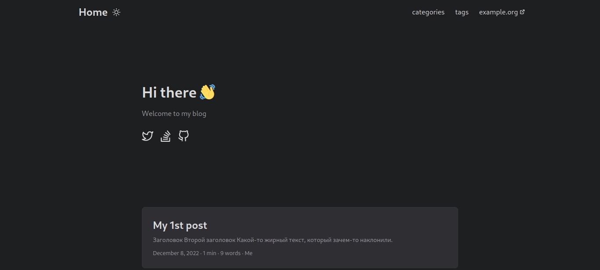
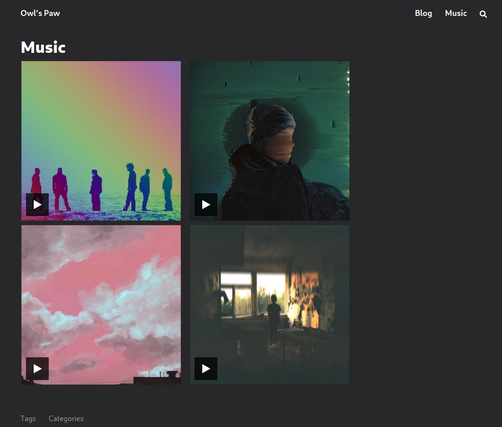

Рассмотриваем, как нам поднять, захостить и настроить деплой нашего
блога не заплатив при этом ни копейки (ну или совсем чуть-чуть).


Не нужно путать Hygge и Hugo, эти слова созвучны, но почти ничего общего не
имеют, кроме того комфорта, который предоставляет Hugo во время работы с ним.

Hugo — фреймворк, генератор статическиъ страниц, а Hygge — датский эпитет,
описывающий теплое и приятное.


## Наш уютный друг Hugo

[Hugo](https://gohugo.io) — генератор статических html файлов. Мы, соблюдая
флоу этого парня, размещаем наш текст в [markdown](https://www.markdownguide.org/getting-started/)
формате и наши изображения в нужных папках, а Hugo при запуске соберут из них
html странички.

### Установка и первый старт

Первом делом идем и читаем [документацию](https://gohugo.io/getting-started/quick-start/).
Нам понадобится установить [git](https://git-scm.com/) и сам Hugo.

```bash
sudo dnf update
sudo dnf install git hugo
```

В документации Hugo есть много [примеров установки](https://gohugo.io/installation/)
на MS Windows, MacOS, Linux и даже BSD. Я использую Fedora 36, так что все примеры
будут из неё, но, если вы используете что-то другое, разница будет не существенной.

Далее нам нужно инициализировать новый блог. Забегая вперед, мы будем хостить блог
на [GitHub pages](https://docs.github.com/en/pages/getting-started-with-github-pages/about-github-pages),
а для этого у нас уже должен быть аккаунт на GitHub и создан репозиторий типа
`<username>.github.io`, это имя я буду использовать для примеров далее:

```bash
hugo new site <username>.github.io
cd <username>.github.io
```

Нам сразу надо озаботиться тем, чтобы в репозиторий не улетали лишние файлы,
так что сначала создадим файл `.gitignore`, в который добавим только одну запись `/public`:

```bash
echo "/public" > .gitignore
```

И только теперь инициализируем репозиторий:

```bash
git init
git branch -M main
git remote add origin git@github.com:<username>/<username>.github.io.git
```

В целом это все, мы сгенерировали базовый проект, который уже работает.
Но мы не будем использовать дефолтный блог, погнали выбирать тему и тюнить его.

### Настаиваем тему и тюним блог

Выбираем тему, которую будем использовать в нашем блоге [тут](https://themes.gohugo.io/).

Мне приглянулась, например [PaperMod](https://themes.gohugo.io/themes/hugo-papermod/).
Почти у каждой темы есть doc-страница, демо и ссылки на репозиторий с ней.
Эта не исключение, идем читать [README](https://github.com/adityatelange/hugo-PaperMod/wiki/Installation).

Устанавливаем тему в наш проект:

```bash
git submodule add --depth=1 https://github.com/adityatelange/hugo-PaperMod.git themes/PaperMod
git submodule update --init --recursive
```

Теперь нужно подключить нашу тему, для этого удалим старый и создадим новый файл настроек:

```bash
rm config.toml
vim config.yml
```

Так делать нужно не всегда: иногда достаточно отредактировать `config.toml`; иногда
требуется следовать flow-темы и переместить `config.toml` в папку `config`.
Все это описано в документации к выбранной вами теме.

Далее скопируем из документации в файл `config.yml` настройки, и немного потюнем
под себя:

```yaml
baseURL: "https://username.github.io/"
title: My new site
paginate: 10
theme: PaperMod

enableRobotsTXT: true
buildDrafts: false
buildFuture: false
buildExpired: false

minify:
  disableXML: true
  minifyOutput: true

params:
  env: production # to enable google analytics, opengraph, twitter-cards and schema.
  title: ExampleSite
  description: "This is long-long description..."
  keywords: [Blog, Portfolio, PaperMod]
  author: My name there
  images: ["<link or path of image for opengraph, twitter-cards>"]
  DateFormat: "January 2, 2006"
  defaultTheme: auto # dark, light
  disableThemeToggle: false

  ShowReadingTime: true
  ShowPostNavLinks: true
  ShowCodeCopyButtons: true
  ShowWordCount: true
  ShowRssButtonInSectionTermList: true
  UseHugoToc: true
  disableSpecial1stPost: false
  disableScrollToTop: false
  hidemeta: false
  hideSummary: true
  showtoc: false
  tocopen: false

  assets:
    favicon: "<link / abs url>"
    favicon16x16: "<link / abs url>"
    favicon32x32: "<link / abs url>"
    apple_touch_icon: "<link / abs url>"
    safari_pinned_tab: "<link / abs url>"

  label:
    text: "Home"
    icon: /apple-touch-icon.png
    iconHeight: 35

  # profile-mode
  profileMode:
    enabled: false # needs to be explicitly set
    title: ExampleSite
    subtitle: "This is subtitle"
    imageUrl: ""
    imageWidth: 120
    imageHeight: 120
    imageTitle: my image
    buttons:
      - name: Posts
        url: posts
      - name: Tags
        url: tags

  # home-info mode
  homeInfoParams:
    Title: "Hi there \U0001F44B"
    Content: Welcome to my blog

  socialIcons:
    - name: twitter
      url: "https://twitter.com/"
    - name: stackoverflow
      url: "https://stackoverflow.com"
    - name: github
      url: "https://github.com/"

  cover:
    hidden: true # hide everywhere but not in structured data
    hiddenInList: true # hide on list pages and home
    hiddenInSingle: true # hide on single page

  # for search
  # https://fusejs.io/api/options.html
  fuseOpts:
    isCaseSensitive: false
    shouldSort: true
    location: 0
    distance: 1000
    threshold: 0.4
    minMatchCharLength: 0
    keys: ["title", "permalink", "summary", "content"]
menu:
  main:
    - identifier: categories
      name: categories
      url: /categories/
      weight: 10
    - identifier: tags
      name: tags
      url: /tags/
      weight: 20
    - identifier: example
      name: example.org
      url: https://example.org
      weight: 30
pygmentsUseClasses: true
markup:
  highlight:
    noClasses: false
    # anchorLineNos: true
    # codeFences: true
    # guessSyntax: true
    # lineNos: true
    # style: monokai
```

Можем даже уже проверить, что у нас получается:

```bash
hugo server
```

По пути 0.0.0.0:1313 или localhost:1313 станет доступен наш блог.

По поводу детальной настройки темы читаем в документации к самоей теме.

### Создаем первую запись в блоге

Теперь попробуем разобраться, как нам добавлять новые статьи на наш сайт.

По сути наши статьи это всего лишь markdown-файлы, которые мы помещаем в папку,
например, `posts/my_new_awesome_post`, а далее Hugo конвертирует их в `.html`
странички.

Создадим для начала папку для нашей статьи:

```bash
mkdir -p content/posts/first-post
vim content/posts/first-post/index.md
```

Поместим туда шаблон статьи и что-то напишем:

```markdown
---
title: "My 1st post"
date: 2022-12-08T11:30:03+00:00
tags: ["first"]
author: "Me"
showToc: true
TocOpen: false
draft: false
hidemeta: false
comments: false
description: "Desc Text."
canonicalURL: "https://canonical.url/to/page"
disableHLJS: true # to disable highlightjs
disableShare: false
disableHLJS: false
hideSummary: false
searchHidden: true
ShowReadingTime: true
ShowBreadCrumbs: true
ShowPostNavLinks: true
ShowWordCount: true
ShowRssButtonInSectionTermList: true
UseHugoToc: true
cover:
    image: "<image path/url>" # image path/url
    alt: "<alt text>" # alt text
    caption: "<text>" # display caption under cover
    relative: false # when using page bundles set this to true
    hidden: true # only hide on current single page
editPost:
    URL: "https://github.com/<path_to_repo>/content"
    Text: "Suggest Changes" # edit text
    appendFilePath: true # to append file path to Edit link
---

# Заголовок

## Второй заголовок

Какой-то **жирный** текст, который зачем-то _наклонили_.
```

Проверим, что у нас там в блоге теперь:



Поговорим подробнее, что мы сейчас сделали:

- Мы создали в директории `content` директорию `posts` и вложили туда директорию
  для нашей статьи `first-post`;
- Создали в директории `first-post` файл `index.md`. Hugo всегда первым делом
  будет искать файл `index.md`, а за адрес до статьи будет принимать путь
  `<category_dir>/<post_name_dir>/`.
- В файл `index.md` закинули расширенную конфигурацию поста.


Конфигурация поста всегда распологается в шапке файла между символами `---` `---`.

Пример базовой конфигурации в code-блоке ниже.


```yaml
---
title: "<Title>"
date: <datetime> # <YYYY-mm-dd>T<HH:MM:ss><+/-UTC>
draft: true # or false
---
```

## Несем проект до хостинга и автоматизируем деплой

Мы сгенерировали сайт, добавили в него кастомную тему, даже пост какой-никакой
написали. Все классно, но блог пока доступент только на вашей машине. Сделаем
его общедоступным.

### Прокидываем секреты

Для автоматической развёртки на GitHub Pages требуется сгенерировать ключи, а
точнее так называемые "секреты".

Если у вас не был настроен git, то прокинем сначала имя и email:

```bash
git config --global user.name "<Your Name>"
git config --global user.email "<Your Email>"
```

Генерируем ключи для деплоя:

```bash
ssh-keygen -t rsa -b 4096 -C "$(git config user.email)" -f deployment -N ""
```

Заходим на GitHub в наш репозиторий (он пока еще пустой, мы в него ничего не пушили).
Далее идем Settings ⇒ Deploy Keys ⇒ Add Deploy Keys.

Добавляем сюда ваш публичный ключ. Скопировать его можно из только что сгенерированного файла:

```bash
cat deployment.pub
```

```bash
ssh-rsa AASdas...KTTx2lOvqFvqOMAIw== <your_email>@proton.com
```

Скопировать фразу нужно целиком. Назовем его `public key of ACTIONS_DEPLOY_KEY`.


**UPD 24.08.2023:** и ставим галочку внизу формы "Allow write access"!


Далее идем в Secrets ⇒ Actions ⇒ New Repository Secret. Вставляет туда приватный ключ:

```bash
cat deployment
```

Также копируем фразу целиком от и до, называем ключ `ACTIONS_DEPLOY_KEY`.


Что бы скопировать что-то из терминала используйте хоткей `CTRL + Shift + C`.

Если хочется совсем обойтись без мыши, то установите `screen`. Как пользоваться
screen [в этом ответе](https://superuser.com/a/228241).



**UPD 24.08.2023:** чтобы не получить ошибку, что deploybot не имеет доступа, двигаемся в Actions ⇒ General скроллим
вниз до секции Workflow permissions и отмечаем пункт Read and write permissions.


### Настраиваем actions и пушим

В корне нашего блога создаем директории:

```bash
mkdir -p .github/workflows
```

В `workflows` создадим файл `gh-pages.yml`:

```bash
vim .github/workflows/gh-pages.yml
```

Скопируем туда это:

```yaml
name: GitHub Pages

on:
  push:
    branches:
      - main

jobs:
  build-deploy:
    runs-on: ubuntu-latest
    concurrency:
      group: ${{ github.workflow }}-${{ github.ref }}
    steps:
      - name: Checkout
        uses: actions/checkout@v3
        with:
          submodules: true
          fetch-depth: 0

      - name: Setup Hugo
        uses: peaceiris/actions-hugo@v2
        with:
          hugo-version: "latest"
          extended: true

      - name: Build
        run: hugo --minify

      - name: Deploy
        uses: peaceiris/actions-gh-pages@v3
        if: ${{ github.ref == 'refs/heads/main' }}
        with:
          github_token: ${{ secrets.GITHUB_TOKEN }}
          publish_branch: gh-pages
          publish_dir: ./public
```

Наконец-то пушим наш блог в удаленный репозиторий и ждем ошибок, потому что мы
не настроили еще одну вещь:

```yaml
git add . && git commit -m "Init" && git push -u origin main
```

Идем в наш репозиторий и скорее всего там нифига не завелось, потому что не
настроена ветка из которой деплоится сайт.
Идем в Settings ⇒ Pages ⇒ Build and deployment.

В Source устанавливаем параметр `Deploy from a branch` и выбираем `Branch`, из
которой будем деплоится `gh-pages`.

Изменим что-нибудь в нашей тестовой статье и повторим пуш. Если деплой прошел
успешно, то ваш блог станет доступен по адресу `<username>.github.io`.

## Say my name!.. Используем свой домен

Мы задеплоили, все настроили, но нам хочется припарковать свой домен или же
купить его для начала.

Купить домен можно где угодно. Я сам покупал на
[https://beget.com/ru/domains](https://beget.com/ru/domains). Никаких рефералок
у меня нет, увы, но там и без того самые дешевые домены в .com зоне.
В .com зоне можно покупать домены не указывая паспортные данные, а в .ru нужно
будет предоставлять паспорт.

Представили, что мы арендовали домен. Че дальше с ним делать?

Для начала идем в панель управления вашим доменом у вашего регистратора,
проходим в настроики DNS и добавляем записи типа А и AAAA. IP-адреса берем
[здесь](https://docs.github.com/en/pages/configuring-a-custom-domain-for-your-github-pages-site/managing-a-custom-domain-for-your-github-pages-site#configuring-an-apex-domain).
Не забываем удалить старый IP-адрес, который был дефолтным от регистратора.

Далее настраиваем поддомен www. Добавим для него запись типа CNAME, который
будет указывать на ваш зарегистрированный домен, таким образом будет происходит переадресация.

Далее идем в корень нашего проекта и создаем там в папке static файл CNAME и
кладем в него наш домен:

```bash
echo "<yourdomen.com>" > static/CNAME
```

Теперь пушим в репозиторий изменения и идем рассказывать GitHub’у, что мы хотим
использовать свой домен. Идем в репозиторий ⇒ Settings ⇒ Pages ⇒ секция `Custom domain`.
Вписываем туда свой apex-домен (<yourdomen.com>) и нажимаем save.
Домен должен проходить все проверки и GitHub самостоятельно подключит к нему tls-сертификаты.


**UPD 24.08.2023:** GitHub теперь часто нормально не подхватывает сертификаты! Если вы столкнулись с проблемой запроса
сертификата, то решение проблемы следующее:

- Идете в панель управления DNS, где арендовали домен
- Ищите там адрес **www**.<yourdomen.com> и создаете / редактируете CNAME запись, добавляя в нее **прямую ссылку на
  ваш блог** типа username.github.io, а не <yourdomen.com>.

После этого идете обратно в нстройки репозитория Pages, удаляете ваш кастомный домен, минут 5 чиллите, пока пройдет деплой,
и добавляете снова ваш домен в виде <yourdomen.com>, без всяких www. Пройдет проверка DNS и практически сразу буден выдан
сертификатю


## Пишем свои кастомные Shortcode

Shortcode — это специальная разметка, которую сможет понять Hugo и отобразить
вам соответствующий результат после рендера.

Представим, что у нас появилась задача, которая шире, чем функционал выбранной
вами темы. Например я захотел добавить на страницу карточку с моей музыкой, но
ни у Hugo, ни у выбранной темы нет шорткода, что бы вставить карточку трека с
bandcamp.com.

Возникнет резонный вопрос: почему не вставить просто `html` в текст .md страниц?

Вопрос хороший. Также хороший вопрос, почему Hugo не позволяет так делать. Он
выдасл на это действие ошибку и не сможет собрать нам страницу. Не беда, напишем
свой кастомный шорткод.

Для начала определимся, как мы хотим использовать его в тексте нашей статьи.

Посмотрим на ссылку, которая ведет до нашего альбома, например:

```
<domain>/EmbeddedPlayer/album=4206660389/size=large/bgcol=ffffff/...
```

Изменяться у нас будет только `album=4206660389`, примем этот параметр как
`<type>=<id>`. А использовать в разметке будем как:


{{\< bandcamp id="<id>" type="<type"> \>}}



Здесь и далее для этого шорткода я экранировал знаки `<` и `>` иначе он сработает =)


С этим определились, теперь накидаем простенький шорткод. Для это создадим файл
нашего шорткода `bandcamp.html` в `layouts/shortcodes`.

```
layouts
└── shortcodes
    └── bandcamp.html
```

Определим 2 переменные, в которые мы получаем значения и 1 логическую конструкцию:

```html
{{- $id := .Get "id" -}} {{- with .Get "type" -}} {{- if eq . "track" -}}
<div style="margin: 0px 10px 10px 10px;;">
  <iframe
    style="border: 0; width: 350px; height: 350px;"
    src="https://bandcamp.com/EmbeddedPlayer/track={{ $id }}/size=large/bgcol=333333/linkcol=9a64ff/minimal=true/transparent=true/"
  >
  </iframe>
</div>
{{- else if eq . "album" -}}
<div style="margin: 0px 10px 10px 10px;">
  <iframe
    style="border: 0; width: 350px; height: 350px;"
    src="https://bandcamp.com/EmbeddedPlayer/album={{ $id }}/size=large/bgcol=333333/linkcol=9a64ff/minimal=true/transparent=true/"
  >
  </iframe>
</div>
{{- end -}} {{- end -}}
```

Вот этот кусок кода я беру с шаринг тулс бендкампа:

```html
<iframe
  style="border: 0; width: 350px; height: 350px;"
  src="https://bandcamp.com/EmbeddedPlayer/track={{ $id }}/size=large/bgcol=333333/linkcol=9a64ff/minimal=true/transparent=true/"
>
</iframe>
```

В нем я просто изменил захардкоженный id на свою переменную.

Никаких дополнительных проверок делать не будем, чтобы не усложнять.

Дополнительно про кастомные шорткоды можно почтитать [тут](https://gohugo.io/content-management/shortcodes/).

## Добавляем кастомные страницы

Теперь нам понадобилось добавить свою страницу, на которой будем рендерить какой-то
кастомный контент. Например это страница с музыкой, на которой будут рендериться
карточки с музыкой. Как нам добавить страничку и кнопку в меню?

Создаем директорию `music` в `content`, и помещаем туда файл `index.md`.

```
content
└── music
    └── index.md
```

В `index.md` расскажем Hugo, что это новый слой и сразу воспользуемся нашим новым
кастомным шорткодом:

```markdown
---
title: "Music"
Description: "Music page"
layout: "music"
---

{{\< bandcamp id="3756810824" type="track" \>}}

{{\< bandcamp id="1062007976" type="album" \>}}
```

Далее нам нужно добавить сам слой в `layouts`. Создаем директорию `page` и кладём
туда файл `music.html`.

```
layouts
├── page
│   └── music.html
└── shortcodes
    └── bandcamp.html
```

Очень похоже на то, как мы добавляли шорткод.

Далее пишем разметку страницы в `music.html`:

```html
{{ define "main" }}
<!-- Main Content -->
<main id="main-content" class="grow">
    <header>
        <h1 class="mt-0 text-4xl font-extrabold text-neutral-900 dark:text-neutral">Music</h1>
    </header>

  <section class="flex flex-wrap -mx-2 place-content-center overflow-hidden">
      <div class="container my-3">
          <div class="row">
              <div class="flex flex-wrap">{{ .Content }}</div>
      </div>
  </section>
</main>
{{ end }}
```

Снова видим обёртку `html` в специфический синтаксис.

Теперь остается рассказать нашей теме о том, что появилась новая кнопка в NavBar.

Идем в конфигурационный файл вашей темы (в зависимости от темы его расположение
будет отличаться), находим секцию с настройкой вашего меню и указываем ссылку на нашу
страницу. Будет что-то вроде такого:

```toml
[[main]]
  name = "Music"
  pageRef = "music"
  weight = 20
```

Все готова. Шаблон для странички написан, сама страница добавлена в контент и
в конфигурационном файле мы сделали ссылку на нашу новую страницу.

Можно посмотреть на примерный результат:



## Упрощаем сохранение и отправку изменений в блог

Финишная прямая. Делаем управление блогом чуточку удобнее.

Сделаем alias для сохранения и пуша изменений. Я использую oh-my-zsh, но для bash
настройка будет аналогичная, только вместо `.zshrc` будет `.bashrc`.

Откроем файл настроек нашего шелла:

```bash
vim ~/.zshrc
```

В самый конец файла дописываем строку:

```bash
alias post-save="git add . && git commit -m \"Added new post\" && git push"
```

Перечитываем файл настроек, что бы изменения вступили в силу:

```bash
source ~/.zshrc
```

Теперь, когда мы внесли какие-то изменения в настройки, например, или добавили статью
мы можем выполнить, будучи в корневой папке блога:

```bash
post-save
```

И все, изменения полетят на GitHub, где все задеплоится и через пару секунд изменения
отобразятся на вашем сайте.

## Благодарности серому волшебнику

Если текст был полезен и ты не можешь усмирить желание быть благодарным, то можешь: 

Воспользоваться моей реферальной ссылкой на TimeWeb:



Воспользоваться моей реферальной ссылкой на DigitalOcean:



Или же закинуть монету в мой кошелёк (USDT и TRX кошельки одинаковые, да, это не ошибка):

**Tether (TRC-20, USDT):**

```markdown
TYvFYUV3h5HwqfyTxskGQK7nDbUHTcwPn2
```

**Tron (TRX):**

```markdown
TYvFYUV3h5HwqfyTxskGQK7nDbUHTcwPn2
```

**Monero (XMR):**

```markdown
4AbxbT9vrNQTUDCQEPwVLYZq2zTEYzNr9ZzTLaq9YcwVfdxwkWjZ6FsewuXVDXPk7x2rE6FZACmLePPgJEcY4rm1GSHkwTZ
```
