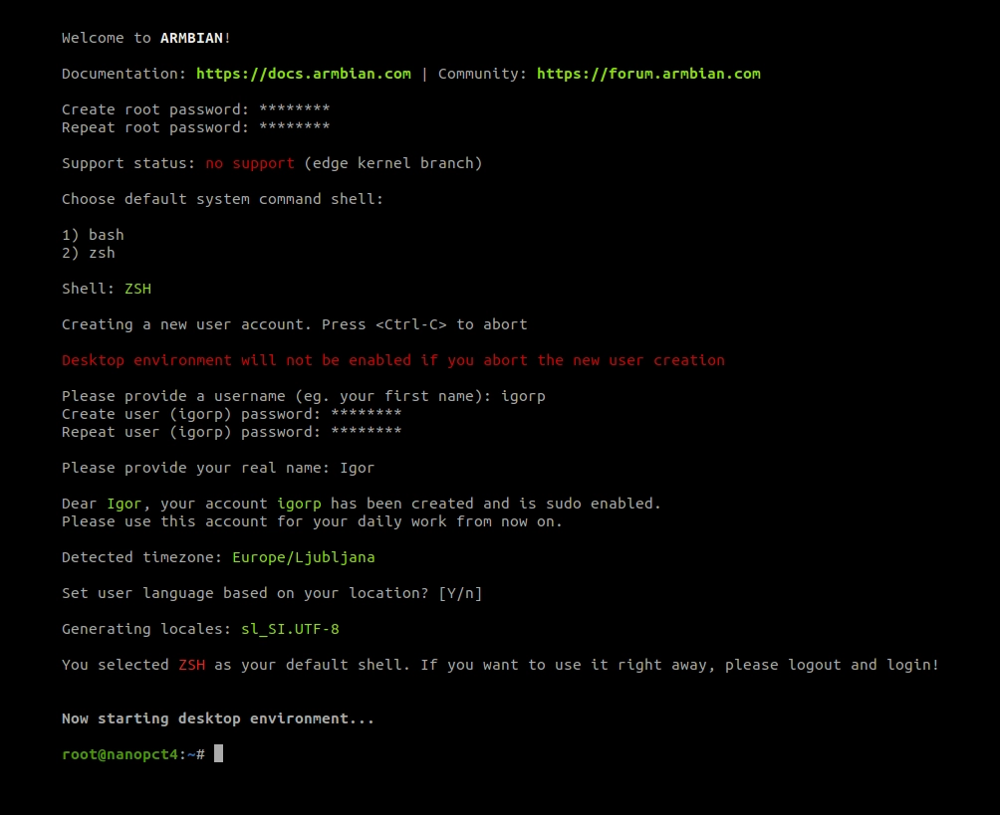

В этой заметке обсудим, как поднять свой сервер под небольшой проект, git-сервер или под умный дом за 1-3 тысячи рублей.

## Raspberry Pi для малоимущих

Многие хотя бы раз слышали про [Raspberry Pi](https://www.raspberrypi.com/), это крутые одноплатные компьютеры с
процессорами на [arm](https://en.wikipedia.org/wiki/ARM_architecture_family) архитектуре. Это малютки всем хороши, но
всегда есть какое-то но, и здесь их больше, чем меньше:

1. **Цена**. Эти штуки до недавнего стояли вменяемые 3-6-8 тысяч рублей, за разного толка конфигурацию, но сейчас цены
   совсем кусачие, это нам не подходит;
2. **Закрытый исходный код**. В интернете достаточно примеров бекдоров, которые есть в ПО этих плат.
3. **Температуры у старших моделей**. Не знаю, стоит ли в целом выносить это в минусы, так как это в целом проблема 
   мощных одноплатников, но пусть будет.

На рынке существует много альтернатив, но мы остановимся на open-source [Orange Pi](http://www.orangepi.org/) и для
игрулек я себе взял чуть ли не самую дохлую Orange Pi PC Plus на 1Gb RAM и Quad-Core ARM Cortex-A7 1.296GHz. Встала
она мне с корпусом, радиаторами, куллером, двумя блоками питания и флешкой 10 класса на 16Gb за 1 тысячу рублей (если 
вы не мастер дипломатии и у вас нет младшего брата, то она вам встанет в районе 3 тысяч).

Если сравнить её с Raspberry Pi, то, очевидно, она проиграет во всем, а самое главное, что у Raspberry Pi огромное
комьюнити и вы легко нагуглите любую проблему с пошаговым гайдом к решению, а вот с OrPi придется знатно так забуриться
в гик-сноб-нёрд форумы и попытаться угадать мелодию с двух нот.

Давайте накатим для начала на нее сервер и будем смотреть, что к чему.

## Подготавливаем flash-карту

Первым делом идём
[сюда](http://www.orangepi.org/html/hardWare/computerAndMicrocontrollers/service-and-support/Orange-Pi-Pc-Plus.html) и
определяемся с дистрибутивом. Скажу сразу, что Armbian развивается лучше всех, но мне очень лень пробовать что-то
другое, ~~так что я возьму
[Ubuntu Server](https://drive.google.com/file/d/1F0EMAQJMlMFLUKddkj4Kna07aiOslCUd/view?usp=share_link). К сожалению
там ubuntu server 16.04, но, как говориться, это open-source, ешь, что дают. Для нас это не станет проблемой, мы
обновимся до 20.04 без особых проблем далее.~~ 

Включение из будущего (так как статья долго была в драфте), это стало проблемой. Просто берем 
[Armbian](https://redirect.armbian.com/orangepipcplus/Bookworm_current_minimal) и следуем иснтрукциям ниже.

Нам нужно подготовить флешку к записи, флешка должна быть отформатирована в FAT, для того, чтобы нам можно было создать
загрузочный диск. Это можно сделать через [GParted](https://gparted.org/), если вы на Linux-системе или же через
[HP USB Disk Storage Format Tool](magnet:?xt=urn:btih:A7C23FBC12256A463D12BACDC0314953427DC3B9&tr=http%3A%2F%2Fbt4.t-ru.org%2Fann%3Fmagnet&dn=HP%20USB%20Disk%20Storage%20Format%20Tool%202.2.3%20ENG%2BRUS%20%5B2012%5D)
если вы на MS Windows.

Что там, что там все очень просто, главное отформатировать в FAT.

Далее нам нужно залить операционную систему на подготовленную flash-карту. Для этого можно использовать любое удобное
для вас ПО, будь то [dd](https://www.man7.org/linux/man-pages/man1/dd.1.html),
[Unetbootin](https://unetbootin.github.io/), [Rufus](https://rufus.ie/), 
[Balena](https://etcher.balena.io/#download-etcher) (предпочтительнее).

### Загрузочная USB через Balena

1. [Скачиваем](https://etcher.balena.io/#download-etcher) нужную версию для вашей операционной системы;
    1.1. Если вы на линуксе, то нужжно сделать \*.appimage исполняемым (ПКМ -> properties -> Executable as program);
2. Запускаем Balena, выбираем "Flash from file", выбираем наш образ 
"Armbian\_23.8.1\_Orangepipcplus\_bookworm\_current\_6.1.47\_minimal.img.xz"
3. "Select target" и выбираем нашу флешку, если она не подтянулась туда автоматически;
4. Заливаем образ. 

Все, флешка готова к использованию в OrPi.

### Загрузочный USB через DD

Узнаем имя нашей USB-flash карточки:

```bash
lsblk
```

или

```bash
fdisk -l
```

Ищем нашу флешку по объему, моя на 16Gb, и имя у него `/dev/sdb`, ваша также будет `/dev/sdb` или `/dev/sdc`.

Далее нам необходимо размонтировать том и отформатировать флешку:

```bash
umount /dev/sdb* && mkfs.vfat /dev/sdb –I
```

Теперь заливаем образ на флешку, образ лежит 
`~/Downloads/Armbian_23.8.1_Orangepipcplus_bookworm_current_6.1.47_minimal.img.xz`:

```bash
dd if=~/Downloads/Armbian_23.8.1_Orangepipcplus_bookworm_current_6.1.47_minimal.img.xz of=/dev/sdb
```

Это займет какое-то время, после окончания процесса ваша флешка готова к использованию в Orange Pi.

## Первый запуск

Мы залили на флешку образ, вставили карточку в плату, подключили питание, клавиатуру и монитор, что дальше?

Дальше стоит произвести некоторые манипуляции, после которых можно будет отключить от платы монитор и клавиатуру и
закинуть её куда-нибудь подальше в пыльный угол, но до этого войдем в систему:

При первом запуске система предложит вам установить пароль и подключиться к сети:

Вы увидите что-то вроде такого:



Я пропустил создание нового пользователя, только задал пароль для root и все. Вы же делайте так, как посчитаете нужным.

Далее Armbian должен сам запустить все скрипты по расширению доступного места. Проверим, запускал ли он их вообще:

```bash
df -h
```

Глазами находим том смонтированный в `/` или в `/root` и смотрим на колонку `size`, там должен быть доступным объем, 
равный объему вашей флешки. Если вдруг магии не случилось (что на моей памяти на Armbian у меня не случалось ни разу) 
то пробуем руками поправить это недоразумение.

### Исправляем проблемы с доступной памятью flash-карты, если не сработал скрипт

Забегая вперед вы 100% столкнетесь с двумя распространенными проблемами:

1. Недоступность всего объема памяти флеш-карты для `/`;
2. Маленький объем в `/boot`

Про первый пункт даже в самой документации есть, не знаю, почему это не исправили спустя столько лет, штош...
open-source moment.

Расширяем доступный объем для файловой системы:

Для нас учтивые разработчики положили скрипт, который нам нужно просто запустить из под `root`:

```bash
/etc/init.d/resize2fs start
```

Если же вы держите flash-карточку в руках, то можно расширить раздел прям через GParted. Мы тем более вернемся к нему
снова в решении следующей проблемы.

Расширяем объем `/boot`:

Ооо, я с этим просидел в поисковике не один час, а решение было очевидное. Суть проблемы:

- Есть раздел `/boot`, у которого выделено 10-15Mb, это очень мало и мы не сможем обновиться;
- Раздел `/boot` отформатирован как 'FAT16', а GParted использует внешний модуль из другой библиотеки для форматирования
  и там (проблема существует с 16 года) до сих пор не добавлена возможность расширить или как-то работать с разделами
  < 256Mb. ~~open-souce moment~~

Мы выйдем из положения просто:

1. Копируем все из папки `/boot` куда-нибудь себе на компьютер;
2. Форматируем раздел в `ext4`;
3. Расширяем его до 512Mb, предварительно откусив это место от раздела `/`;
4. Форматируем расширенный раздел в `FAT16`;
5. Заливаем обратно файлы в `/boot`, которые мы копировали к себе в п. 1.

Отлично! Мы только что починили две проблемы, которые не дали бы нам обновляться в будущем, но осталось еще несколько...

## Работаем с OrPi удаленно

Чтобы подключиться к нашему серверу по `ssh` просто пишем:

```bash
ssh root@<your_ip>
```

Вводим пароль, который установили при первом логине и все, мы внутри. При первом подключении нас могут спросить про 
внесение записи в knowhost, пишем `yes`.

### Показываем сервер наружу через VPN

[Вот тут](https://owlpaw.com/blog/wireguard-vpn) я уже рассказывал, как нам можно поднять VPN, через который мы
соберем устройства в приватной сети. Нам останется только добавить новый Peer для нашего сервера и настроить сам сервер.

По [этой инструкции](https://owlpaw.com/blog/wireguard-vpn/#%d0%b4%d0%be%d0%b1%d0%b0%d0%b2%d0%bb%d1%8f%d0%b5%d0%bc-%d0%bf%d0%b5%d1%80%d0%b2%d1%8b%d0%b9-peer) генерируем ключи и добавляем Peer на сервере, затем перезагружаем службу.

Я добавлял Peer с IP `10.0.0.10`, что бы мне проще было запомнить, так что дальше я буду использовать в примере этот
адрес.

Дальше переходим на наш OrPi сервер и там устанавливаем `wireguard-tools`

```bash
sudo apt install -y wireguard-tools
```

Создаем файл конфигурации `/etc/wireguard/wg0.conf` и вставляем в него это (поменяв ip-внешнего сервера и ключи на
свои):

```bash
[Interface]
PrivateKey = <YOUT_PRIVATE_KEY>
Address = 10.0.0.10/32
DNS = 8.8.8.8

[Peer]
PublicKey = <SERVER-PUBLICKEY>
Endpoint = <SERVER-IP>:51820
AllowedIPs = 0.0.0.0/0
PersistentKeepalive = 20

```

Затем прокинем аляс, что бы не так страшно было набирать команды:

```bash
vim ~/.bashrc
```

В конец файла добавляем:

```bash
alias vpn-on='wg-quick up wg0'
alias vpn-off='wg-quick down wg0'
```

Сохраняем и перечитываем конфиг:

```bash
source ~/.bashrc
```

Включаем vpn:

```
vpn-on
```

Добавим в cron задачу, что бы после рестарта включался vpn:

```bash
crontab -e
```

Добавляем в конец файла следующее:

```bash
@reboot sleep 60 && wg-quick up wg0 >>/tmp/cron_log 2>&1

```

Сохраняемся. Вы великолепны! Теперь вы можете подключиться к своему серверу **не** из локальной сети:

```bash
ssh root@10.0.0.10
```

## Что дальше?

Давайте ради примера, чтобы эта игрушка не была бесполезной, подумаем, что можно на ней вообще поднять.

У меня дома на ней поднят Git-сервер при помощи [Gitea](https://about.gitea.com/):

- [Скачиваем](https://docs.gitea.com/installation/install-from-binary) нужный бинарник;
- [Подготавливаем](https://docs.gitea.com/installation/database-prep#postgresql) PostgreSQL базу данных;
- [Запускаем](https://docs.gitea.com/installation/linux-service) в качестве демона/службы.

На работе на похожей плате у меня крутится сервер системы радиационного контроля, запущенный в Docker, но можно и 
установить netcore runtime локально, никто не мешает это сделать, и в systemd добавить конфигурацию демона.

Также есть куча идей в интренете, от своейго NAS-хранилища и DNS-прокси-фильтра, до каких-то крутых DIY проектов:

- [NAS-хранилище](https://www.instructables.com/DIY-Raspberry-Orange-Pi-NAS-That-Really-Looks-Like/);
- [NAS-хранилище](https://www.instructables.com/OrangePi-PC-NAS/) конкретно на нашей плате;
- [Ретро-консоль](https://www.retrorangepi.org/) из вашего одноплатника;

И куча всяких IoT проектов, гуглите, что вас интересует, наверняка это уже кто-то реализовывал.

## Благодарности серому волшебнику

Если текст был полезен и ты не можешь усмирить желание быть благодарным, то вот мои кошелечки (USDT и TRX кошельки одинаковые, да, это не ошибка):

**Tether (TRC-20, USDT):**

```markdown
TYvFYUV3h5HwqfyTxskGQK7nDbUHTcwPn2
```

**Tron (TRX):**

```markdown
TYvFYUV3h5HwqfyTxskGQK7nDbUHTcwPn2
```

**Monero (XMR):**

```markdown
4AbxbT9vrNQTUDCQEPwVLYZq2zTEYzNr9ZzTLaq9YcwVfdxwkWjZ6FsewuXVDXPk7x2rE6FZACmLePPgJEcY4rm1GSHkwTZ
```
