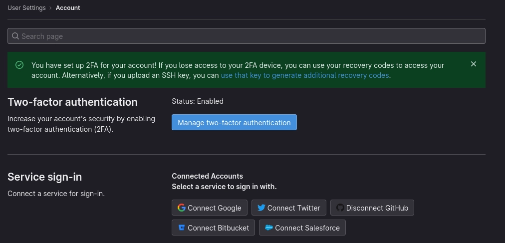
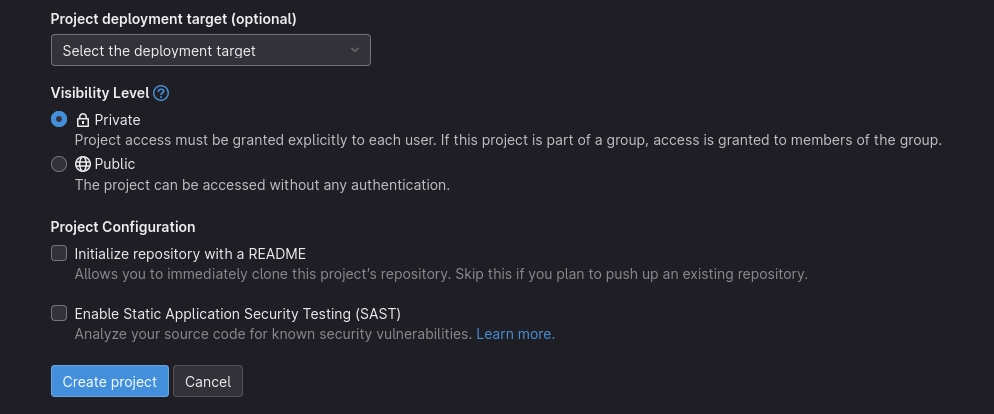
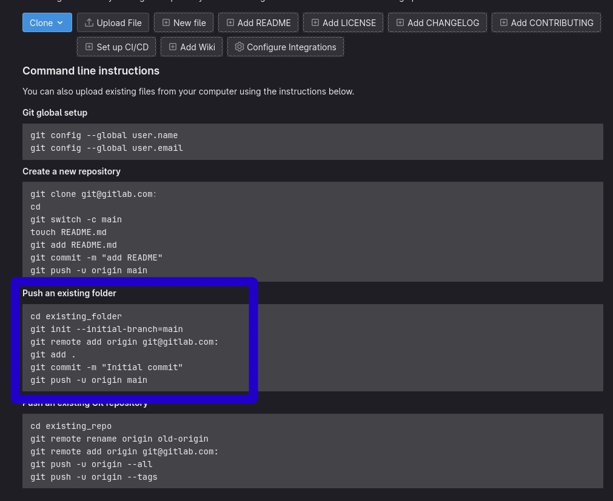
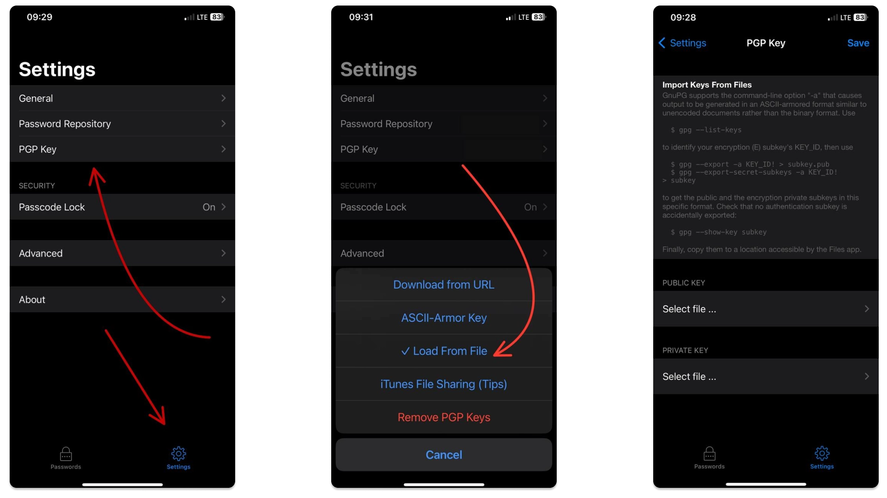
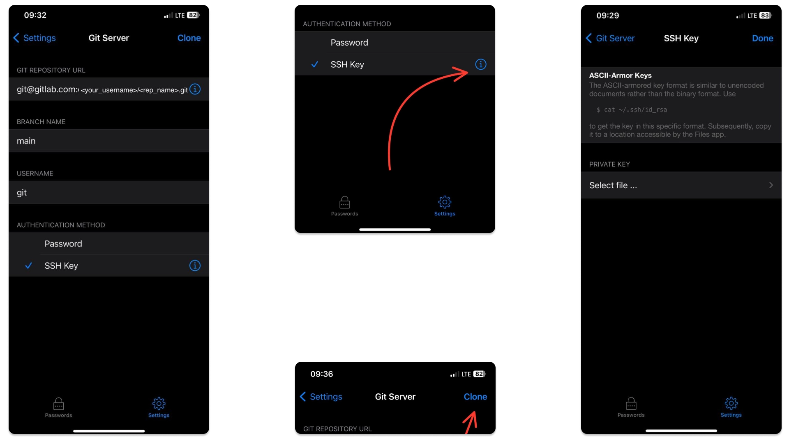

В этой заметке мы разберемся, как нам безопасно хранить все свои пароли и каким образом снизить 
вероятность взлома своих аккаунтов.

## Вода по теме безопасности

Цифровая гигиена достаточно скучная тема для среднего потребителя контента, но все же привыкли 
мыть руки после 2020 года, так и в случае с digital-пространством эта рутина должна стать 
обыденностью.

Многие люди, когда в беседе могут быть упомянуты утечки данных или подтверждения того, что 
коммерческие корпорации, вроде Google, Apple, Microsoft, etc., используют ваши персональные данные 
в своих целях, могут сказать, мол, да пускай, мне скрывать нечего. Но, когда упоминаешь, что 
эти компании знают, что вы едите, какие покупки совершаете чаще всего, по каким сайтам 
передвигаетесь в течении дня, кто ваш круг общения, какие финансовые транзации совершаете, номера 
ваших карт, ваши адреса и многие другие чувствительные данные, которые мы тоннами передаём 
добровольно, меняя личное удобство и комфорт на свои данные — собеседник на секунду округляет 
глаза, но потом махает рукой, со словами "да и пофиг", теряя интерес к диалогу.

Для тех же, кому сохранность своих данных важнее, чем комфорт, я поделюсь одним способов хотя бы 
немного отодвинуть от себя надоедливого большого брата. Совсем отказаться от многих вещей сейчас 
не получится да и не захочется, но так мы хотя бы увеличим шансы не остаться с носом. 

При этом, как показала практика, никто не будет нести какую-либо ответственность за утечки ваших 
персональных данных. Ну, подумаешь, утекла база на несколько миллионов человек у какой-то 
доставки или такси...

Между тем утечек все больше, например [тут](https://tech.co/news/data-breaches-updated-list),
[тут](https://www.cshub.com/attacks/articles/the-biggest-data-breaches-and-leaks-of-2022), или вот 
[тут](https://kod.ru/6718).

Вместе с сливами ваших данных, которые могут быть попросту агрегированы из открытых источникв 
(предположим, бот ходит по всем открытым страницам социальных сетей и собирает дату), могут быть 
слиты и связки login-password, что уже куда опаснее, чем просто знание, сколько котиков вы 
лайкнули вчера вечером. Если за то, что вы лайкаете только белых котиков, вам могут предъявить 
зоозащитники, то вот за утерю доступа до своих аккаунтов уже можно поплатиться из своего кармана.

Если на утечки баз данных мы не можем непосредственно влиять (разве что перестать кормить данными эти сервисы), 
то вот урон от утечек баз данных с паролями мы можем свести на нет.

### Как мои аккаунты могут быть взломаны

Существует множество способов взлома учетных записей, какие-то из них уже устарели и не дадут 
никаких результатов, какие-то слишком медленные и тоже не особо результативны, а какие-то 
маловероятны, но могут давать 100% результат.

Перечислять все способы бессмысленно, потому что кроме брутфорса в лоб или социальной инженерии 
существует как раз один из таких маловероятных, но эффективных методов — дамп базы данных с 
логинами и паролями. В случае утечки злоумышленник получает ваши пары login-password в 
хешированном виде, а если разработчик сервиса еще и не очень порядочный или попросту глуповатый 
человек, то пароли могли хранить в открытом виде.

Возникнет резонный вопрос — ну получил вот злоумышленник мой пароль и что? У меня двухфакторная 
авторизация по SMS или приложение для генирации кодов, типа _Google Authenticator_. И это не 
гарантирует 100% защиты, 
[и вот почему](https://www.howtogeek.com/310418/why-you-shouldnt-use-sms-for-two-factor-authentication/). 
А в случае утери доступа к Google-аккаунту вы потеряете еще и доступ к приложению с кодами. 

### Почему важно иметь разные пароли

Первый эшелон защиты — один пароль для одного сервиса. Если вы пользуетесь 1-5 сервисами, то 
пароли еще можно запомнить, но будем реалистами. Тем более лучше всего попросту генерировать и 
составлять из различных последовательностей свой уникальный пароль, который будет обезличен и у 
злоумышленника не будет возможность попросту отождествляя ваш аккаунт с вами методом тыка угадать 
ваш `Fluffy19-CaT2022`.

Перед нами встаёт задача как-то оперативно управлять нашими паролями, при необходимости изменять 
их и запоминать, потому что сгенерировав новый пароль вида `Asd7_634--sc(324)?` вы его помните 
ровно 0 секунд.

Как вариант, вы заходите начать использовать различные сервисы для хранения ваших паролей, ведь 
они гарантируют сохранность и приватность ваших данных, например iCloud, 
Google/Firefox/Any\_browser хранилки. Но спешу вас предостеречь, что эти сервисы не могут вам 
гарантировать на 100% сохранность ваших данных, они не будут вам гарантировать перманентный доступ 
до ваших паролей в любое время и в любой момент вы можете попросту потерять все свои данные по 
прихоти владельца сервиса.

## Как будем хранить пороли

Первым делом мы унесем все ключи шифрования и связки login-password на локальную машину, что бы только вы были 
ответственны за сохранность этих данных. Хранить пароли в .txt файлике очень плохая идея, потому 
что мы получаем ровно туже самую картину, что в случае утери файла с вашими паролями злоумышленник 
имеет все нужные ему данные для входа, потому что пароли были в открытом виде.

Первым шагом было бы логично предположить — шифровать пароли, хешировать или еще как-то прятать 
данные от глаз.

Вторым шагом — спрятать пары login-password вообще в целом от простого доступа, но что бы это 
было локально, на вашем компьютере или смартфоне, что бы никто, кроме вас, не управлял этим файлом.

Выход из ситуации простой — менеджер паролей Pass.

## Pass — лучший менеджер паролей

Для своих целей мы будем использовать open-source менеджер [Pass](https://www.passwordstore.org/). 

Цитата с сайта:


Управление паролями должно быть простым и соответствовать философии Unix. С pass, каждый пароль 
живет внутри gpg зашифрованный файл, имя файла которого является названием веб-сайта или ресурса, 
для которого требуется пароль. Эти зашифрованные файлы могут быть организованы в значимые иерархии 
папок, скопированы с компьютера на компьютер и, в общем, управляться с помощью стандартных утилит 
управления файлами командной строки.


По сути Pass это bash скрипт, который использует для шифрования [GnuPG](https://gnupg.org/).

### Создаем ключи шифрования

```bash
gpg --full-gen-key
```

Будет преложен алгоритм шифрования:

```bash
Please select what kind of key you want:
   (1) RSA and RSA
   (2) DSA and Elgamal
   (3) DSA (sign only)
   (4) RSA (sign only)
   (9) ECC (sign and encrypt) *default*
  (10) ECC (sign only)
  (14) Existing key from card
```

Выбираем `RSA`, вводим `1`.

Далее нам предлагают ввести длину ключа:

```bash
RSA keys may be between 1024 and 4096 bits long.
What keysize do you want? (3072)
```

Вводим 4096.

Далее нас спрашивают о сроке жизни ключа, я указал бессрочный (0):

```bash
Please specify how long the key should be valid.
         0 = key does not expire
      <n>  = key expires in n days
      <n>w = key expires in n weeks
      <n>m = key expires in n months
      <n>y = key expires in n years
Key is valid for? (0) 0
Key does not expire at all
Is this correct? (y/N) y
```

Следом нас просят ввести реальное имя и почту (можно вводить вообще любые данные, главное, чтобы 
вы их помнили сами), и дополнительный пароль для доступа к ключам.

Что бы внести больше рандомизации в генерацию ключей, нас попросят нажимать всякие кнопки и 
двигать курсором: 

```bash
We need to generate a lot of random bytes. It is a good idea to perform
some other action (type on the keyboard, move the mouse, utilize the
disks) during the prime generation; this gives the random number
generator a better chance to gain enough entropy.
```

Делаем это и получаем свои ключи:

```bash
gpg: /home/<username>/.gnupg/trustdb.gpg: trustdb created
gpg: directory '/home/<username>/.gnupg/openpgp-revocs.d' created
gpg: revocation certificate stored as '/home/<username>/.gnupg/openpgp-revocs.d/<cert_name>.rev'
public and secret key created and signed.

pub   rsa4096 2022-01-15 [SC]
      <cert_name>
uid                      <your_name> <email@mail.com>
sub   rsa4096 2022-01-15 [E]
```

Чтобы удостовериться, что наши ключи созданы, вводим:

Показать все публичные ключи:

```bash
gpg -k
```

Показать все приватные ключи:

```bash
gpg -K
```

Так как gpg использует ассиметричное шифрование, то публичные ключи позволяют нам зашифровать 
данные, а приватные ключи позволяют нам расшифровать данные.

Через gpg можно зашифровать любой файл, который будет невозможно прочесть без приватных ключей. 
Но нам нужно шифровать только пароли, так что поиграемся с этим как-нибудь в другой раз.

### Учимся пользоваться Pass

Инициализируем хранилище паролей, указав идентификатор наших ключей:

```bash
pass init email@mail.com
```

Добавим свой первый пароль:

```bash
pass insert <site_name>
```

Вводим дважды пароль и всё, наш первый пароль сохранен в зашифрованном хранилище.

Его можно посмотреть, набрав:

```bash
pass <site_name>
```

Нас попросят ввести пароль для доступа к ключам, после этого ваш пароль будет отображен.

Если набрать просто `pass`, то мы получим список имен паролей, например:

```bash
Password Store
├── notion.so
└── openai.com
```

Вот весь список команд:

```bash
--clip  -c  -- put it on the clipboard
cp          -- Copy the password
edit        -- Edit a password with $EDITOR
find        -- Find password files or directories based on pattern
generate    -- Generate a new password using pwgen
git         -- Call git on the password store
grep        -- Search inside decrypted password files for matching pattern
--help      -- Output help message
help        -- Output help message
init        -- Initialize new password storage
insert      -- Insert a new password
ls          -- List passwords
mv          -- Rename the password
rm          -- Remove the password
show        -- Decrypt and print a password
version     -- Output version information
```

Мы также можем хранить не только лишь пароль, но и связки login-password и различную другую 
информацию, для этого добавляем ключ `-m`

```bash
pass insert mysite.com -m
```

Если я не хочу выводить куда-либо пароль, а просто хочу поместить его в буфер обмена, я сделаю вот 
так:

```bash
pass mysite.com -c

# Copied mysite.com to clipboard. Will clear in 45 seconds.
```

## Перенос паролей и ключей на другие устройства

Эти пароли можно загружать даже в git-репозиторий, потому что они зашифрованы и ключи есть только 
у вас, но если вы не хотите выгружать их куда-то в сеть, скармливая их тем же Microsoft, тогда вам 
скорее всего захочится бекапить время от времени эти пароли куда-то на флешку или на телефон.

Для этого нужно нужно сначала сделать экспорт ключей, потому что без них это бесполезные файлы.

### Экспорт и импорт ключей

Публичный ключ, где email@mail.com ваш идентификатор, который вы указывали с именем:

```bash
gpg --export -a email@mail.com > pub_email.gpg
```

Приватный ключ:

```bash
gpg --export-secret-key -a email@mail.com > sec_email.gpg
```

Здесь ключ `-a` просит gpg экспортировать наши ключи в [ASCII](https://en.wikipedia.org/wiki/ASCII), в 
человеко-читаемом виде. Если вы не хотите, чтобы кто-то мог в принципе открыть и прочитать ключи каким-то текстовым 
редактором, то просто уберите ключ `-a`.

Чтобы импортировать ключи:

```bash
gpg --import pub_email.gpg && gpg --import sec_email.gpg
```

### Синхронизация с мобильными устройствами

#### Решаем вопрос с движением паролей между устройствами

Тут есть 3 пути:
- Свой git-сервер в своей локальной сети, доступ к которому будет под VPN (тогда вам не придется орендовать IP у 
провайдера);
- Свой git-сервер где-нибудь у Digital Ocean или Selectel, например;
- Приватный репозиторий на gitlab.

Думаю очевидно, что варианты идут по нисходящей в отношении приватности, но каждый из вариантов способен обеспечить 
достаточный уровень надежности, ключи шифрования только у вас, а загружать в git вы будете зашифрованные файлы.

Попробуем идти от простого к сложному, начнем с приватного репозитория + `passforios` для телефона.

##### Синхронизация через GitLab

Первым делом заводим аккаунт, генерируем ssh-ключ, включаем двухфакторную авторизацию и вот это вот всё. 

С регистрацией у вас не должно возникать проблем, поговорим только о генерации ssh-ключей для доступа по ssh:

1. [Генерируем ssh-ключи](https://docs.gitlab.com/ee/user/ssh.html):

```bash
ssh-keygen -t rsa -b 2048 -C "<your_email@email.com>"
```

2. Прокидываем ключи в агент:

```bash
eval $(ssh-agent -s)
```

```bash
ssh-add ~/.ssh/id_rsa
```

3. Копируем публичный ключ:

```bash
cat ~/.ssh/id_rsa.pub
```

4. Идем вот [сюда](https://gitlab.com/-/profile/keys) и вставляем всё в поле `Key`

Далее в обязательном порядке включаем двухфакторную авторизацию вот [тут](https://gitlab.com/-/profile/account).



Наш аккаунт готов, создаем приватный репозиторий [тут](https://gitlab.com/projects/new#blank_project), выбираем тип 
в поле _Visibility Level_ __PRIVATE__.



5. Теперь у нас есть приватный репозиторий и можно инициализировать локальный репозиторий, попутно сославшись на 
внешний. Все инстукции есть на странице созданного репозитория, нас интересует следующее:



Ознакомились, проворачиваем следующую штуку:

```bash
cd ~/.password-store \
    && git init --initial-branch=main \
    && git remote add origin git@gitlab.com:<your_username>/<repos_name>.git \
    && git add . \
    && git commit -m "Initial commit" \
    && git push -u origin main
```

6. Наши зашифрованные пароли лежат в закрытом репозитории. Отлично! Теперь пора синхронизироваться с телефоном. Я покажу 
это на примере iOS и приложение [passforios](https://mssun.github.io/passforios/). 
[Устанавливаем его](https://apps.apple.com/us/app/pass-password-store/id1205820573).

Будьте внимательны, на третей строке, где мы добавляем ссылку на удаленный репозиторий, вам нужно указать своё имя 
пользователя и имя репозитория.

7. Добавляем ключи шифрования в приложение Pass на iOS. Для этого следуем инструкциям на скриншоте:



На последнем скриншоте есть инструкция по экспорту sub-key. Подобное мы [делали выше](#экспорт-и-импорт-ключей), но 
там мы экспортировали сами ключи, а здесь будут использоваться саб-ключи. Продублирую этот текст сюда, что бы было 
проще скопировать и экспортировать.

```bash
gpg --export -a <your_key_id> > ~/Documents/subkey.pub
```

```bash
gpg --export-secret-subkeys -a <your_key_id> > ~/Documents/subkey
```

Теперь эти ключи переносим на свой смартфон любым удобным способом (__только не через мессенеджеры!!!__). Я, например, 
перекидывал ключи через свой локальный ftp сервер. Вы можете перекинуть через NAS, если у вас есть, поднять ftp или 
samba-шару сделать. Короче, перенесите как угодно, только не через внешние сервисы.

8. Конфигурируем git-репозиторий, для этого следуем инструкции на скриншоте:



На этом шаге нам требуется указать ssh-ключ, и ссылку на репозиторий. Ключ для репозитория я советую сгенерировать еще 
один, конкретно для вашего приложения и добавить его  на gitlab. Как генерировать ключ для репозитория и добавлять его 
мы обсуждали [выше](#синхронизация-с-мобильными-устройствами) в п. 1. 

Когда вы добавите ssh-ключ и укажите ссылку на репозиторий посто нажимайте `Clone` и проверяйте. Всё должно работать и 
репозитории синхронизируются.

##### Свой Git-сервер на DigitalOcean

Все готово, мы молодцы! Теперь мы можешь углубиться и синхронизироваться через личный gitlab-сервер, который захостим, 
например, на Digital Ocean. Принцип настройки самой синхронизации останется таким же, только адрес репозитория будет 
другим. О том, как поднять свой личный gitlab сервер есть отличная статья от самих  
[Digital Ocean](https://www.digitalocean.com/community/tutorials/how-to-install-and-configure-gitlab-on-ubuntu-20-04), 
лучше и понятнее этих ребят я не напишу, так что позволю себе просто сослаться на них.


__Внимание!__ для GitLab заявлены требования в минимум 4Гб оперативной памяти на сервере, так что имейте это ввиду, 
когда будете поднимать дроплет. Ценник получается слегка кусачий, так что держите эту информацию в голове.


Также, если будете пользоваться услугами Digital Ocean не забывайте про мою реферальную ссылку!

DigitalOcean предлагает реферальную программу, сделка будет честной, вам $100-$200 на 2 месяца, 
мне $25. За это время вы успеете попрактиковаться с облачными тулами, может быть решите разместить 
там свой проект. При регистрации вас попросят внести $6 на свой депозит, чтобы подтвердить, что 
вы реальный пользователь. Это цена дроплета на месяц.

Реферальная ссылка: [](https://www.digitalocean.com/?refcode=321ec44407f8&utm_campaign=Referral_Invite&utm_medium=Referral_Program&utm_source=badge)

Регистрироваться по моей ссылке **вовсе не обязательно**. Этот текст не реклама и не промо. 
Как вариант вы можете использовать любой другой хостинг, который удобен или выгоден вам, но если у 
вас есть потребность отблагодарить меня за этот текст, то вы можете сделать это так, ну и получите 
себе бонус на 2 месяца.

##### Свой локальный Git-сервер

Если нет желание оплачивать сервер, то вы всегда можете купить какую-нибудь 
[Orange Pi (_Предпочтительнее_)](http://www.orangepi.org/), [Raspberry Pi](https://www.raspberrypi.com/) или что-то 
похожее, главное с 4Гб оперативной памяти на борту, арендовать у вашего провайдера статический IP-адрес (100-150 р в 
месяц) или же просто поднять VPN и собрать в одну сеть под VPN ваши железки. Вы повторив инструкцию по установке GitLab 
сервера устанавливаете всё на ваш одноплатник и всё. Это самый надежный вариант. Данные в этом случае пренадлежат только 
вам и никому больше. Если вы поднимаете VPN, то это будет еще надежнее, потому что вы не отсвечиваете статическим 
IP-адресом наружу.

#### Моё мнение по поводу синхронизации

Я считаю, что синхронизировать через gitlab.com мягко говоря не самая лучшая идея, несмотря на то, что если уведут 
файлы с паролями из репозиториев каким-то образом, их все равно не смогут расшифровать. Пока что =)

Не хотелось бы оказаться в ситуации, когда в срочном порядке приходится менять пароли на сотни сервисах. Но! __это всё 
еще гораздо безопаснее хранения паролей в iCloud, браузере или каком-либо сервисе__! Это может быть первым шагом к 
вашей цифровой гигиене.

Я, очевидно, только за локальное хранение данных на своём личном маленьком сервере. Но часто это неудобно, для многих 
вообще бессмысленно и непонятно, но хранить пароли на сервере Digital Ocean или Selectel практически также безопасно, 
но выходит дороговато.

Выбор за вами, все три варианта имеют смысл и обеспечивают безопасное хранение ваших паролей. Какие-то удобнее, но чуть 
менее безопасные, какие-то сложнее, но более безопасные.

## Аддоны и приложения для Pass

- [passmenu](https://git.zx2c4.com/password-store/tree/contrib/dmenu) - клиент для dmenu
- [qtpass](http://qtpass.org/) - GUI клиент на C++ и Qt 
- [Android-Password-Store](https://github.com/zeapo/Android-Password-Store#readme) - Android клиент
- [passforios](https://mssun.github.io/passforios/) - iOS клиент
- [pass-ios](https://github.com/davidjb/pass-ios#readme) - iOS клиент (old)
- [passff](https://github.com/jvenant/passff#readme) - Аддон для FireFox
- [browserpass](https://github.com/dannyvankooten/browserpass#readme) - Аддон для Chrome
- [Pass4Win](https://github.com/mbos/Pass4Win#readme) - Windows клиент
- [gopass](https://github.com/cortex/gopass#readme) - GUI клиент на Go
- [pass.applescript](https://git.zx2c4.com/password-store/tree/contrib/pass.applescript) - OSX клиент

## Комментарии по статье

Все комментарии, вопросы и советы оставляйте под [этой записью](https://t.me/owlpawgram/12) в 
[telegram-канале](https://t.me/owlpawgram).

## Благодарности серому волшебнику

Если текст был полезен и ты не можешь усмирить желание быть благодарным, то вот мои кошелечки (USDT и TRX кошельки одинаковые, да, это не ошибка):

**Tether (TRC-20, USDT):**

```markdown
TYvFYUV3h5HwqfyTxskGQK7nDbUHTcwPn2
```

**Tron (TRX):**

```markdown
TYvFYUV3h5HwqfyTxskGQK7nDbUHTcwPn2
```

**Monero (XMR):**

```markdown
4AbxbT9vrNQTUDCQEPwVLYZq2zTEYzNr9ZzTLaq9YcwVfdxwkWjZ6FsewuXVDXPk7x2rE6FZACmLePPgJEcY4rm1GSHkwTZ
