Настроим свежую машину с Fedora38 для комфортной работы разработчика.

## Быстрый старт

Кому не интересно читать всю заметку, вот список пакетов необходимых для работы. Для остальных же
— устанавливаем все пакеты и идем разбираться ниже, что для чего и как это настраивать.

### Обновляем репозитории и ставим пакеты

Включаем все репозитории, в том числе и с проприетарным ПО, таким как драйверы видеокарт Nvidia, если это не было сделано при установке:

Идем в Software, далее следуем скриншотам:

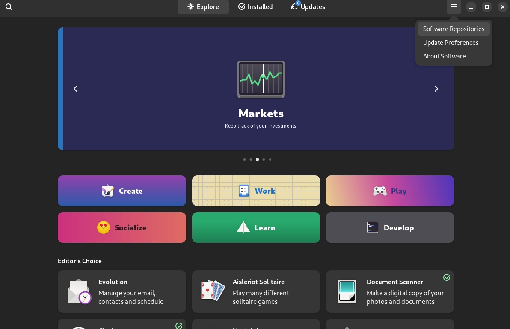

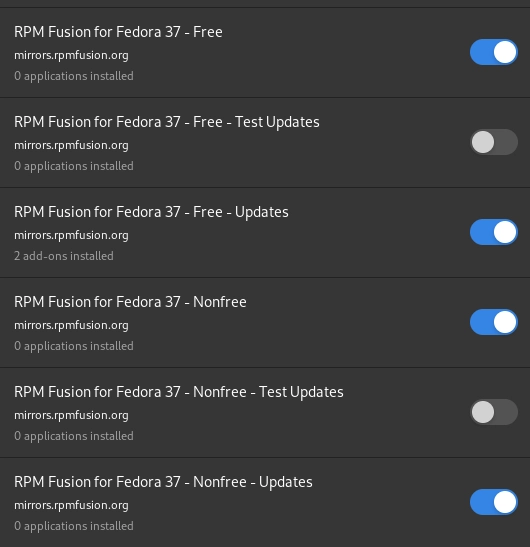

Включаем [Flatpak](https://www.flatpak.org/setup/Fedora), отсюда мы будем ставить львиную долю ПО, которая ищется на flathub.org:

```bash
flatpak remote-add --if-not-exists flathub https://dl.flathub.org/repo/flathub.flatpakrepo
```

Обновляем репозитории:

```bash
sudo dnf update -y
```

Ставим нужные пакеты:

```bash
sudo dnf install -y git tmux tree zsh ranger screen neovim duf bat make htop
```

### Docker, docker-compose

Ставим docker и docker-compose:

```bash
sudo dnf remove docker \
                docker-client \
                docker-client-latest \
                docker-common \
                docker-latest \
                docker-latest-logrotate \
                docker-logrotate \
                docker-selinux \
                docker-engine-selinux \
                docker-engine

sudo dnf -y install dnf-plugins-core

sudo dnf config-manager \
    --add-repo \
    https://download.docker.com/linux/fedora/docker-ce.repo

sudo dnf install docker-ce docker-ce-cli containerd.io docker-compose-plugin
```

### Установка кодеков

```bash
sudo dnf install gstreamer1-plugins-{bad-\*,good-\*,base} gstreamer1-plugin-openh264 gstreamer1-libav --exclude=gstreamer1-plugins-bad-free-devel
```

```bash
sudo dnf install lame\* --exclude=lame-devel
```

```bash
sudo dnf group upgrade --with-optional Multimedia
```

### Твикаем Gnome-4\*

Установим gnome-tweak и подкрутим некоторые штуки:

```bash
sudo dnf install gnome-tweaks
```

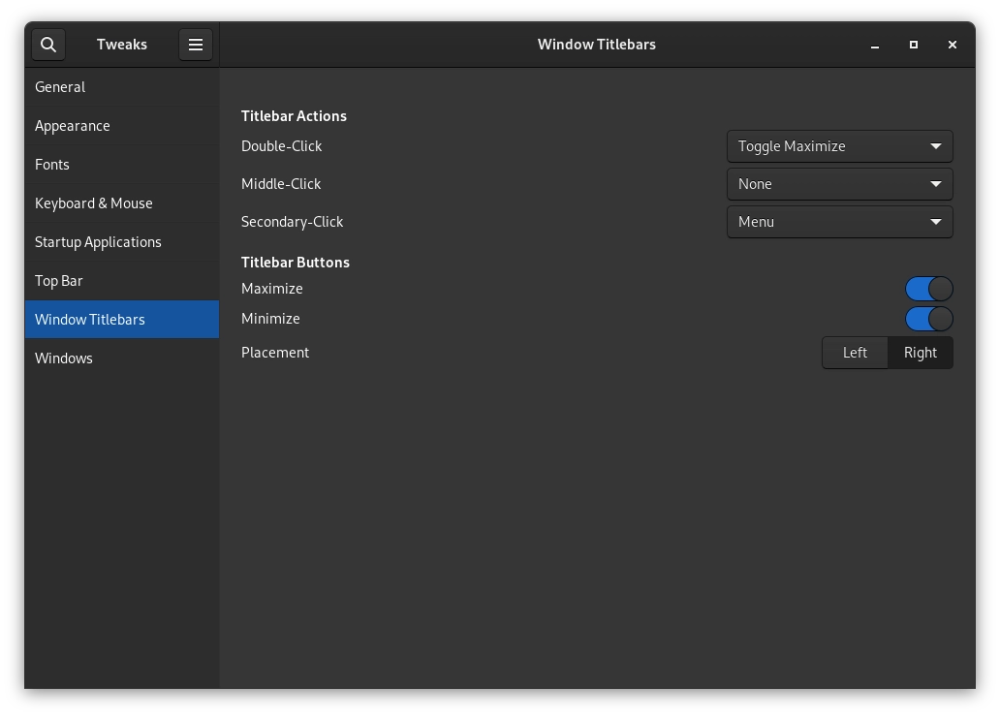

И включаем для Legacy окон принудительно нашу тему:

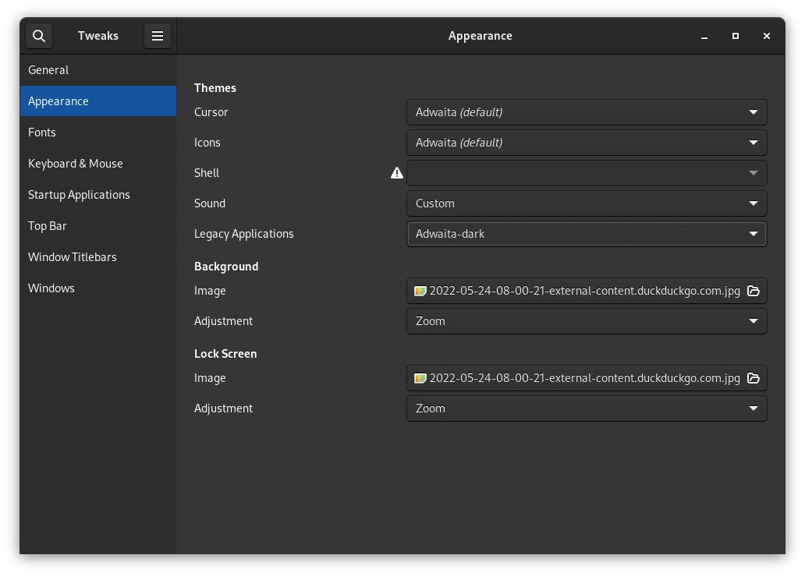

Устанавливаем менеджер расширений и сами расширения:

```bash
flatpak install flathub com.mattjakeman.ExtensionManager
```

Мой список расширений:

- [AppIndicator and KStatusNotifierItem Support](https://extensions.gnome.org/extension/615/appindicator-support/);
- [Status Area Horizontal Spacing](https://extensions.gnome.org/extension/355/status-area-horizontal-spacing/);
- [Vitals](https://extensions.gnome.org/extension/1460/vitals/).

Сами расширения можно поискать [тут](https://extensions.gnome.org/).

### .net core и ruby для разработчиков

Всё, что ниже — опционально, потому что это все можно запускать в Docker, не засоряя вашу машину,
но мне иногда больше нравится играться с CLI ruby или что-то быстренько пробовать с .net вне
докер-образа.

Ставим .NET (.net core 7)

```bash
sudo dnf install dotnet-sdk-7.0
```

Ставим Ruby:

```bash
sudo dnf install ruby

sudo dnf install rubygem-{tk{,-doc},rake,irb,test-unit}
```

## Терминал — общаемся с машиной текстом

Часто нужно сделать что-то простое, вроде создания новой папки или файла, а GUI для того зачастую
ужасно неудобные, например, в Windows, в их Explorer, нужно ткнуть в свободно место правой кнопкой
мыши, выбрать `Create new folder`, ввести название файла и тд. Пример высосан из пальца, но
смотрите, как быстро я сделаю это в терминале:

```bash
mkdir <new_dir_name>
```

Или, если нам понадобилось добавить много вложенных папок, мы можем использовать ключ -p:

```bash
mkdir -p <dir_1>/<dir_2>/<dir_n>
```

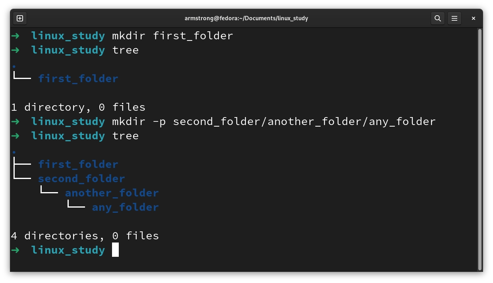

Или, вот уже более полезный пример, мне часто нужно конвертировать .png изображения в .webp, но
я не хочу их конвертировать по одному или как-то еще, я просто хочу сказать компьютеру о своих
намерениях и всё, например, сконвертируй все файлы с расширением .png в .webp, которые ты найдешь
в этой папке, но... я забыл эту команду, там было что-то с .png... Не беда, терминал дружелюбен:

```bash
history | grep .png
```

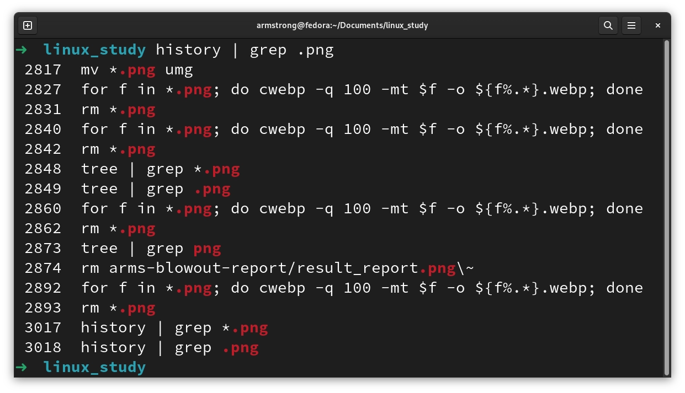

Нашли нужную, выполним:

```bash
for f in *.png; do cwebp -q 100 -mt $f -o ${f%.*}.webp; done
```

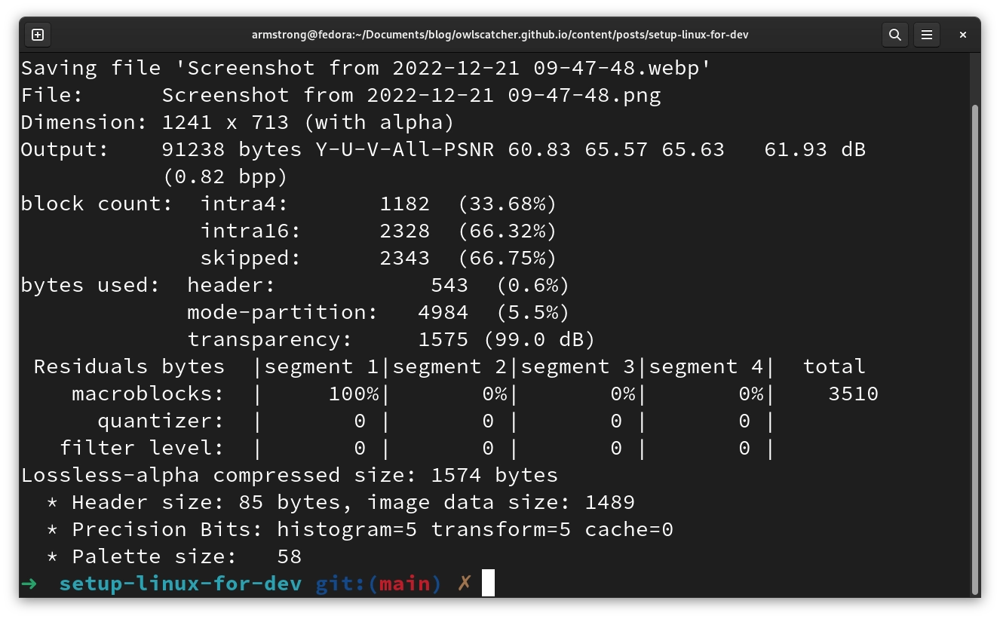

Столько воды для того, что бы убедить вас, что терминал — ваш друг. Не надо бояться и искать
красивые GUI, чтобы клацать по ним _манипулятором типа мышь_ © [Диджитализируй](https://www.youtube.com/c/%D0%94%D0%B8%D0%B4%D0%B6%D0%B8%D1%82%D0%B0%D0%BB%D0%B8%D0%B7%D0%B8%D1%80%D1%83%D0%B9)

### Oh-my-ZSH

Стандартно у вас установлен [Bash](https://www.gnu.org/software/bash/). Мы же поставим
[ZSH](https://www.zsh.org/) и твикнем его надстройкой [Oh-my-zsh](https://ohmyz.sh/).

Установим Oh-my-ZSH:

```bash
sh -c "$(curl -fsSL https://raw.githubusercontent.com/ohmyzsh/ohmyzsh/master/tools/install.sh)"
```

Oh-my-ZSH предложит выбрать по умолчанию ZSH-шелл. Выбираем. Закрываем терминал и все, все круто.

Если вдруг открывается опять Bash, назначаем руками шеллом по умолчанию для вашего юзера ZSH:

```bash
chsh -s $(which zsh)
```

Проверяем, установился ли по умолчанию у нашего юзера нужный шелл:

```bash
grep $USER /etc/passwd
```

Должны получить это:

```bash
<username>:x:1000:1000:Armstrong:/home/<username>:/usr/bin/zsh
```

#### Настройки Oh-my-ZSH

Файл настроек Oh-my-ZSH лежит в директории `~/.zshrc`, можете отредактировать его любым текстовым
редактором и перечитать (команда `source <dir>/<file_name>`), чтобы применить настройки.ш

Для примера прокинем какой-нибудь удобный alias для терминала:

```bash
echo "alias glog=\"git log --pretty=oneline\"" >> ~/.zshrc \
    source ~/.zshrc
```

## Всякие повседневные удобности

### duf — показывает, сколько рыбоф еще поместится на hdd/ssd

Иногда нужно посмотреть, сколько осталось свободного места, а вызывать тот же `nautilus` и клацать мышью по примонтированным устройствам
не очень удобно.

Для просмотра свободного и занятого дискового пространства обычно предустановлен `df`, используется просто:

```bash
df -h
```

Вывод будет примерно таким

```bash
Filesystem      Size  Used Avail Use% Mounted on
devtmpfs        4.0M     0  4.0M   0% /dev
tmpfs           7.7G  4.7M  7.7G   1% /dev/shm
tmpfs           3.1G  2.0M  3.1G   1% /run
/dev/nvme0n1p8  180G   75G  102G  43% /
tmpfs           7.7G  2.9M  7.7G   1% /tmp
/dev/nvme0n1p6  511M   18M  494M   4% /boot/efi
tmpfs           1.6G  156K  1.6G   1% /run/user/1000
/dev/sr0        5.2M  5.2M     0 100% /run/media/<username>/<device_title>
```

Не очень наглядно и тяжело ориентироваться (я отсюда еще половину всяких `/loop0n` убрал, чтобы меньше путаницы было). Если красивая
альтернатива [duf](https://github.com/muesli/duf). Делает все тоже самое, только аккуратнее и понятнее:

```bash
duf
```

```bash
╭───────────────────────────────────────────────────────────────────────────────────────────────────────────────────────────╮
│ 9 local devices                                                                                                           │
├────────────────────────────────────┬────────┬────────┬────────┬───────────────────────────────┬──────────┬────────────────┤
│ MOUNTED ON                         │   SIZE │   USED │  AVAIL │              USE%             │ TYPE     │ FILESYSTEM     │
├────────────────────────────────────┼────────┼────────┼────────┼───────────────────────────────┼──────────┼────────────────┤
│ /                                  │ 179.4G │  74.5G │ 101.7G │ [########............]  41.5% │ btrfs    │ /dev/nvme0n1p8 │
│ /boot/efi                          │ 511.0M │  17.4M │ 493.6M │ [....................]   3.4% │ vfat     │ /dev/nvme0n1p6 │
│ /run/media/<username>/<device>     │   5.2M │   5.2M │     0B │ [####################] 100.0% │ iso9660  │ /dev/sr0       │
╰────────────────────────────────────┴────────┴────────┴────────┴───────────────────────────────┴──────────┴────────────────╯
╭────────────────────────────────────────────────────────────────────────────────────────────────╮
│ 5 special devices                                                                              │
├────────────────┬──────┬────────┬───────┬───────────────────────────────┬──────────┬────────────┤
│ MOUNTED ON     │ SIZE │   USED │ AVAIL │              USE%             │ TYPE     │ FILESYSTEM │
├────────────────┼──────┼────────┼───────┼───────────────────────────────┼──────────┼────────────┤
│ /dev           │ 4.0M │     0B │  4.0M │                               │ devtmpfs │ devtmpfs   │
│ /dev/shm       │ 7.7G │   4.6M │  7.6G │ [....................]   0.1% │ tmpfs    │ tmpfs      │
│ /run           │ 3.1G │   2.0M │  3.1G │ [....................]   0.1% │ tmpfs    │ tmpfs      │
│ /run/user/1000 │ 1.5G │ 152.0K │  1.5G │ [....................]   0.0% │ tmpfs    │ tmpfs      │
│ /tmp           │ 7.7G │   2.9M │  7.6G │ [....................]   0.0% │ tmpfs    │ tmpfs      │
╰────────────────┴──────┴────────┴───────┴───────────────────────────────┴──────────┴────────────╯
```

Уже куда красивее и понятнее!

Всю справку можно получить по `duf -h`, либо же почитать _README.md_ в [репозитории автора](https://github.com/muesli/duf).

### bat — красиво вывести текстовый очень файл

Для того, чтобы посмотреть содержимое текстового файла, можно сделать так:

```bash
cat ~/.bashrc
```

Вывод будет читаемый, но не очень удобный и без навигации. `less` тоже не слишком удобный будет для этих целей, хотя и тот и тот инструменты
очень шустрые и 100% выполняют свои задачи. Всему этому есть очень прикольная альтернатива с vim-подобным управлением, которая называется
[bat](https://github.com/sharkdp/bat).

Ну что, попробуем:

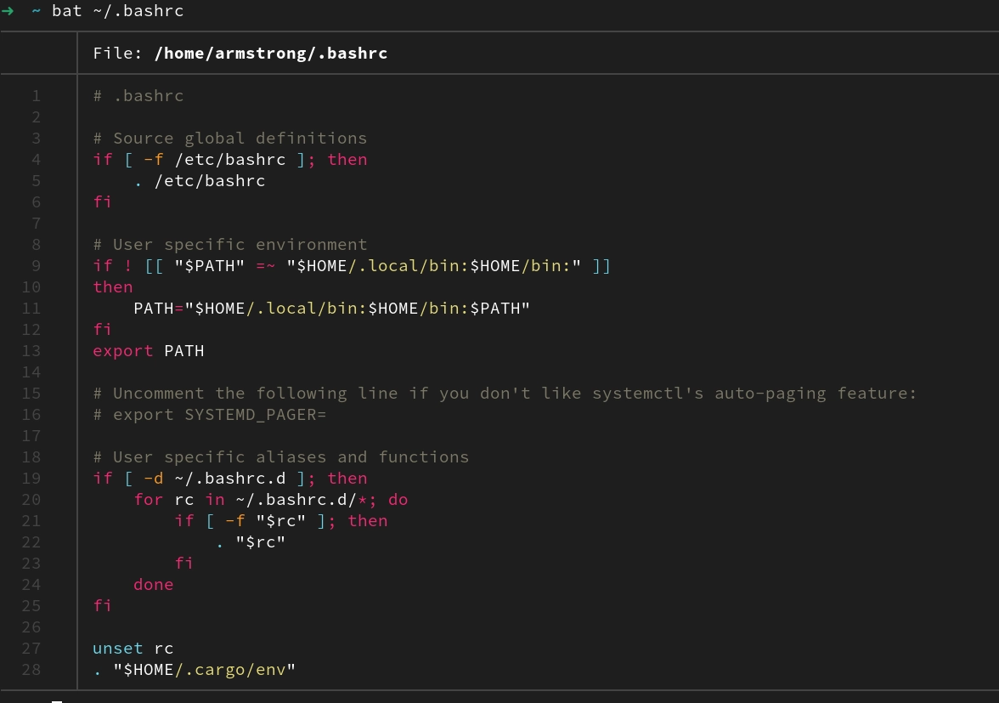

_Ommm, So pretty good!_ Навигация `jk` работает, и всякие комбинации `Shift + g`, `g`, поиск по `/<word>` и тд, которые работают в vim
для навигации также работают. Если будучи в `bat` назать `h`, то вы попадете в справку по навигации в `bat`. Не поленитесь почитать ее,
либо посмотреть в [репозитории автора](https://github.com/sharkdp/bat).

### htop — отобразить нагрузку и процессы

Есть такая утилита, как `top`, она предустановлена во всех системах и показывает нагрузку на систему и запущенные процессы. Отображает,
как это водится, не в очень удобном формате.

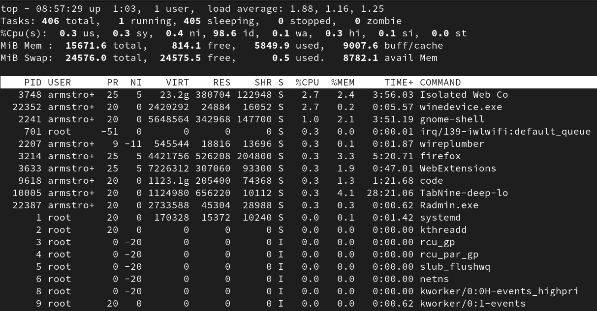

Инструмент мощный, и всё в нем есть в целом, но... Мы будем пользоваться [htop](https://github.com/htop-dev/htop).

Не вижу смысла особо подробно останавливаться на этой утилите, вот вам 2 картинки, как оно смотрится и погнали дальше.

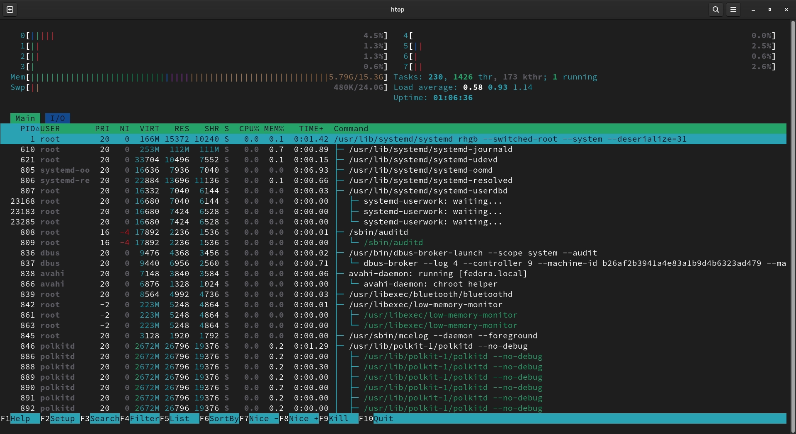

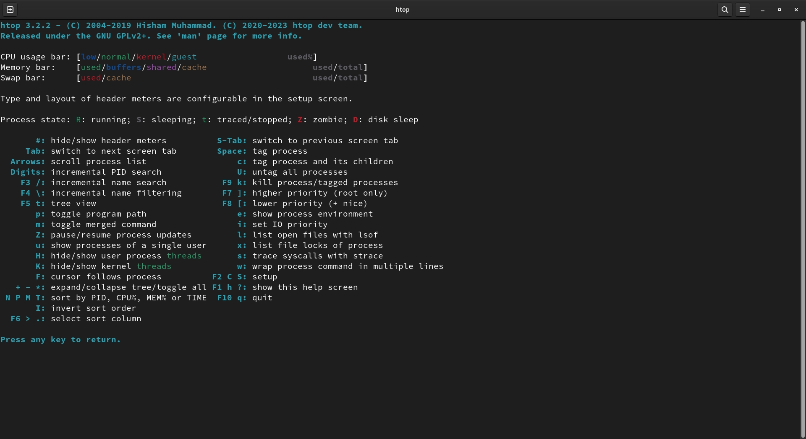

## Git, расскажем о себе

[Git](https://git-scm.com/) **должен** уметь использовать любой разработчик. Но не все
озадачиваются чуть-чуть его поднастроить.

Расскажем git наше имя и нашу почту, чтобы условный gitlab или github матчил наш аккаунт с нашими
коммитами, а то бывает, что коммитят будто бы два разных человека.

```bash
git config --global user.name "<Your> <Name>"

git config --global user.email "<your_email>"
```

Чтобы посмотреть настройку, просто добавляем `--get`:

```bash
git config --global --get user.name
```

## NeoVim — переосмысление VI и VIM

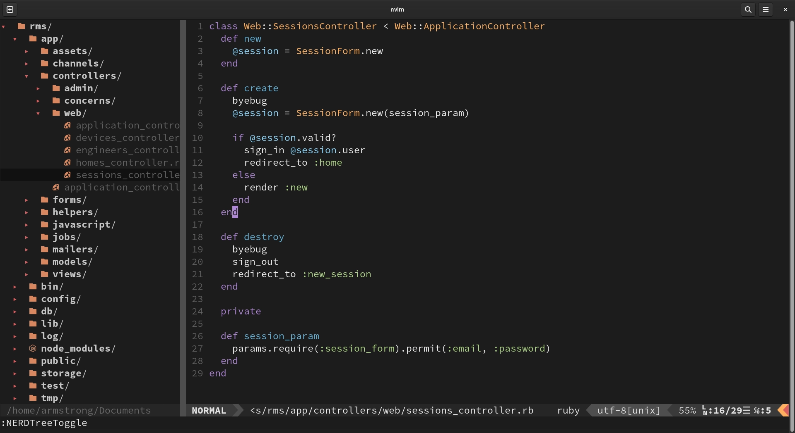

_Тут еще одна шутка о том, что кто-то опять не смог выйти из VIM._

Безусловно можно исопльзовать любой редактор кода, хоть тот же
[VScode](https://code.visualstudio.com/). Все это легко устанавливается на Fedora. Но я хочу
привести несколько аргументов в пользу "неудобного" на первый взгляд любого VIM-подобного редактора:

- Однообразие рабочего пространства. Нам, как разработчикам, приходится работать как на сервере,
  так и на своей рабочей машине. VIM есть на любой linux-машине. Научившись 1 раз работать с ним, мы
  никогда не сядем в лужу, когда нам срочно понадобится твикнуть какой-то конфиг руками прям на
  сервере.
- Скорость. VIM крайне шустрый. Дурацкий пример, но все же: попробуйте загрузить JSON-файл на
  20-30 тысяч строк в VScode или какой-то другой редактор, а потом еще и поиском попробуйте
  воспользоваться.
- VIM очень гибкий. На него, как и на VScode, можно навесить очень много разных плагинов, очень
  точно настроить сам view-port редактора или вовсе переназначить хоткеи. С появлением LSP
  надобность в IDE с их [IntelliSence](https://learn.microsoft.com/en-us/aspnet/web-forms/videos/building-35-applications/intellisense) вообще отпадает.
- Существует много программ с VIM-подобным управлением, например Ranger. Так что знание VIM
  никогда не будет чем-то бесполезным.

Теперь перейдем к настройке. Мы не будем использовать ванильный Vi или VIM, а поставили форк от VIM
который называется [NeoVim](https://neovim.io/).

Создадим файл настроек NeoVim:

```bash
touch ~/.config/nvim/init.vim
```

Предварительно поставим [PlugInstall](https://github.com/junegunn/vim-plug), через него мы будим
устанавливать плагины для NeoVim:

```bash
sh -c 'curl -fLo "${XDG_DATA_HOME:-$HOME/.local/share}"/nvim/site/autoload/plug.vim --create-dirs \
       https://raw.githubusercontent.com/junegunn/vim-plug/master/plug.vim'
```

И [шрифт](https://github.com/ryanoasis/nerd-fonts#font-installation), который нужен для плагина
[devicons](https://github.com/ryanoasis/vim-devicons):

```bash
mkdir -p ~/.local/share/fonts

cd ~/.local/share/fonts && curl -fLo "Droid Sans Mono for Powerline Nerd Font Complete.otf" https://github.com/ryanoasis/nerd-fonts/raw/HEAD/patched-fonts/DroidSansMono/complete/Droid%20Sans%20Mono%20Nerd%20Font%20Complete.otf
```

Далее предлагаю вставить мой конфиг (который я, кстати, тоже где-то подрезал):

Откроем наш файл конфигурации:

```
nvim ~/.config/nvim/init.vim
```

Вставляем это:

```bash
" We start by installing Vim plugin manager to manage plugins.
" A Lot of customizations doen here.
if empty(glob('~/.vim/autoload/plug.vim'))
  silent !curl -fLo ~/.vim/autoload/plug.vim --create-dirs
    \ https://raw.githubusercontent.com/junegunn/vim-plug/master/plug.vim
  autocmd VimEnter * PlugInstall --sync | source $MYVIMRC
endif

call plug#begin('~/.vim/plugged')
Plug 'preservim/nerdtree' " Left file-tree pannel
Plug 'ryanoasis/vim-devicons' " Language icon for file
Plug 'vim-airline/vim-airline' " Bottom info pannel
Plug 'flazz/vim-colorschemes'
Plug 'vim-airline/vim-airline-themes'
Plug 'ervandew/supertab'
Plug 'neoclide/coc.nvim', {'branch': 'release'}
Plug 'puremourning/vimspector'
Plug 'prettier/vim-prettier', { 'do': 'npm install' , 'branch' : 'release/1.x' }
Plug 'dense-analysis/ale'
" LSP servers
Plug 'OmniSharp/omnisharp-vim' " LSP server form .net
"Fuzzy Search
Plug 'junegunn/fzf', { 'do': { -> fzf#install() } }
Plug 'junegunn/fzf.vim'
Plug 'valloric/MatchTagAlways'
Plug 'jiangmiao/auto-pairs'
call plug#end()

:map <C-n> :NERDTreeToggle<CR>
:map <C-p> :GFiles<CR>
:map <C-f> :Files<CR>
"collapse json files by themselves.
:map <C-j> :set filetype=json \| :syntax on \| :set foldmethod=syntax
"zo for open
"zc for close

" Auto indent your file.
map <F7> gg=G<C-o><C-o>
" Navigate Tabs
map <C-t><up> :tabr<cr>
map <C-t><down> :tabl<cr>
map <C-t><left> :tabp<cr>
map <C-t><right> :tabn<cr>

" Supprot for different goto definitions for different file types.
autocmd FileType cs nmap <silent> gd :OmniSharpGotoDefinition<CR>
autocmd FileType cs nnoremap <buffer> <Leader>fu :OmniSharpFindUsages<CR>
autocmd FileType cs nnoremap <buffer> <Leader>fi :OmniSharpFindImplementations<CR>
autocmd FileType cs nnoremap <Leader><Space> :OmniSharpGetCodeActions<CR>

autocmd FileType ts nmap <silent> gd :call CocActionAsync('jumpDefinition')<CR>
autocmd FileType html nmap <silent> gd :call CocActionAsync('jumpDefinition')<CR>


" The following commands are contextual, based on the cursor position.
" autocmd FileType cs nnoremap <buffer>
" autocmd FileType cs nnoremap <buffer> <Leader>fs :OmniSharpFindSymbol<CR>
let g:vimspector_enable_mappings = 'HUMAN'
let g:airline_powerline_fonts=1
let g:tmuxline_powerline_separators = 0

" colorscheme Monokai
colorscheme minimalist
let g:airline_theme='minimalist'
set colorcolumn=120
set number
" set relativenumber

" Toggle relative line number
nmap <C-L><C-L> :set norelativenumber<CR>
map  <C-R><C-L> :set relativenumber<CR>

set encoding=utf-8
scriptencoding utf-8
let g:airline#extensions#tmuxline#enabled = 0

" How tab behaves while picking auto complete.
let g:SuperTabMappingForward = '<S-Tab>'
let g:SuperTabMappingBackward = '<Tab>'

:set tabstop=4
:set shiftwidth=4
:set expandtab

set clipboard+=unnamedplus
" Move Swap Directory to something temporary.
set directory^=$HOME/tempswap//

" This directory should exist.
" Always enable preview window on the right with 60% width
let g:fzf_preview_window = 'right:60%'

" vim wiki settings.
set nocompatible
filetype plugin on
syntax on
let g:vimwiki_list = [{'path': '~/vimwiki/',
                      \ 'syntax': 'markdown', 'ext': '.md'}]


if executable('ag')
  " Use Ag over Grep
  set grepprg=ag\ --nogroup\ --nocolor

  " Use ag in CtrlP for listing files. Lightning fast and respects .gitignore
"   let g:ctrlp_user_command = 'ag %s -l --nocolor -g ""'
endif
" ctrl+p when you move to a file this highlights it.
let g:nerdtree_sync_cursorline = 1


" Use K to show documentation in preview window.
nnoremap <silent> K :call <SID>show_documentation()<CR>

function! s:show_documentation()
  if (index(['vim','help'], &filetype) >= 0)
    execute 'h '.expand('<cword>')
  else
    call CocAction('doHover')
  endif
endfunction


" Read gitignore and dont show relevant files in ctrlp.
" let g:ctrlp_user_command = ['.git/', 'git --git-dir=%s/.git ls-files -oc --exclude-standard']
let g:prettier#config#parser = 'babylon'
" hi Normal ctermbg=none
"
" For Coc Action Menu to work.
" Remap for do codeAction of selected region
function! s:cocActionsOpenFromSelected(type) abort
  execute 'CocCommand actions.open ' . a:type
endfunction
xmap <silent> <leader>a :<C-u>execute 'CocCommand actions.open ' . visualmode()<CR>
nmap <silent> <leader>a :<C-u>set operatorfunc=<SID>cocActionsOpenFromSelected<CR>g@

let g:ale_linters_ignore = {
      \   'typescript': ['tslint'],
      \}

let g:ale_linters = {
\ 'cs': ['OmniSharp']
\}

let g:OmniSharp_server_use_net6 = 1
```

Сохраняем и перечитываем файл, для этого используем команды vim. Чтобы ввести команду, нужно нажать
`:` и далее ввести шорткод. В нашем случае вводим `w` от `write`, нажимаем `enter`, затем вводим
команду `so %`, чтобы перечитать файл. На все ошибки пока не обращаем внимание, нажимаем `enter`,
пока они не пропадут.

Установим все плагины, которые мы указали в конфигуракции: `:PlugInstall`.

Установим [LSP-сервер](https://github.com/OmniSharp/Omnisharp-vim) для netcore: `:OmniSharpInstall`

Все, вам VIM готов. Хорошо бы почитать все шорткоды для установленных плагинов, например для
[NerdTree](https://github.com/preservim/nerdtree) открыть / закрыть панель будет `CTRL + n` и тд.

## Ranger — VIM-подобный файловый менеджер

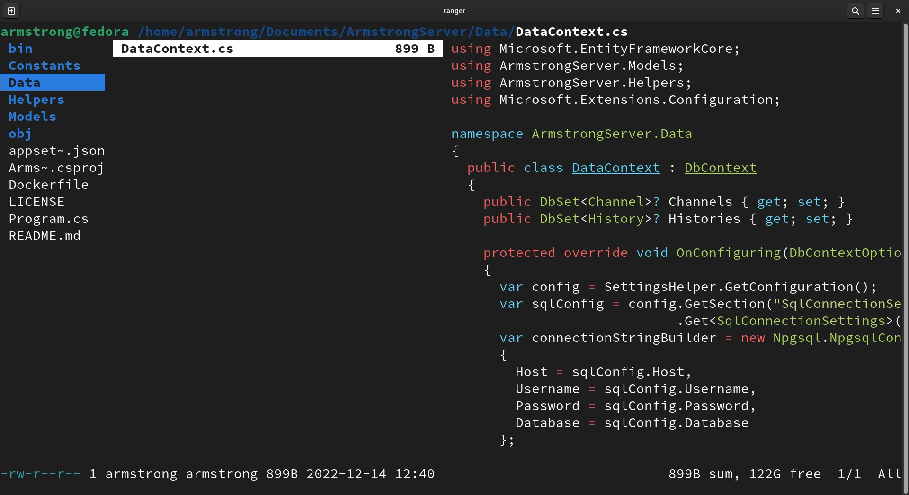

Ranger очень удобный файловый менеджер, который управляется примерно также, как и VIM. Он удобен
тем, что его, как и VIM, очень легко настроить под свои нужны, например мы хотим включить
предпросмотр .pdf файлов, картинок и тд.

### Включаем предпросмотр изображений и .pdf на Wayland

А не включите вы его, если у вас Wayland по умолчанию, вот [issues](https://github.com/ranger/ranger/issues/1476), который был закрыт со
словами, что `imv` был принят,как просмотрщик по умолчанию в 2019 году еще, что сейчас там поменялось или нет, я не совсем в курсе, так что
никаких превью картинок.

## Docker — исправление проблем

Docker по умолчанию не запущен при старте системы. Исправляем это:

Добавляем вашего пользователя в группу Docker:

```bash
usermod -a -G docker $USER
```

Добавляем Docker в автозагрузку:

```bash
sudo systemctl enable docker
```

## Благодарности серому волшебнику

Если текст был полезен и ты не можешь усмирить желание быть благодарным, то вот мои кошелечки (USDT и TRX кошельки одинаковые, да, это не ошибка):

**Tether (TRC-20, USDT):**

```markdown
TYvFYUV3h5HwqfyTxskGQK7nDbUHTcwPn2
```

**Tron (TRX):**

```markdown
TYvFYUV3h5HwqfyTxskGQK7nDbUHTcwPn2
```

**Monero (XMR):**

```markdown
4AbxbT9vrNQTUDCQEPwVLYZq2zTEYzNr9ZzTLaq9YcwVfdxwkWjZ6FsewuXVDXPk7x2rE6FZACmLePPgJEcY4rm1GSHkwTZ
```
