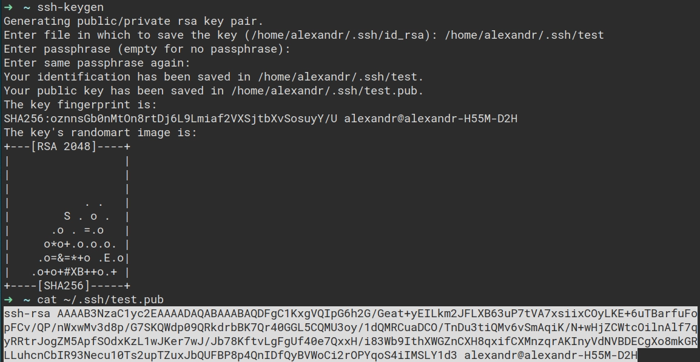

Разберемся, как поднять свой VPN и почему это нужно было сделать еще вчера.

## Что такое VPN и WireGuard

[VPN](https://access.redhat.com/documentation/en-us/red_hat_enterprise_linux/5/html/deployment_guide/ch-vpn) ( англ. Virtual Private Network «виртуальная частная сеть») — обобщённое название 
технологий, позволяющих обеспечить одно или несколько сетевых соединений поверх другой сети, 
например Интернет. Часто используется для объединения в локальную сеть нескольких устройств, 
которые физически не располагаются в одной сети.

[Wireguard](https://www.wireguard.com/) это чрезвычайно простая, но быстрая и современная VPN, 
использующая современную криптографию. Первоначально выпущенный для ядра Linux, теперь он является 
кроссплатформенным (Windows, macOS, BSD, iOS, Android) и широко развертываемым. В настоящее время 
он находится в стадии интенсивной разработки, но уже может считаться самым безопасным, простым в 
использовании и простейшим VPN-решением в отрасли. Важно уточнить, что wireguard не является VPN в 
чистом виде. У него нет [обфускации трафика](https://wiki.iphoster.net/wiki/VPN_-_%D0%BE%D0%B1%D1%84%D1%83%D1%81%D0%BA%D0%B0%D1%86%D0%B8%D1%8F_%D1%82%D1%80%D0%B0%D1%84%D0%B8%D0%BA%D0%B0_-_%D1%87%D1%82%D0%BE_%D1%8D%D1%82%D0%BE_%D1%82%D0%B0%D0%BA%D0%BE%D0%B5) 
(для этого можно дополнить наш сервер прокси-сервером 
[Shadowsocks](https://github.com/shadowsocks)). Wireguard следует unix-way идеологии: он выполняет 
ровно одну задачу и выполняет её хорошо. Очень хорошая статья, поясняющая unix-way 
[тут](https://www.technewsworld.com/story/The-Unix-Way-86879.html).

Разговор не идет про OpenVPN, потому что это устаревшее, громоздское и менее производительное 
решение, которое, к тому же, сильно сложнее настроить.

## Настройка сервера на DigitalOcean

Для начала нам понадобится сервер, где расположится wireguard. Как вариант я использую 
[DigitalOcean](https://www.digitalocean.com/). Помимо DigitalOcean есть куча сервисов, которые 
предложат вам аналогичные услуги, к примеру, тот же [Selectel](https://selectel.ru/), у которого 
есть датацентры за границей. Что именно выбирать определитесь сами, главный критерий — сервер 
**не на территории страны**, откуда вы выходите в сеть.

Как оплатить сервер DigitalOcean я рассказываю в 
[статье о крипте](https://owlpaw.com/blog/crypto-visa/), в которой затрагивают тему как 
прямой оплаты криптой ([bitlaunch](https://bitlaunch.io/)), так и visa-картой, пополненной через 
крипту. 

### Регистрация по реферальной ссылке

DigitalOcean предлагает реферальную программу, сделка будет честной, вам $100-$200 на 2 месяца, 
мне $25. За это время вы успеете попрактиковаться с облачными тулами, может быть решите разместить 
там свой проект. При регистрации вас попросят внести $6 на свой депозит, чтобы подтвердить, что 
вы реальный пользователь. Это цена дроплета на месяц.

Реферальная ссылка: [](https://www.digitalocean.com/?refcode=321ec44407f8&utm_campaign=Referral_Invite&utm_medium=Referral_Program&utm_source=badge)

Регистрироваться по моей ссылке **вовсе не обязательно**. Этот текст не реклама и не промо. 
Как вариант вы можете использовать любой другой хостинг, который удобен или выгоден вам, но если у 
вас есть потребность отблагодарить меня за этот текст, то вы можете сделать это так, ну и получите 
себе бонус на 2 месяца.

### Настройка безопасности

После регистрации вам станет доступна панель управления. Настроим безопасный доступ до наших 
серверов посредством добавления [SSH](https://en.wikipedia.org/wiki/Secure_Shell)-ключа. 
Проходим в Settings ⇨ Security ⇨ Add SSH key


После клика по Add SSH key следуем инструкции:

```bash
ssh-keygen
cat ~/.ssh/id_rsa.pub
```

В моём примере я указываю абсолютный путь до ключа и 
называю его test, потому что у меня уже были сгенерированы `id_rsa` ключи 
(так они называются по умолчанию).



Копируем весь ключ и вставляем в нужное поле.


Ключ добавлен. Теперь мы можем подключаться к серверу по ssh.

### Создание дроплета

Переходим к созданию непосредственно нашего сервера. В DigitalOcean эти серверы принято называть 
дроплет (droplet, англ.: капля). Следуем в Droplets ⇨ Create ⇨ Droplets.


Теперь просто следуем моим скриншотам. Нам требуется:

- Choose an image: Ubuntu 20.04 (или новее, но 
[LTS](https://ubuntu.com/blog/what-is-an-ubuntu-lts-release))
- Choose a plan: Basic (за $5-$6)
- Choose a datacenter region: Frankfurt (или ближайший к вам)
- Authentication: SSH keys (установлено по умолчанию, если нет - выбираем руками сами)
- Choose a hostname: wireguard (можно любое, это ни на что не влияет)
- Кликаем Create Droplet


Создастся ваш новый дроплет (может пару секунд придется подождать), копируем его IP-адрес, и идем 
в терминал (можно использовать терминал прям там, указано зеленой стрелочкой)


Я же в моём случае подключусь через терминал по ssh. Это 
не принципиально, как удобнее, так и делайте. Если вы будете 
подключаться через ssh из терминала, то это будет выглядить вот так:

```bash
ssh root@<SERVER_IP_ADDRESS>
```

Где вместо `<SERVER_IP_ADDRESS>` надо подставить IP-адрес вашего дроплета. Его можно скопировать у 
дроплета в, кхм... списке дроплетов.

## Настраиваем WireGuard

Мы на сервере. Первым делом нам нужно обновить всё, чтобы 
иметь актуальную версию операционной системы, затем установить сам 
wireguard и qrencode (последний нам нужен для генерирования QR-кода, 
чтобы быстро подключать телефон без возни с конфигом).

Итак, обновляемся и устанавливаем всё нужное (просто по очереди копируем команды в терминал и 
выполняем):

```bash
apt update && apt upgrade -y
apt install wireguard qrencode -y
echo "net.ipv4.ip_forward=1" >> /etc/sysctl.conf
```

Когда все установится можно дополнительно проверить, что 3-й шаг у нас точно выполнился:

```bash
sysctl -p
```

Мы должны увидеть следующее:

```bash
net.ipv4.ip_forward = 1
```

Переходим к настройке самого сервера wireguard.

### Настраиваем сервер

Первым делом нам нужно сгенерировать ключи, так как наш wireguard-сервер использует симметричное 
шифрование:

```bash
wg genkey | tee /etc/wireguard/privatekey | wg pubkey | tee /etc/wireguard/publickey
```

Ключи будут сгенерированы по пути `/etc/wireguard`, на данный момент в этой папке будут лежать 
`privatekey` и `publickey`. Их содержимое нам понадобится дальше.
Сразу скопируйте куда-нибудь содержимое `privatekey`, получаем его таким образом:

```bash
cat /etc/wireguard/privatekey
```

Следом нужно создать файл конфигурации wireguard-сервера:

```bash
vim /etc/wireguard/wg0.conf
```

У вас откроется редактор vim, нажимаем `i` и вставляем туда эту настройку (`ctrl + shift + v`):

```bash
[Interface]
Address = 10.0.0.1/24
PostUp = iptables -A FORWARD -i %i -j ACCEPT; iptables -t nat -A POSTROUTING -o eth0 -j MASQUERADE
PostDown = iptables -D FORWARD -i %i -j ACCEPT; iptables -t nat -D POSTROUTING -o eth0 -j MASQUERADE
ListenPort = 51820
PrivateKey = <PRIVATEKEY>
```

Ключ вставлять надо без `< >`, просто после "равно" вставляете ваш скопированный приватный ключ и 
всё. Здесь и далее справедливо это правило.

Теперь, чтобы сохранить настройку и выйти из vim нажимаем `ESC` или `ctrl + [`, далее `ctrl + :` 
и вводим `wq`. Редактор сохранит файл и закроется, вернув вас обратно в терминал.

Запускаем интерфейс и сам сервис:

```bash
wg-quick up wg0
systemctl enable wg-quick@wg0
```

Проверяем, работает ли сама служба:

```bash
systemctl status wg-quick@wg0
```

Скорее всего будет гореть серым, это значит что не стартовало. Прибьём интерфейс и перезапустим 
службу:

```bash
wg-quick down wg0
systemctl start wg-quick@wg0
```

Убеждаемся, что служба поднялась и все работает:

```bash
systemctl status wg-quick@wg0
```


Если все хорошо, переходим к добавлению клиентов (peer)

### Добавляем первый peer

Сервер крутится, VPN мутится. Осталось добавить наших 
клиентов, которые смогут подключаться. Добавление клиентов производится 
просто правкой конфига с добавлением секции [Peer].

Генерируем новые ключи, например, для ios пользователя (тут отличий никаких, процесс для любого 
пира одинаковый)

```bash
wg genkey | tee /etc/wireguard/ios_privatekey | wg pubkey | tee /etc/wireguard/ios_publickey
```

Сразу же куда-нибудь скопируем публичный ключ:

```bash
cat /etc/wireguard/ios_publickey
```

Открываем снова наш конфиг:

```bash
vim /etc/wireguard/wg0.conf
```

Как мы уже знаем, нажимаем `i` для перехода в режим ввода, делаем отступ в одну строку от основной 
настройки и добавляем такую секцию

```bash
[Peer]
PublicKey = <IOS-СLIENT-PUBLIC-KEY>
AllowedIPs = 10.0.0.2/32
```

Вместо `<IOS-СLIENT-PUBLIC-KEY>` вставляем ваш `ios_publickey`. `AllowedIPs` здесь выбирается 
таким, чтобы не пересекался с другими пирами и адресом интерфейса, который у нас `10.0.0.1/24`, 
следующий пир будет, например, с адресом `10.0.0.3/32`, следующий `10.0.0.4/32` и тд. Теперь 
сохраняемся и выходим из vim (напомню чтобы сохранить настройку и выйти из vim нажимаем `ESC` или 
`ctrl + [`, далее `ctrl + :` и вводим `wq`. Редактор сохранит файл и закроется, вернув вас обратно 
в терминал).

После каждого изменения конфига нам нужно перезапускать сервис, сделаем это:

```bash
systemctl restart wg-quick@wg0
```

Так как в примере мы делаем настройку для iOS, то у нас есть удобный способ загрузить настройку 
через сканирование QR-кода. Этот файл настройки надо написать (по его примеру вы поймете, как 
настраивать руками конфигурации, какие ключи куда вставлять)

Для начала скопируем сразу некоторые ключи, которые нам понадобятся:

- IP-адрес вашего сервера (это тот, по которому вы подключились по ssh, его же можно скопировать 
из Droplets, вашего дроплета)
- содержимое ios_privatekey `cat /etc/wireguard/ios_privatekey`
- содержимое server_publickey `cat /etc/wireguard/publickey`

Создаем файл `vim /etc/wireguard/ios.conf` конфигурации с таким содержимым:

```bash
[Interface]
PrivateKey = <IOS_PRIVATE_KEY>
Address = 10.0.0.2/32
DNS = 8.8.8.8

[Peer]
PublicKey = <SERVER-PUBLICKEY>
Endpoint = <SERVER-IP>:51820
AllowedIPs = 0.0.0.0/0
PersistentKeepalive = 20
```

Адрес интерфейса должен быть такой же, как и адрес, указанный в peer AllowedIPs, потому у нас 
Address = 10.0.0.**2**/32

Вместо `<IOS_PRIVATE_KEY>`, `<SERVER-PUBLICKEY>` и `<SERVER-IP>` вставляем соответствующие ключи 
и IP-адрес.

Сохраняем файл и теперь устанавливаем на ваш iOS приложение 
[wireguard](https://apps.apple.com/ru/app/wireguard/id1441195209?l=en), аналогично будет и для 
Android, но я все это продублирую ниже, так что не запутаетесь.

Когда приложение установили, заходим в него, нажимаем `+` и выбираем *Create from QR code*, у вас 
откроется камера.

На сервере теперь генерируем QR-код:

```bash
qrencode -t ansiutf8 < /etc/wireguard/ios.conf
```

Сканируете сгенерированный QR-код и настройка сама добавится. Разрешаем управление вашими VPN.

Можем проверить на сервере, добавился ли наш пир:

```bash
wg show wg0
```


Всё, на вашем устройстве теперь можно использовать ваш личный VPN. Таким образом вы можете 
собрать все устройства в 1 локальную сеть и иметь к ним доступ, причем физически они не будут 
располагаться в одной сети.

## Настроим на наших устройствах подключение к WireGuard

С настройкой на некоторых устройствах есть нюансы. На Mac, iOS, Android подключение происходит 
просто через конфиг (телефоны и вовсе через QR-код, а на mac просто нужно указать на файл 
конфигурации), но на Linux не все так просто, там придется немного потанцевать, чтобы добавить в 
network-manager wireguard и тумблер для быстрого переключения. Опишу процесс настройки для всех 
устройств.

### iOS

На сервере:

- генерируем ключи
- добавляем новый пир
- пишем файл конфигурации
- генерируем QR-код

На телефоне:

- Устанавливаем приложение [wireguard](https://apps.apple.com/ru/app/wireguard/id1441195209?l=en)

Теперь развернуто.
Генерируем ключи:

```bash
wg genkey | tee /etc/wireguard/ios_privatekey | wg pubkey | tee /etc/wireguard/ios_publickey
```

Добавляем пир в файл конфигурации wireguard `vim /etc/wireguard/wg0.conf`:

```bash
[Peer]
PublicKey = <ANDROID-СLIENT-PUBLIC-KEY>
AllowedIPs = 10.0.0.3/32
```

Про `AllowedIPs` помним, что можем использовать любой из указанной подсети, главное чтобы не 
пересекался с другими пирами.

Создаем файл `vim /etc/wireguard/ios.conf` конфигурации с таким содержимым:

```bash
[Interface]
PrivateKey = <ANDROID_PRIVATE_KEY>
Address = 10.0.0.3/32
DNS = 8.8.8.8

[Peer]
PublicKey = <SERVER-PUBLICKEY>
Endpoint = <SERVER-IP>:51820
AllowedIPs = 0.0.0.0/0
PersistentKeepalive = 20
```

Генерируем QR-код:

```bash
qrencode -t ansiutf8 < /etc/wireguard/ios.conf
```

Сканируем код приложением на телефоне. Done!

### Android

На сервере:

- генерируем ключи
- добавляем новый пир
- пишем файл конфигурации
- генерируем QR-код

На телефоне:

- Устанавливаем приложение [wireguard](https://play.google.com/store/apps/details?id=com.wireguard.android&hl=ru&gl=US)

Теперь развернуто.
Генерируем ключи:

```bash
wg genkey | tee /etc/wireguard/android_privatekey | wg pubkey | tee /etc/wireguard/android_publickey
```

Добавляем пир в файл конфигурации wireguard `vim /etc/wireguard/wg0.conf`:

```bash
[Peer]
PublicKey = <ANDROID-СLIENT-PUBLIC-KEY>
AllowedIPs = 10.0.0.4/32
```

Про `AllowedIPs` помним, что можем использовать любой из указанной подсети, главное чтобы не 
пересекался с другими пирами.

Создаем файл `vim /etc/wireguard/android.conf` конфигурации с таким содержимым:

```bash
[Interface]
PrivateKey = <IOS_PRIVATE_KEY>
Address = 10.0.0.4/32
DNS = 8.8.8.8

[Peer]
PublicKey = <SERVER-PUBLICKEY>
Endpoint = <SERVER-IP>:51820
AllowedIPs = 0.0.0.0/0
PersistentKeepalive = 20
```

Генерируем QR-код:

```bash
qrencode -t ansiutf8 < /etc/wireguard/android.conf
```

Сканируем код приложением на телефоне. Done!

### Linux

Здесь все не так быстро и прытко, придеться немного писать руками, но, в целом, нет никаких 
сложностей.

У нас есть 2 пути:

1. Включать-Выключать vpn через терминальный шорткат, который мы пропишем в настройках .bashrc 
или .zshrc (на мой взгляд самый верный способ);
2. Включать-Выключать vpn тумблером через GUI (на случай, если вы настраиваете это всё 
родственникам, а не себе)

#### Управление через терминал

Для начала сделаем всё что нужно на самом сервере, а потом переходим к нашей linux-машине.
На сервере:

- генерируем ключи;
- добавляем новый пир.

На linux:

- устанавливаем WireGuard Tools;
- прокидываем шорткат для нашего шелла.

Теперь развернуто.
Генерируем ключи:

```bash
wg genkey | tee /etc/wireguard/linux_privatekey | wg pubkey | tee /etc/wireguard/linux_publickey
```

Добавляем пир в файл конфигурации wireguard `vim /etc/wireguard/wg0.conf`:

```bash
[Peer]
PublicKey = <LINUX-СLIENT-PUBLIC-KEY>
AllowedIPs = 10.0.0.7/32
```

Про `AllowedIPs` помним, что можем использовать любой из указанной подсети, главное чтобы не 
пересекался с другими пирами.

Теперь переходим к настройке linux-машины:

Установим WireGuard Tools:

Debian / Ubuntu

```bash
sudo apt install wireguard-tools
```

Fedora

```bash
sudo dnf install wireguard-tools
```

Arch / Manjaro

```bash
sudo pacman -S wireguard-tools
```

Вставляем конфиг нашего клиента сюда:

```bash
/etc/wireguard/wg0.conf
```

Сам конфиг будет аналогичный всем предыдущим:

```bash
[Interface]
PrivateKey = <LINUX_PRIVATE_KEY>
Address = 10.0.0.7/32
DNS = 8.8.8.8

[Peer]
PublicKey = <SERVER-PUBLICKEY>
Endpoint = <SERVER-IP>:51820
AllowedIPs = 0.0.0.0/0
PersistentKeepalive = 20
```

Теперь подключаться или отключаться можно будет простой командой:

```bash
wg-quick up wg0    # connect
wg-quick down wg0  # disconnect
```

Это не очень удобно. Cделаем чтобы команды имели вид `vpn-on` и `vpn-off`.

Открываем файл конфигурации вашего шелла (у меня .zshrc, т.к. я использую oh-my-zsh, у вас будет 
.bashrc или что-то еще)

```bash
vim ~/.zshrc
```

В самый конец файла дописываем строки:

```bash
alias vpn-on="wg-quick up wg0"
alias vpn-off="wg-quick down wg0"
```

Сохраняем и перечитываем файл, что бы изменения вступили в силу:

```bash
source ~/.zshrc
```

#### Управление через GUI

Разбирем на примере Ubuntu.

Если мы зайдем в network-manager, то обнаружим, что там нет wireguard. И даже, если вы установите 
его, все равно не появится.


Для того, чтобы исправить эту несправедливость, нужно немножко твикнуть наш GUI.

Устанавливаем необходимое:

```bash
sudo apt install wireguard git dh-autoreconf libglib2.0-dev intltool build-essential libgtk-3-dev libnma-dev libsecret-1-dev network-manager-dev resolvconf
```

Теперь скачиваем и собираем из исходников нужный апплет:

```bash
git clone https://github.com/max-moser/network-manager-wireguard
cd network-manager-wireguard
./autogen.sh --without-libnm-glib

./configure --without-libnm-glib --prefix=/usr --sysconfdir=/etc --libdir=/usr/lib/x86_64-linux-gnu --libexecdir=/usr/lib/NetworkManager --localstatedir=/var

make
sudo make install
```

Теперь переходим в network-manager и видим, что у нас появился wireguard. Создаем подключение:


И заполняем необходимые поля:


Где красным горит, я указал, что туда надо вписать. Это аналогично сonf-файлу. Копируем туда 
нужные ключи, IP-адрес сервера. Сохраняем, проверяем. В таскбаре должен появиться тумблер VPN.


### MacOS

Для Mac все почти так же, как для телефонов, только файл 
конфигурации создается на пользовательской машине и скармливается 
приложению. Порядок такой:

На сервере:

- генерируем ключи
- добавляем новый пир

На mac:

- пишем файл конфигурации
- устанавливаем приложение 
[wireguard](https://itunes.apple.com/us/app/wireguard/id1451685025?ls=1&mt=12)
- скармливаем его приложению wireguard

Теперь развернуто.
Генерируем ключи:

```bash
wg genkey | tee /etc/wireguard/mac_privatekey | wg pubkey | tee /etc/wireguard/mac_publickey
```

Добавляем пир в файл конфигурации wireguard `vim /etc/wireguard/wg0.conf`:

```bash
[Peer]
PublicKey = <MAC-СLIENT-PUBLIC-KEY>
AllowedIPs = 10.0.0.5/32
```

Про `AllowedIPs` помним, что можем использовать любой из указанной подсети, главное чтобы не 
пересекался с другими пирами.

На mac cоздаем файл `mac.conf` (где вам удобно) конфигурации с таким содержимым:

```bash
[Interface]
PrivateKey = <MAC_PRIVATE_KEY>
Address = 10.0.0.5/32
DNS = 8.8.8.8

[Peer]
PublicKey = <SERVER-PUBLICKEY>
Endpoint = <SERVER-IP>:51820
AllowedIPs = 0.0.0.0/0
PersistentKeepalive = 20
```

Переходим в wireguard и скармливаем ему конфигурацию. Всё, тумблер VPN появится у вас в 
network-manager.

### Windows

Для Windows все аналогично mac. Порядок такой:

На сервере:

- генерируем ключи
- добавляем новый пир

На windows:

- пишем файл конфигурации
- устанавливаем приложение 
[wireguard](https://download.wireguard.com/windows-client/wireguard-installer.exe)
- скармливаем его приложению wireguard

Теперь развернуто.
Генерируем ключи:

```bash
wg genkey | tee /etc/wireguard/win_privatekey | wg pubkey | tee /etc/wireguard/win_publickey
```

Добавляем пир в файл конфигурации wireguard `vim /etc/wireguard/wg0.conf`:

```bash
[Peer]
PublicKey = <win-СLIENT-PUBLIC-KEY>
AllowedIPs = 10.0.0.6/32
```

Про `AllowedIPs` помним, что можем использовать любой из указанной подсети, главное чтобы не 
пересекался с другими пирами.

На windows cоздаем файл `win.conf` (где вам удобно) конфигурации с таким содержимым:

```bash
[Interface]
PrivateKey = <WIN_PRIVATE_KEY>
Address = 10.0.0.6/32
DNS = 8.8.8.8

[Peer]
PublicKey = <SERVER-PUBLICKEY>
Endpoint = <SERVER-IP>:51820
AllowedIPs = 0.0.0.0/0
PersistentKeepalive = 20
```

Переходим в wireguard и скармливаем ему конфигурацию. Всё, тумблер VPN появится у вас в 
network-manager.

## Полезные ссылки

- [Что лучше выбрать: Wireguard или OpenVPN? Любимый VPN Линуса Торвальдса](https://habr.com/ru/company/ruvds/blog/537010/)
- [Точечный обход блокировок PKH на роутере с OpenWrt с помощью WireGuard и DNSCrypt](https://habr.com/ru/post/440030/)
- [Объяснение VPN обфускации](https://heritage-offshore.com/vpn-i-konfidencialnost/objasnenie-vpn-obfuskacii/)
- [Документация по WireGuard для роутеров Microtik](https://help.mikrotik.com/docs/display/ROS/WireGuard)
- [WireGuard on MikroTik RouterOS](https://kaspars.net/blog/wireguard-mikrotik-routeros)
- [Why is Free VPN Bad Idea?](https://gbksoft.com/blog/why-is-free-vpn-bad-idea/)
- [Worst VPN Warning List: Free VPN Scams in 2022](https://www.cloudwards.net/worst-free-vpn/)

## Благодарности серому волшебнику

Если текст был полезен и ты не можешь усмирить желание быть благодарным, то вот мои кошелечки 
(USDT и TRX кошельки одинаковые, да, это не ошибка):

**Tether (TRC-20, USDT):**

```markdown
TYvFYUV3h5HwqfyTxskGQK7nDbUHTcwPn2
```

**Tron (TRX):**

```markdown
TYvFYUV3h5HwqfyTxskGQK7nDbUHTcwPn2
```

**Monero (XMR):**

```markdown
4AbxbT9vrNQTUDCQEPwVLYZq2zTEYzNr9ZzTLaq9YcwVfdxwkWjZ6FsewuXVDXPk7x2rE6FZACmLePPgJEcY4rm1GSHkwTZ
```
