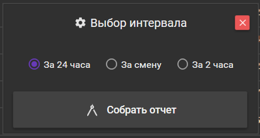
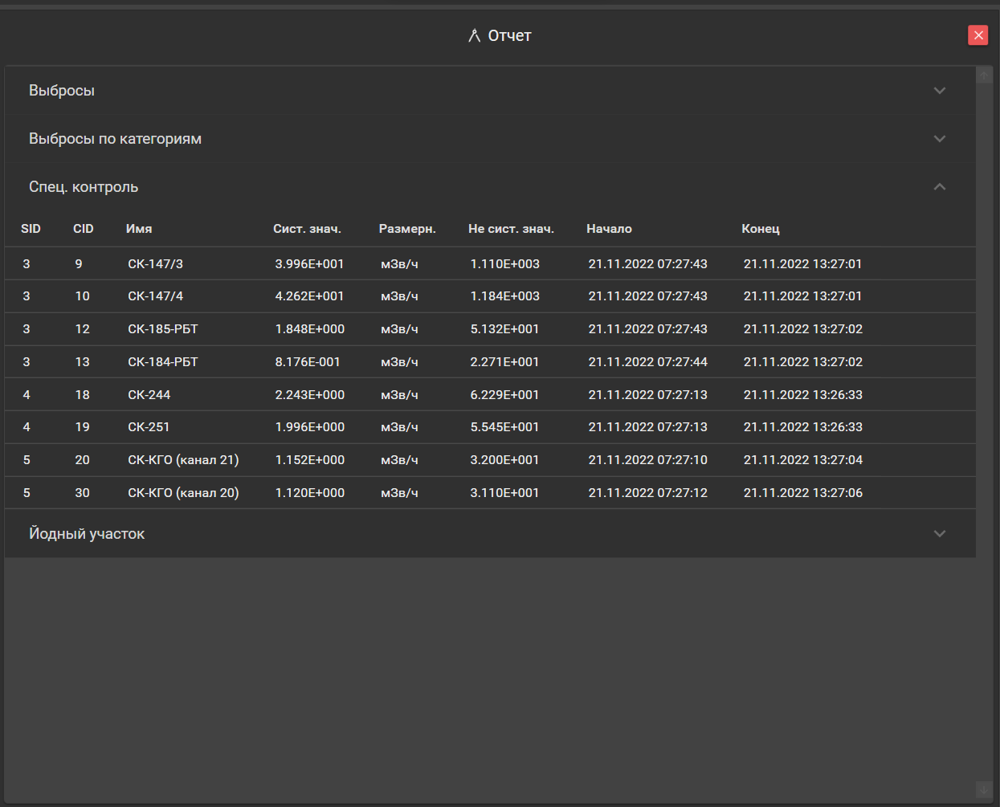

Рассказываю, как ARMStrong расчитывает выбросы через вентсистему и строит из них отчёты.




Контроль, контроль и еще раз контроль! Смотрим, какое количество активных газов мы выбрасываем, оцениваем их вес и формируем отчеты.



**Внимание!** Спасибо за внимание.


## Введение

На атомных, хим и металлургических предприятиях всегда требуется контроль за уровнем выхода активных веществ, которое сбрасывает предприятие. Эти уровни устанавливаются нормативными актами и не должны быть превышены.

На различных предприятиях отчетность ведётся по-разному, мы же разберем случай, когда есть оперативный контроллирующий персонал, который должен заносить запись об контроллируемой обстановке в оперативный журнал каждые _n_ часов, в начале смены или же посуточно.

Для этих целей был разработан небольшой модуль для клиента [ARMStrong](https://github.com/digital-armstrong/Armstrong.Client), который и будет формировать отчетность по выбрасываемым газам, средней активности на МЭД-точках контроля и \\(I\_{131}\\)-участке.

## Рассчитываем выбросы


**Для справки:** каждая точка представляет собой объект из истории измерений, который имеет три свойства: Id, SystemEventValuem и EventDateTime.


```csharp
public class History
{
    public int Id { get; }
    public double SystemEventValue { get; }
    public DateTime EventDateTime { get; }
}
```

Что бы вычислить, сколько _Бк_ было выброшено, нам нужно знать значение на момент начала расчёта, продолжительность выброса и значение на момент окончания расчёта. Значение на момент начала и окончания расчёта мы принимаем за \\(N_1\\) и \\(N_2\\) соответственно.

За продолжительность выброса мы возьмем \\(\Delta T\\), которая является просто разницей по времени между второй и первой точкой.

Таким образом для вычисления выброса нам требуется две точки и выброс будет расчитываться как:

\\(S = \dfrac{N_1 + N_2}{2} \Delta T\\)

Среднее по этим точкам мы берем по причине, что не представляется возможным предугадать, в какой момент времени между двумя соседними точками начался рост или спад. Минимальное время регистрации можно устанавливать в 2.5 секунды, но ввиду особенности блоков детектирования типа БДГБ-02П и подобных сокращать окно практически бессмысленно, это не приводит к увеличению точность.

Далее, чтобы вычислить суммарный расход, нужно просто просуммировать все результаты и умножить на расход по вентсистеме точки контроля.

Расход хранится в формате \\(\dfrac{м^3}{час}\\), поэтому требуется привести его к \\(\dfrac{м^3}{сек}\\), для этого просто разделим его на 3600.

Учитывая вышесказанное мы можем вывести формулу расчета выбросов и применить её в коде клиента:

\\(S_{sum} = (\sum{\dfrac{N_1 + N_2}{2} \Delta T}) C_{sec} \\), где:

- \\(S_{sum}\\) -- суммарный выброс по точке контроля, \\(Бк\\);
- \\(\dfrac{N_1 + N_2}{2}\\) -- среднее значение по двум точкам, \\(\dfrac{Бк}{м^3}\\)
- \\(\Delta T\\) -- длительность выброса \\(T_2 - T_1\\), \\(сек.\\);
- \\(C_{sec}\\) -- расход газа через вентсистему точки контроля \\(\dfrac{C_{hour}}{3600}\\), \\(\dfrac{м^3}{сек}\\).

Метод для расчета выбросов будет следующим:

```csharp
public double GetSystemBlowout(List<History> histories, Channel channel)
{
    double summaryBlowout, rawBlowoutSumm = 0;

    for (int i = 0; i < histories.Count - 1; i++)
    {
        DateTime firstPointDateTime = histories[i].EventDate;
        DateTime secondPointDateTime = histories[i + 1].EventDate;
        double deltaT = secondPointDateTime
                            .Substract(firstPointDateTime)
                            .TotalSeconds;

        double firstPointValue = histories[i].SystemEventValue;
        double secondPointValue = histories[i + 1].SystemEventValue;
        dobule averageValue = (firstPointValue + secondPointValue) / 2;

        rawBlowoutSumm += averageValue * deltaT;
    }

    double consumprion = channel.ChannelConsumption / 3600;
    summaryBlowout = rawBlowoutSumm * consumption;

    return summaryBlowout;
}
```

## Группируем выбросы по категориям

На данный момент группы были [захардкодены](https://en.wikipedia.org/wiki/Hard_coding), и выглядит это следующим образом:

```csharp
private void SetBlowoutReportCategory()
{
    int V1id = 275, V2id = 276, V3id = 277, V4id = 278, V4_id = 279, V5id = 280, V6id = 281, V7id = 282;

    int[] categoryI = new int[] { V1id, V7id };
    int[] categoryII = new int[] { V2id, V3id, V4_id, V5id };
    int[] categoryIII = new int[] { V6id };

    if (categoryI.Contains(Channel.Id))
    {
        BlowoutReportCategory = (int)BlowoutCategory.I;
    }
    else if (categoryII.Contains(Channel.Id))
    {
        BlowoutReportCategory = (int)BlowoutCategory.II;
    }
    else if (categoryIII.Contains(Channel.Id))
    {
        BlowoutReportCategory = (int)BlowoutCategory.III;
    }
}
```

Изначально немного неверно были спроектированы модели, мы отталкивались от существующей базы данных и в будущем будем это исправлять, ну а пока ~~говнокодим~~ хардкодим и проверяем как работает.

В коде выше мы просто отсортировали каналы по категориям. ID-каналов мы указали руками, какой в какую категорию должен отправляться, это тоже неверное, так делать нельзя ~~но нам льзя~~. 

Теперь можно посчитать суммарную активность по категориям:

```csharp
private void StartReport()
{
    int V1 = 275, V2 = 276, V3 = 277, V4 = 278, V4_ = 279, V5 = 280, V6 = 281, V7 = 282;

    int[] blowoutGroup = new int[] { V1, V2, V3, V4, V4_, V5, V6, V7 };

    //...

    var I = new Channel()
    {
        ChannelName = "Категория I",
        SystemEventValue = BlowoutReport
                            .Where(x => x.BlowoutReportCategory == 1)
                            .Sum(x => x.BlowoutSystemValue),
        NotSystemEventValue = BlowoutReport
                                .Where(x => x.BlowoutReportCategory == 1)
                                .Sum(x => x.BlowoutNotSystemValue)
    };
    var II = new Channel()
    {
        ChannelName = "Категория II",
        SystemEventValue = BlowoutReport
                            .Where(x => x.BlowoutReportCategory == 2)
                            .Sum(x => x.BlowoutSystemValue),
        NotSystemEventValue = BlowoutReport
                                .Where(x => x.BlowoutReportCategory == 2)
                                .Sum(x => x.BlowoutNotSystemValue)
    };
    var III = new Channel()
    {
        ChannelName = "Категория III",
        SystemEventValue = BlowoutReport
                            .Where(x => x.BlowoutReportCategory == 3)
                            .Sum(x => x.BlowoutSystemValue),
        NotSystemEventValue = BlowoutReport
                                .Where(x => x.BlowoutReportCategory == 3)
                                .Sum(x => x.BlowoutNotSystemValue)
    };
    var summ = new Channel()
    {
        ChannelName = "Суммарная",
        SystemEventValue = I.SystemEventValue + II.SystemEventValue + III.SystemEventValue,
        NotSystemEventValue = I.NotSystemEventValue + II.NotSystemEventValue + III.NotSystemEventValue,
    };

    CategoryBlowoutBindingCollection = ReportsCollectionSingleton.GetInstance().CategoryCollection;
    CategoryBlowoutBindingCollection.Clear();

    CategoryBlowoutBindingCollection.Add(I);
    CategoryBlowoutBindingCollection.Add(II);
    CategoryBlowoutBindingCollection.Add(III);
    CategoryBlowoutBindingCollection.Add(summ);
}
```

Тут все просто, суммируем по группе и все: \\(S_{cat} = \sum N\\)

Да, это некрасиво и очень неудобно, но для того, что бы проверить, как это работает -- сойдет. В будущем ID-каналов и группы будут вынесены во внешний файл настроек.

Из пояснений стоит сказать, что мы немного схитрили и используем объект канала, что бы вывести расчеты по группам в таблицу отчётов. Это в нашем случае удобно, что бы не плодить новые сущности, но нарушает концепцию и заводит в заблуждение других разработчиков. В будущем, возможно, над этим стоит поразмыслить.

## Рассчитываем среднее по МЭД и йодному участку

Мы на финишной прямой! Осталось совсем немного -- посчитать среднее по точкам контроля, которые следят за МЭД, т.е. за мощностью эквивалентной дозы и посчитать среднее по йодному участку. 

Приступим!

Среднее считаеть будем просто: \\(S_{avg} = \dfrac{N_1 + N_2 + N_n}{n}\\)

Для удобства сделаем человеко-читаемые нотации категорий и типов блоков:

```csharp
enum DeviceType : int { EquivalenDoseRate = 1, GasVolumetricActivity, AerosolVolumetricActivity, Impulses };
enum Category : int { SpecialControl = 1, Blowout, Aerosol, Impulses };
```

Наполняем объект отчёта:

```csharp
public Report(int id, DateTime startDateTime)
{
    //...

    switch (Channel.DeviceType)
    {
        case (int)DeviceType.EquivalenDoseRate:
            ReportCategory = (int)Category.SpecialControl;
            AverageNotSystemValue = UnitConverter.Convert(type: (int)DeviceType.EquivalenDoseRate,
                                                          value: AverageSystemValue);
            break;
        case (int)DeviceType.AerosolVolumetricActivity:
            ReportCategory = (int)Category.Aerosol;
            AverageNotSystemValue = UnitConverter.Convert(type: (int)DeviceType.AerosolVolumetricActivity,
                                                          value: AverageSystemValue);
            break;
        default:
            AverageNotSystemValue = AverageSystemValue;
            break;
    }

    //...
}
```

Сам метод, который считает среднее, просто обычные LINQ-запросы:

```csharp
private double GetAverageSystemValue() =>
            ReportHistories.Any() ? ReportHistories.Average(avg => avg.SystemEventValue) : 0;
```

## Отображаем пользователю отчёт


Код view-страниц показывать не буду, потому что там просто размечены таблицы и все. Там нет ничего сложного или непонятного:

- Берем объект отчёта
- Выводим в таблицу только то, что хотим видеть из него


Мы рассчитали выбросы, посчитали МЭД и йод, теперь настало время показать пользователю то, что мы насчитали.

Отображать отчёты будем в виде таблиц с _эспандером_, которым будут закрыты все лишние таблицы, что бы не отвлекали.

Пользователю будет предложен выбор интервала, за который он хочет получить отчет:



Далее будет собран и отображен сам отчёт:



## В планах

- Добавить файл настроек, в котором можно будет перечислять группы и параметры, по которым будет происходить сборка отчетов;
- Добавить возможность вывода отчёта в файл и/или отправка отчёта по почте.
