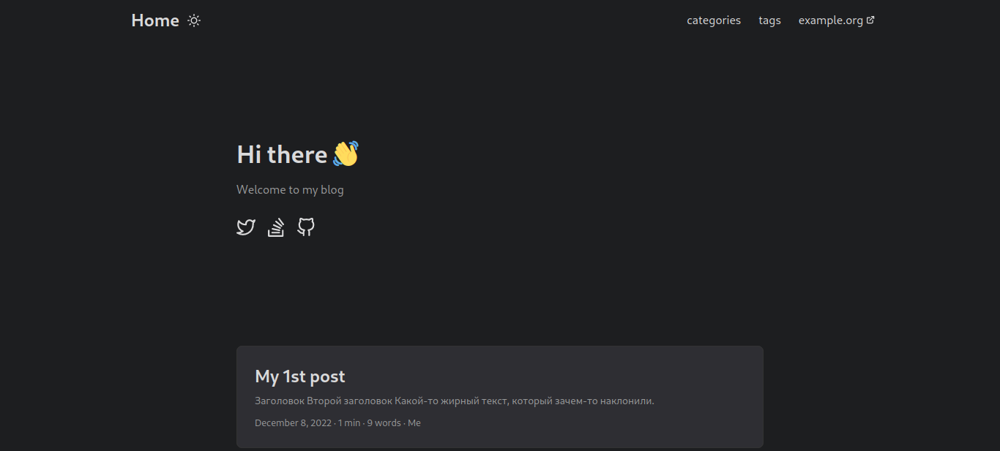

# Введение 

Пост дополняется!

В этой заметке рассмотри как нам поднять, захостить и настроить деплой нашего блога не заплатив при этом ни копейки (ну или совсем чуть-чуть).


Не путать Hygge и Hugo. Они просто созвучны, но почти ничего общего не имеют, кроме того комфорта, который предоставляет Hugo. 

Hugo -- фреймворк, а Hygge -- датский эпитет, описывающий теплое и приятное.


## Наш уютный друг Hugo

[Hugo](https://gohugo.io) — генератор статических html файлов. Мы, соблюдая флоу этого парня, размещаем наш текст в [markdown](https://www.markdownguide.org/getting-started/) формате и наши изображения в нужных папках, а Hugo при запуске соберут из них html странички.

Он то и послужит нашим ядром.

### Установка и первый старт

Первом делом идем и читаем [документацию](https://gohugo.io/getting-started/quick-start/). Нам понадобится установить git и сам Hugo.

Я использую Fedora с dnf, но у вас может быть Debian с apt или Arch с pacman. По сути это не играет большой роли, отличия будут только в свежести версии из репозиториев вашего дистрибутива.

```bash
sudo dnf update
sudo dnf install git hugo
```

Далее нам нужно инициализировать новый блог. Забегая вперед, мы будем хостить блог на GitHub pages, а для этого у нас уже должен быть аккаунт там и создан репозиторий типа <username>.github.io, это имя я Буду использовать для примеров:

```bash
hugo new site <username>.github.io
cd <username>.github.io
```

Нам сразу надо озаботиться тем, чтобы в репозиторий не улетали лишние файлы, так что сначала создадим файл .gitignore, в который добавим только одну запись /public:

```bash
echo "/public" > .gitignore
```

И только теперь проинициализируем репозиторий:

```bash
git init
git branch -M main
git remote add origin git@github.com:<username>/<username>.github.io.git
```

Вот в целом и все, сгенерирован базовый проект, который уже работает. Но мы не будем использовать дефолтный блог, погнали выбирать тему и тюнить его.

### Настаиваем тему и тюним блог

Выбираем тему, которую будем использовать в нашем блоге [тут](https://themes.gohugo.io/).

Мне приглянулась, например [PaperMod](https://themes.gohugo.io/themes/hugo-papermod/). Почти у каждой темы есть doc-страница, демо и ссылки на репозиторий с ней. Эта не исключение, идем читать ее [README](https://github.com/adityatelange/hugo-PaperMod/wiki/Installation).

Устанавливаем тему в наш проект:

```bash
git submodule add --depth=1 https://github.com/adityatelange/hugo-PaperMod.git themes/PaperMod
git submodule update --init --recursive
```

Теперь нужно подключить нашу тему, для этого удалим старый и создадим новый файл настроек:

```bash
rm config.toml
vim config.yml
```

Вставим в него настройки, и немного потюнем под себя:

```yaml
baseURL: "https://username.github.io/"
title: My new site
paginate: 10
theme: PaperMod

enableRobotsTXT: true
buildDrafts: false
buildFuture: false
buildExpired: false

minify:
  disableXML: true
  minifyOutput: true

params:
  env: production # to enable google analytics, opengraph, twitter-cards and schema.
  title: ExampleSite
  description: "This is long-long description..."
  keywords: [Blog, Portfolio, PaperMod]
  author: My name there
  images: ["<link or path of image for opengraph, twitter-cards>"]
  DateFormat: "January 2, 2006"
  defaultTheme: auto # dark, light
  disableThemeToggle: false

  ShowReadingTime: true
  ShowPostNavLinks: true
  ShowCodeCopyButtons: true
  ShowWordCount: true
  ShowRssButtonInSectionTermList: true
  UseHugoToc: true
  disableSpecial1stPost: false
  disableScrollToTop: false
  hidemeta: false
  hideSummary: true
  showtoc: false
  tocopen: false

  assets:
    favicon: "<link / abs url>"
    favicon16x16: "<link / abs url>"
    favicon32x32: "<link / abs url>"
    apple_touch_icon: "<link / abs url>"
    safari_pinned_tab: "<link / abs url>"

  label:
    text: "Home"
    icon: /apple-touch-icon.png
    iconHeight: 35

  # profile-mode
  profileMode:
    enabled: false # needs to be explicitly set
    title: ExampleSite
    subtitle: "This is subtitle"
    imageUrl: ""
    imageWidth: 120
    imageHeight: 120
    imageTitle: my image
    buttons:
      - name: Posts
        url: posts
      - name: Tags
        url: tags

  # home-info mode
  homeInfoParams:
    Title: "Hi there \U0001F44B"
    Content: Welcome to my blog

  socialIcons:
    - name: twitter
      url: "https://twitter.com/"
    - name: stackoverflow
      url: "https://stackoverflow.com"
    - name: github
      url: "https://github.com/"

  cover:
    hidden: true # hide everywhere but not in structured data
    hiddenInList: true # hide on list pages and home
    hiddenInSingle: true # hide on single page

  # for search
  # https://fusejs.io/api/options.html
  fuseOpts:
    isCaseSensitive: false
    shouldSort: true
    location: 0
    distance: 1000
    threshold: 0.4
    minMatchCharLength: 0
    keys: ["title", "permalink", "summary", "content"]
menu:
  main:
    - identifier: categories
      name: categories
      url: /categories/
      weight: 10
    - identifier: tags
      name: tags
      url: /tags/
      weight: 20
    - identifier: example
      name: example.org
      url: https://example.org
      weight: 30
pygmentsUseClasses: true
markup:
  highlight:
    noClasses: false
    # anchorLineNos: true
    # codeFences: true
    # guessSyntax: true
    # lineNos: true
    # style: monokai
```

Можем даже уже проверить, что у нас получается:

```bash
hugo server
```

По пути 0.0.0.0:1313 или localhost:1313 станет доступен наш блог.

По поводу детальной настройки темы читаем в документации к самоей теме.

### Создаем первую запись в блоге

Создадим для начала папку для нашей статьи:

```bash
mkdir -p content/posts/first-post
vim content/posts/first-post/index.md
```

Поместим туда шаблон статьи и что-то напишем:

```markdown
---
title: "My 1st post"
date: 2022-12-08T11:30:03+00:00
tags: ["first"]
author: "Me"
showToc: true
TocOpen: false
draft: false
hidemeta: false
comments: false
description: "Desc Text."
canonicalURL: "https://canonical.url/to/page"
disableHLJS: true # to disable highlightjs
disableShare: false
disableHLJS: false
hideSummary: false
searchHidden: true
ShowReadingTime: true
ShowBreadCrumbs: true
ShowPostNavLinks: true
ShowWordCount: true
ShowRssButtonInSectionTermList: true
UseHugoToc: true
cover:
    image: "<image path/url>" # image path/url
    alt: "<alt text>" # alt text
    caption: "<text>" # display caption under cover
    relative: false # when using page bundles set this to true
    hidden: true # only hide on current single page
editPost:
    URL: "https://github.com/<path_to_repo>/content"
    Text: "Suggest Changes" # edit text
    appendFilePath: true # to append file path to Edit link
---

# Заголовок

## Второй заголовок

Какой-то __жирный__ текст, который зачем-то _наклонили_.
```

Проверим, что у нас там в блоге теперь:



## Хостим и деплоим

Теперь сделаем наш блог общедоступным!

### Прокидываем секреты

Если у вас не был настроен git, то прокинем сначала имя и email:

```bash
git config --global user.name "<Your Name>"
git config --global user.email "<Your Email>"
```

Генерируем ключи для деплоя:

```bash
ssh-keygen -t rsa -b 4096 -C "$(git config user.email)" -f deployment -N ""
```

Заходим на GitHub в наш репозиторий (он пока еще пустой, мы в него ничего не пушили). Далее идем Settings ⇒ Deploy Keys ⇒ Add Deploy Keys.

Добавляем сюда ваш публичный ключ. Скопировать его можно из только что сгенерированного файла:

```bash
cat deployment.pub
```

```bash
ssh-rsa AASdas...KTTx2lOvqFvqOMAIw== <your_email>@proton.com
```

Скопировать фразу нужно целиком. Назовем его `public key of ACTIONS_DEPLOY_KEY`.

Далее идем в Secrets ⇒ Actions ⇒ New Repository Secret. Вставляет туда приватный ключ:

```bash
cat deployment
```

Также копируем фразу целиком от и до, называем ключ `ACTIONS_DEPLOY_KEY`.

### Настраиваем actions и пушим

В корне нашего блога создаем папки:

```bash
mkdir -p .github/workflows
```

В workflows создадим файл `gh-pages.yml`:

```bash
vim .github/workflows/gh-pages.yml
```

Скопируем туда это:

```yaml
name: GitHub Pages

on:
  push:
    branches:
      - main

jobs:
  build-deploy:
    runs-on: ubuntu-latest
    concurrency:
      group: ${{ github.workflow }}-${{ github.ref }}
    steps:
      - name: Checkout
        uses: actions/checkout@v3
        with:
          submodules: true
          fetch-depth: 0

      - name: Setup Hugo
        uses: peaceiris/actions-hugo@v2
        with:
          hugo-version: "latest"

      - name: Build
        run: hugo --minify

      - name: Deploy
        uses: peaceiris/actions-gh-pages@v3
        if: ${{ github.ref == 'refs/heads/main' }}
        with:
          github_token: ${{ secrets.GITHUB_TOKEN }}
          publish_branch: gh-pages
          publish_dir: ./public
```

Наконец-то пушим наш блог в удаленный репозиторий и ждем ошибок, потому что мы не настроили еще одну вещь:

```yaml
git add . && git commit -m "Init" && git push -u origin main
```

Идем в наш репозиторий и скорее всего там нифига не завелось, потому что не настроена ветка из которой деплоится сайт. Идем в Settings ⇒ Pages ⇒ Build and deployment.

В Source устанавливаем параметр Deploy from a branch и выбираем Branch, из которой будем деплоится gh-pages.

Изменим что-нибудь в нашей тестовой статье и повторим пуш. Если деплой прошел успешно, то ваш блог станет доступен по адресу <username>.github.io.

## Say my name!.. Используем свой домен

Мы задеплоили, все настроили, но нам хочется припарковать свой домен или же купить его для начала.

Купить домен можно где угодно. Я сам покупал на [https://beget.com/ru/domains](https://beget.com/ru/domains). Никаких рефералок у меня нет, увы, но там и без того самые дешевые домены в .com зоне. В .com зоне можно покупать домены не указывая паспортные данные, а в .ru нужно будет предоставлять паспорт.

Представили, что мы арендовали домен. Че дальше с ним делать?

Для начала идем в панель управления вашим доменом у вашего регистратора, проходим в настроики DNS и добавляем записи типа А и AAAA. IP-адреса берем [здесь](https://docs.github.com/en/pages/configuring-a-custom-domain-for-your-github-pages-site/managing-a-custom-domain-for-your-github-pages-site#configuring-an-apex-domain). Не забываем удалить старый IP-адрес, который был дефолтным от регистратора.

Далее настраиваем поддомен www. Добавим для него запись типа CNAME, который будет указывать на ваш зарегистрированный домен, таким образом будет происходит переадресация.

Далее идем в корень нашего проекта и создаем там в папке static файл CNAME и кладем в него наш домен:

```bash
echo "<yourdomen.com>" > static/CNAME
```

Теперь пушим в репозиторий изменения и идем рассказывать GitHub’у, что мы хотим использовать свой домен. Идем в репозиторий ⇒ Settings ⇒ Pages ⇒ секция Custom domain. Вписываем туда свой apex-домен (<yourdomen.com>) и нажимаем save. Домен должен проходить все проверки и GitHub самостоятельно подключит к нему tls-сертификаты.
