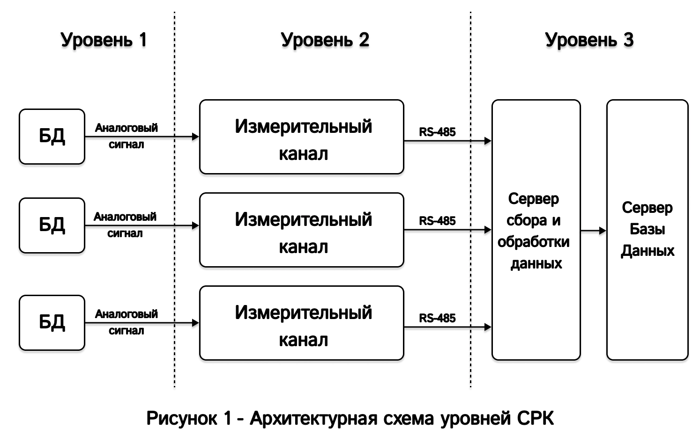
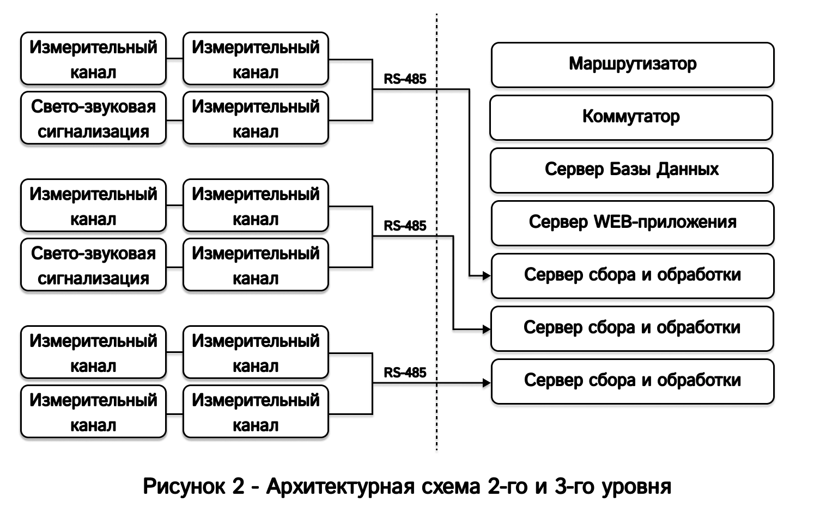
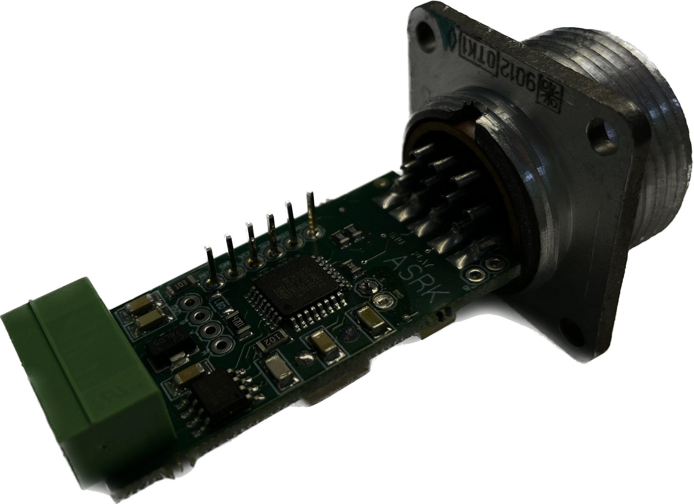
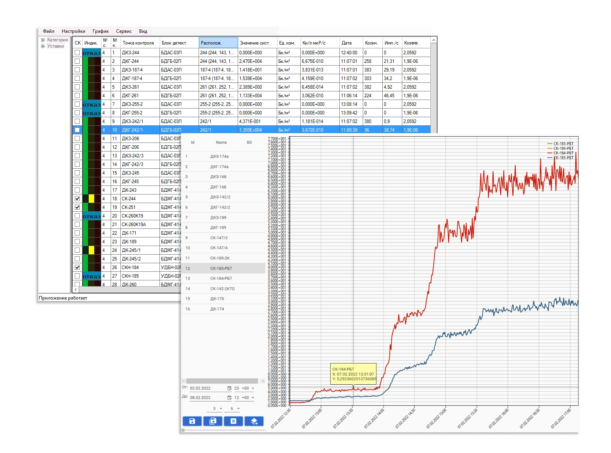
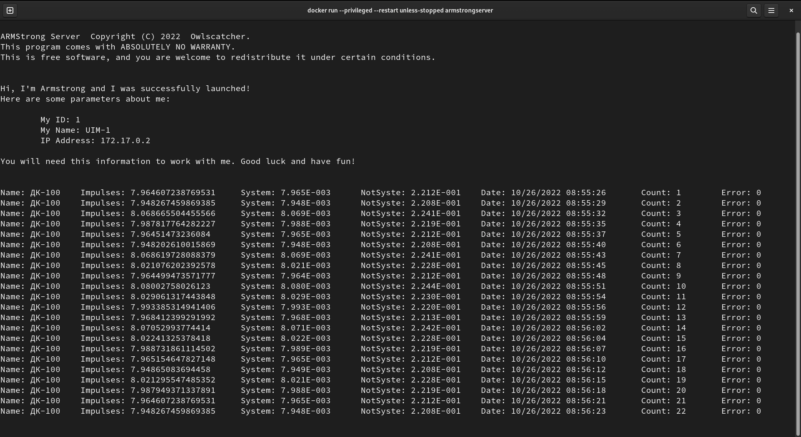
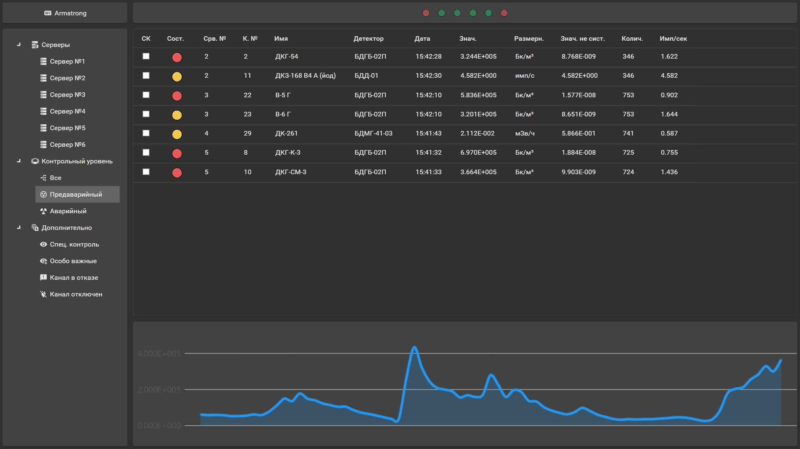
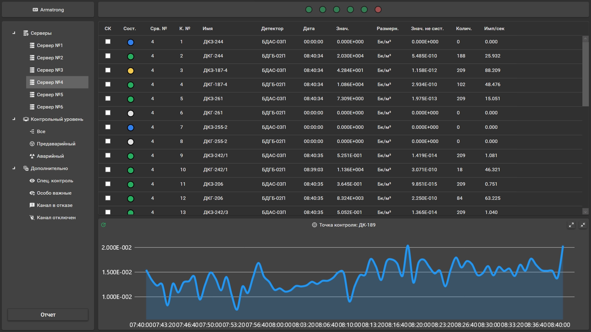
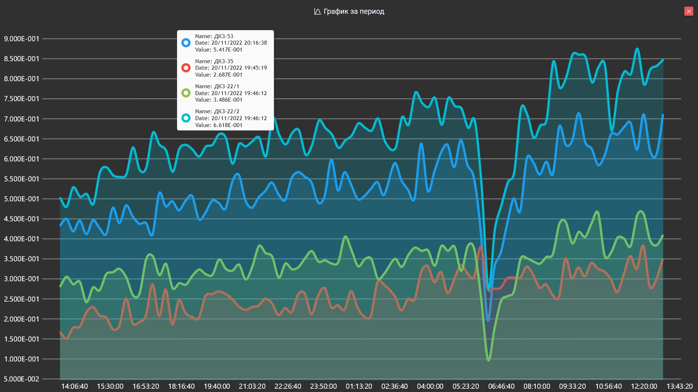

Познакомимся с ARMStrong, рассмотрим принципы построения и задачи, которые перед нами стоят.

ARMStrong (Automated Radiation Monitoring System) — автоматизированная система радиационного
контроля, (далее **СРК**) включающая в себя комплекс средств, призванных осуществлять радиационный
контроль, в целях снижения травматизма, предупреждения предаварийных ситуация и недопущения
развития аварийных сценариев.


Система представляет собой open-source набор средств, призванный решать строго определенный набор задач.
Авторы не несут ответственность и предоставляют систему "как есть".

Весь код по мере доработки будет публиковаться в репозитории [Digital Armstrong](https://github.com/digital-armstrong/).
Все контакты для связи указаны в шапке репозитория.


## Базовая архитектура

ARMStrong реализует базовую трехуровневую архитектуру представленной на рисунке 1, и является вторым и третьим уровни
соответственно.



## Назначение

ARMStrong на сегодняшний день обеспечен следующим функционалом:

- Сбор, обработка и хранение информации с блоков детектирования (далее **БД**);
- Осуществление управления **БД**;
- Агрегирование данных с целью в виде числовых значений и графиков;
- Свето-звуковое оповещение при превышении предаварийных и аварийных пороговых значений;

В будущем присутствует возможность добавления функционала для:

- Расширения парка поддерживаемых устройств с аналоговым выходом или поддерживающих протокол RS-485, например,
  управление электромагнитными клапанами или новым **БД**;
- Построения тепловых карт по собранным данным;

## Архитектура 2-го и 3-го уровня

Второй уровень представляет собой измерительные каналы и каналы свето-звуковой сигнализации. Каналы объединяются
параллельно и подключаются к серверу сбора и обработки данных (_далее **ССОД**_) по RS-485 линии связи.

В свою очередь **ССОД** после получения и обработки данных с измерительных каналов сохраняет значения в базу данных,
расположенной на сервере (_далее **СБД**_).

Коммутатор устанавливается для объединения всех серверов в стойке в одну локальную сеть, чтобы **ССОД** могли иметь
доступ до **СБД**.

Маршрутизатор устанавливается в стойку для организации локальной сети внутри каждой серверной стойки, что повышает
отказоустойчивость в случае обесточения и отказа внешних маршрутизаторов. Организация доступа к данным может
осуществляться как прямыми запросами в базу данных, так и через [API](https://en.wikipedia.org/wiki/API) для
зарегистрированных и аутентифицированных WEB-клиентов.



## Hardware уровень

**Измерительный канал**, который получил название **АСРК** (_Автоматизированное Средство Радиационного Контроля_)
выполнен на печатной плате на базе микроконтроллера ATMega-8. Интерфейсы подключения:

- Аналоговый вход: разъем типа РМ;
- Комбинированный выход: коннектор 5-pin (2-pin A-B Data + 3-pin DC 12V);
- Логические выходы: штырьковые разъемы.



Размеры одного готового к подключению канала всего **70** \* **35** \* **35** миллиметров, а без разъема типа РМ и вовсе
составляет **42** \* **21** миллиметра.

**Измерительный канал** подключается к персональному компьютеру или серверу при помощи преобразователя интерфейсов
RS-485 --> USB. В нашем случае используется преобразователь интерфейсов [ОВЕН АС4-М](https://owen.ru/product/as4m)

### ПО контроллера

Програмное обеспечение контроллера (далее **ПОК**) написано на языке программирования `C` и
скомпилированно под ATMega 8.

**ПОК** реализует самописный протокол обмена данными, который основан на стандартизированном промышленном протоколе
[Modbus](https://en.wikipedia.org/wiki/Modbus#Modbus_RTU_frame_format).

**ПОК** позволяет осуществлять:

- Назначение адреса канала;
- Назначение режима обработки сигнала от БД (_Частотный / Времянной / Счет отключен_)
- Управление бленкером, генератором и другими средствами самопроверки **БД**;
- Осуществление перемотки кадра лентопротяжного механизма **БД**;
- Управление свето-звуковой сигнализацией.
- Опрос значений измерений **БД**;
- Управление свето-звуковой сигнализацией.

### Предоставляемые возможности

Помимо описанных возможностей в разделе [ПО контроллера](#по-контроллера), канал связи может быть исполнен в разных
конфигурациях и с разным количеством логических портов.

Канал связи может быть дооснащен дисплеем и аккумулятором, и использован в качестве автономного, носимого,
прямопоказывающего БОИ (блока обработки информации), для подключаемого к нему **БД**.

Также канал связи может быть использован в качестве дооснащения существующих **БД** или при изготовлении новых **БД**
для организации прямого подключения, т.к. размеры платы очень малы, а потребление всего 0.010-0.015 Ампера.

Сфера применения платы канала связи АСРК не ограничивается только стационарными решениями для обеспечения радиационной
безопасности, за счет малого потребления тока и малых габаритов это устройство может помогать решать достаточно широкий
спектр задач.

## Серверный уровень

### Уровень хранения информации

#### База данных

В качестве сервера базы данных в нашем случае используется сервер ... оснащенный 4 жесткими дисками, емкостью по 4
террабайта каждый и обьединенными в [RAID10](https://en.wikipedia.org/wiki/Nested_RAID_levels#RAID_10_.28RAID_1.2B0.29)
массив, что повышает отказоустойчивость и осуществляет первичное резервирование данны.


**Важно!**

Каждый такой сервер, обеспечивающий работу базы данных, должен быть оснащен дополнительным комплектом из минимум 4-х
аналогичных жестких дисков для обеспечения подменного фонда.


На сервер установлена бесплатная, с открытым исходным кодом операционная система на базе ядра
[Linux](https://en.wikipedia.org/wiki/Linux_kernel) — [Ubuntu 20.04 LTS](https://ubuntu.com/download/server).

В качестве [СУБД](https://en.wikipedia.org/wiki/Relational_database#RDBMS) используется бесплатная с открытым исходным
кодом СУБД [PostgreSQL](https://en.wikipedia.org/wiki/PostgreSQL).

### Уровень обработки данных

Уровень обработки данных:

- Осуществляет опрос измерительных каналов в заданном интервале времени;
- Преобразует полученные данные в системные и несистемные величины в соответствии с типом **БД**, такие как: мЗв/ч
  (мкР/с) или Бк/м. куб. (Ки/л);
- Сохраняет полученные данные с временной меткой в базу данных;
- Осуществляет управление свето-звуковой сигнализацией в соответствии с установленными порогами на каждом канале через
  канал связи **АСРК**;
- Осуществляет агрегирование данных для расчетов выбросов газа из вентсистем в заданных промежутках времени;
- Осуществляет агрегирование данных для отображения графиков;
- Осуществляет управление **БД** через канал связи **АСРК**;

В качестве сервера **ССОД** используются промышленные компьютеры [AdvantiX](https://www.advantix-pc.ru/), но могут
использоваться и менее громозкие и дорогие решения, так как требования ПО **ССОД** к вычислительной мощности **ССОД**
достаточно низкие. В качестве таких решений могут выступать даже одноплатные компьютеры, типа
[Raspberry PI 4](https://www.raspberrypi.com/products/raspberry-pi-4-model-b/) или их аналоги, поддерживающие запуск
х64 Linux.

Первоначально **ПО** **ССОД** написано на `C#, .net framework 4.7` под ОС Windows с графическим интерфейсом, который
выступал и сервером и клиентом:



Но на данный момент, с целью миграции на системы на базе ядра Linux, основная часть ПО сервера была переписана на
`C#, net core 6`, и теперь является [кросс-платформенным](https://en.wikipedia.org/wiki/Cross-platform_software)
серверным решением, а клиент был выделен в отдельное desktop и web-приложение (в разработке).



ПО **ССОД** запускается в изолированном контейнере, который в случае непредвиденных ошибок будет автоматически
перезапущен. Подход с использованием контейнеров позволяет не устанавливать зависимости на серверные машины (весь
[runtime](https://en.wikipedia.org/wiki/Runtime_library) включен в состав сборки) и в случае поломки позволит в
кратчайшие сроки без лишних манипуляций запустить сервер на новой / резервной серверной машине.

Контейнеризация ПО **ССОД** так же обеспечивается free-open-souce ПО.

## Клиентский уровень

Desktop-клиент написан на `C#, net core 6` с использованием библиотеки `WPF`, представляет собой средство отображения
информации со всей системы, такой как:

- Результаты измерения с БД;
- Состояние пороговой сигнализации и измерительных каналов;
- Состояние всех доступных **ССОД**;
- Графики значений по точкам контроля.

Клиент позволяет:

- Устанавливать на контроль один из выбранных каналов, что позволяет в реальном времени отслеживать динамику на живом
  графике в нижней части клиента;
- Выбирать способ сортировки и отображения каналов (отображать только превышения / конкретный сервер / отказавшие
  каналы и др.)

Внешний вид клиента:



[upd v0.0.3](https://github.com/digital-armstrong/Armstrong.Client/releases/tag/v0.0.3), добавили возможность:

- Выводить отчёт за 24/6/2 часа по выбросам с вентсистемы, спецконтролю и йодному участку;
- Выводить мультиканальные графики за выбранный период времени как в отдельном окне, так и в нижнюю секцию клиента;
- Отображать состояние серверов системы;

Обновленный клиент:





В данный момент ведется активное расширение функционала клиента.

## В планах

### Объединенная Web-платформа

Платформа пишется на языках `Ruby`, `JavaScript` и `C#`, будет включать в себя комплексное решение для упрощения
взаимодействия служб, упрощенный доступ до данных системы радиационного контроля, унифицирования информации, с целью
упрощения доступа к ней сотрудников аутентифицированных служб.

Все средства используемые в разработке являются open-source решениями использующими свободные лицензии.

#### Web-клиент системы РБ

Решаемая проблема:

- Существующий клиент требует своей установки на персональный компьютер или рабочую станцию каждому конкретному
  пользователю;
- В случае обновления существуют трудности с доставкой файлов обновления до клиента и существует вероятность
  непредвиденных ошибок, которые потребуют помощи специалиста;
- Часть пользователей могут иметь отличные от поддерживаемых операционную систему или не иметь персонального компьютера
  вовсе, а, например, иметь только планшет на iOS или Android => пользователь не может получить оперативный доступ к
  данным системы радиационного контроля.

Решение:
WEB-клиент, входящий в состав платформы.

Этот клиент будет отображать графики, значения с точек контроля и состояние каналов, при этом не требуется ничего,
кроме браузера, который сейчас есть на любом устройстве.

Авторизированный доступ осуществляется только для сотрудников УРБ и / или имеющих соответствующий доступ
аутентефицированнмы пользователям **в режиме чтения.**

_Работы по разработке WEB-клиента уже ведутся._

#### Помощник службы РБ, доз. контроль

Решаемая проблема:

- Оформление допусков дозиметристом занимает много времени;
- При оформлении допуска дозиметристу требуется вручную расчитывать время пребывания исполнителя в требуемом помещении,
  исходя из параметров, полученных из системы радиационного контроля.
- Требуется ведение дополнительных журналов контроля дозовых нагрузок, с целью недопущения переоблучения персонала.

Решение:
Помощник для службы РБ, входящий в состав платформы.

При оформлении электронного допуска, вся требуемая информация будет автоматически расчитана и учтена из данных,
полученных от системы радиационного контроля. Система также обязана учесть возможность допуска сотрудника до работ,
приняв во внимание его дозовую нагрузку за установленный период времени.

Дозиметристу останется только дать своё согласие на допуск сотрудника, а по завершению работ внести набранные дозы в
допуск и закрыть его. Информация о набранной дозе будет учтена в базе данных сотрудников.

Авторизированный доступ осуществляется только для сотрудников УРБ и / или имеющих соответствующий доступ
аутентефицированнмы пользователям.

#### Помощник для службы ОМИТ

Решаемая проблема:
В данный момент:

- существуют затруднения в коммуникации между отделами ОМИТ и службами, которым требуется осуществлять госповерку
  средств измерения при помощи ОМИТ;
- для отправки, получения, осуществления поверки требуется заполнять слишком много лишних бумаг;
- бумажные паспорта приборов быстро изнашиваются и часто могут теряться, требуют дополнительного внимание сотрудников
  служб ОМИТ, многие документы приходится заполнять 2 и более раз в разной форме.

Решение:
Система "Тикетов", входящая в состав платформы, позволяющая создавать задачу пользователю, который осуществляет
отправку прибора с меткой, в примерном виде:

| Служба  | Пользователь                   | Цель    | Тип        | Коэффицент |
| ------- | ------------------------------ | ------- | ---------- | ---------- |
| УРБ-106 | Суперинженеров Иван Демьянович | Поверка | БДМГ-41-01 | 2.4        |

Пользователю достаточно будет выбрать только цель отправки устройства и сам прибор, вся сотальная информация будет
получена из базы данных, и передать устройство в доставку.

Инспектор в свою очередь получит оповещение, что ему направлена задача, с возможностью просмотреть подробную информацию
об устройстве, отправителе, износе направляемого устройства, предыдущих поверках и тд.

Пользователи, отправляющие прибор, смогут видеть статус поверки прибора, например:

- Принят в службе ОМИТ;
- Отправлен на ремонт;
- Продлён срок эксплуатации;
- Не подлежит продлению и тд.

Эта часть системы работает по аналогии с канбан-доской, где создается задача и ее статус меняется пользователем по
завершению какого-либо этапа работы.

Такая система позволит:

- Отказаться от физических, бумажных паспортов средств измерения;
- Прогнозировать и перераспределять нагрузку на отдел ОМИТ;
- Сократить процент "просроченных" сроков госповерки средств измерения;
- Сократить процент "затерявшихся" средств измерений, отправленных на поверку;
- Осуществлять в автоматическом режиме подготовку нужных документов для продления сроков служб средств измерений /
  осуществлять продление.

В индеальной картине на складах должны быть установлены сканеры QR- или штрих-кодов, для увеличения пропускной
способности пунктов приема и отправки. В таком случае движение приборов отслеживается более гибко как отправителем,
так и инспектором.

Авторизированный доступ осуществляется только для сотрудников ОМИТ и / или имеющих соответствующий доступ
аутентефицированнмы пользователям в режиме чтения.

### Объединение частей систем в единый комплекс

#### Системы мониторинга состояний отдельных юнитов системы

Когда серверов становится больше одного, отслеживание состояний машин становится достаточно трудозатратной задачей,
требующей постоянного присутствия специалиста. Современные средства позволяют осуществлять наблюдение за парком
устройств в автоматическом режиме и заблаговременно оповещать о проблемах, например, об заканчивающимся месте на
жестких дисках, оперативной памяти или зависании машины, перегрев и тд.

В качестве сервера мониторинга мы будем использовать [Zabbix](https://en.wikipedia.org/wiki/Zabbix) +
[Graphana](https://en.wikipedia.org/wiki/Grafana). Они позволят отслеживать состояние машин, отображать в виде
графиков нужную информаци, информировать о различных ошибках или изменениях отслеживаемых параметров.

Благодаря применению таких средств, мы сократим время простоя участков системы и увеличим отказоустойчивость. Система
будет легко расширяемой не только за счет простого масштабирование серверной части **ARMStrong**, но и за счет систем
мониторинга zabbix и graphana.

## Благодарности серому волшебнику

Если текст был полезен и ты не можешь усмирить желание быть благодарным, то можешь: 

Воспользоваться моей реферальной ссылкой на TimeWeb:



Воспользоваться моей реферальной ссылкой на DigitalOcean:



Или же закинуть монету в мой кошелёк (USDT и TRX кошельки одинаковые, да, это не ошибка):

**Tether (TRC-20, USDT):**

```markdown
TYvFYUV3h5HwqfyTxskGQK7nDbUHTcwPn2
```

**Tron (TRX):**

```markdown
TYvFYUV3h5HwqfyTxskGQK7nDbUHTcwPn2
```

**Monero (XMR):**

```markdown
4AbxbT9vrNQTUDCQEPwVLYZq2zTEYzNr9ZzTLaq9YcwVfdxwkWjZ6FsewuXVDXPk7x2rE6FZACmLePPgJEcY4rm1GSHkwTZ
```
