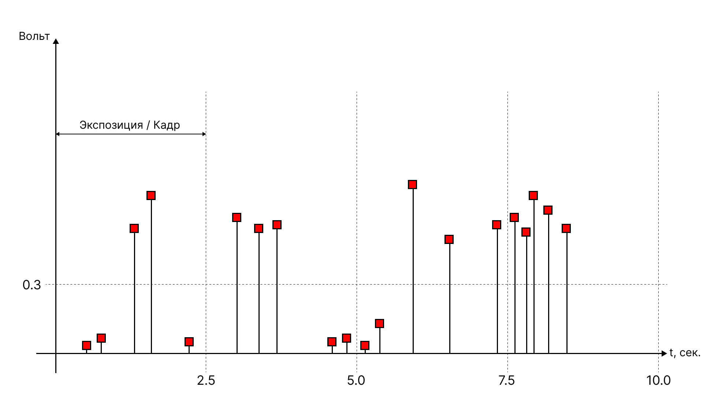

В этой заметке мы разберемся, как же нам опросить внешние устройства, подсмотрим в
[Modbus RTU](https://en.wikipedia.org/wiki/Modbus#Modbus_RTU_frame_format) и придумаем свой протокол опроса внешних устройств.

## Начало


**Хантер С. Томпсон «Страх и отвращение в Лас-Вегасе»**

У нас было два пакетика травы, семьдесят пять ампул мескалина, 5 пакетиков диэтиламида лизергиновой кислоты или ЛСД, солонка, наполовину
наполненная кокаином, и целое море разноцветных амфетаминов, барбитуратов и транквилизаторов, а так же литр текилы, литр рома, ящик
«Бадвайзера», пинта чистого эфира, и 12 пузырьков амилнитрита. Не то, чтобы всё это было категорически необходимо в поездке, но если уж
начал собирать коллекцию, то к делу надо подходить серьёзно.


Перед нами стояла задача получить данные с блока детектирования, каким-то образом обработать полученный результат опроса и положить
храниться в базу данных. Сегодня мы подробно остановимся именно на процессе получения данных от внешних устройств, таких как блоки детектирования.

Вооружившись паяльником, парой компьютеров и смекалкой начнем решать задачу!

## Куда бегут ионы

Краткий экскурс в 9 класс школьной физики: электрический ток -- это направленное движение частиц способных переносить заряд. В нашем случае
носителем заряда является электроны и ионы, которые скользят по поверхности медного или другого проводника (электролита) при возникновении
разницы потенциалов.

Это наши самые маленькие друзья и соратники, которые помогают провести измерение какой-то физической величины, а потом, при помощи других
устройств или приборов, оцифровать полученные результаты. Эти устройства должны получать какой-либо сигнал на вход, чтобы его зарегистрировать.
Сам же сигнал представляет собой просто электрический ток, который двигается до первого аналогово-цифрового преобразователя, нашего устройства.

Старые блоки детектирования, как правило, не оснащены цифровым выходом, а следовательно нам требовалось подумать, как нам преобразовать
аналоговый сигнал (тот самый электрический ток), который представляет из себя набор различных амплитуд напряжения в двоичный код, где
положительное напряжение от 0.3 Вольт мы считаем за единицу, а 0 Вольт за, соответственно, ноль.

По большому счету нам требовалось получить понятный набор нулей и единиц из этого:



Сигнал в таком виде приходит на вход аналогово-цифрового преобразователя, которым в нашем случае выступает измерительный канал:


Преобразование происходит по принципу накопления количества импульсов за определенный отрезок времени. Этот отрезок времени принято называть
временем экспозиции кадра или просто кадром, по аналогии с плёночной фотографией, где экспозиция характеризует время, за которое свет
попадает на пленочный кадр (экспонирует кадр).

В нашем случае за время кадра мы принимаем 2.5 секунды, это время было выбранно эмпирическим путём и для наших задач оно оптимально.

Весь процесс "экспонирования кадра" можно разбить на следующие этапы:

- В микроконтроллере срабатывает триггер каждый раз, когда на его ножке появляется положительное напряжение амплитудой выше 0.3 вольта;
- Каждое срабатывание триггера увеличивает счетчик на 1;
- По истечении 2.5 секунды счетчик обнуляется, процесс повторяется.

На псевдокоде это выглядело примерно бы так:

```ruby
counter = 0
frame_time = 2.5
timer = Timer.new

def trigger
  counter += 1
end

def watch
  if timer.total_seconds >= frame_time
    counter = 0
    timer = 0
  end
end

def main
  timer.start
end
```
