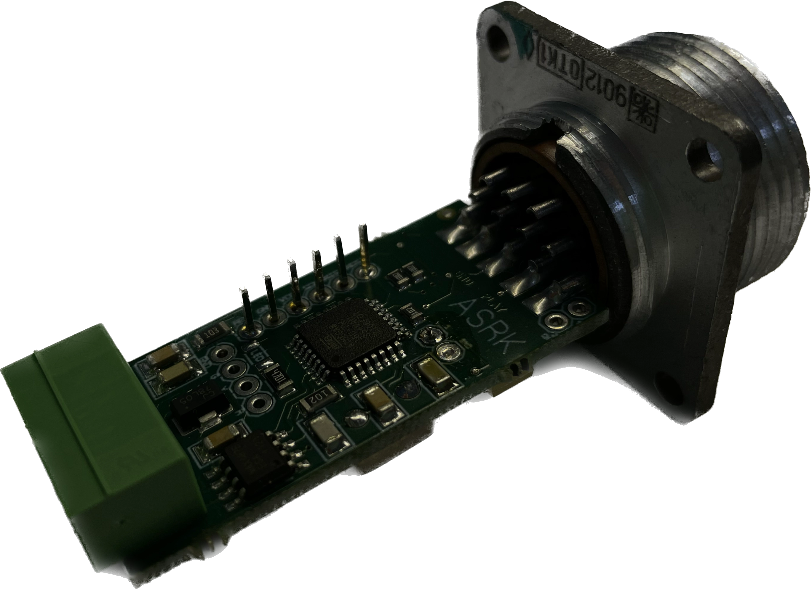

В этой заметке мы разберемся, как же нам опросить внешние устройства, подсмотрим в
[Modbus RTU](https://en.wikipedia.org/wiki/Modbus#Modbus_RTU_frame_format) и придумаем свой протокол опроса внешних устройств.

## Начало


**Хантер С. Томпсон «Страх и отвращение в Лас-Вегасе»**

У нас было два пакетика травы, семьдесят пять ампул мескалина, 5 пакетиков диэтиламида лизергиновой кислоты или ЛСД, солонка, наполовину
наполненная кокаином, и целое море разноцветных амфетаминов, барбитуратов и транквилизаторов, а так же литр текилы, литр рома, ящик
«Бадвайзера», пинта чистого эфира, и 12 пузырьков амилнитрита. Не то, чтобы всё это было категорически необходимо в поездке, но если уж
начал собирать коллекцию, то к делу надо подходить серьёзно.


Перед нами стояла задача получить данные с блока детектирования, каким-то образом обработать полученный результат опроса и положить
храниться в базу данных. Сегодня мы подробно остановимся именно на процессе получения данных от внешних устройств, таких как блоки детектирования.

Вооружившись паяльником, парой компьютеров и смекалкой начнем решать задачу!

## Откуда берется информация на микроконтроллере

Краткий экскурс в 9 класс школьной физики: электрический ток — это направленное движение частиц способных переносить заряд. В нашем случае
носителем заряда является электроны и ионы, которые скользят по поверхности медного или другого проводника (электролита) при возникновении
разницы потенциалов.

Это наши самые маленькие друзья и соратники, которые помогают провести измерение какой-то физической величины, а потом, при помощи других
устройств или приборов, оцифровать полученные результаты. Эти устройства должны получать какой-либо сигнал на вход, чтобы его зарегистрировать.
Сам же сигнал представляет собой просто электрический ток, который двигается до первого аналогово-цифрового преобразователя, нашего устройства.

Старые блоки детектирования, как правило, не оснащены цифровым выходом, а следовательно нам требовалось подумать, как нам преобразовать
аналоговый сигнал (тот самый электрический ток), который представляет из себя набор различных амплитуд напряжения в двоичный код. Полезным
сигналом мы считаем положительные импульсы от 0.3 Вольта.

По большому счету нам требовалось получить понятный набор нулей и единиц из этого:


Сигнал в таком виде приходит на вход аналогово-цифрового преобразователя, которым в нашем случае выступает измерительный канал:



Преобразование происходит по принципу накопления количества импульсов за определенный отрезок времени. Этот отрезок времени принято называть
временем экспозиции кадра или просто кадром, по аналогии с плёночной фотографией, где экспозиция характеризует время, за которое свет
попадает на пленочный кадр (экспонирует кадр).

В нашем случае за время кадра мы принимаем 2.5 (_если точнее — одно переполнение таймера = 2,275560 с., 2.5 с. взяли для упрощения_)
секунды, это время было выбранно эмпирическим путём и для наших задач оно оптимально.

Весь процесс "экспонирования кадра" можно разбить на следующие этапы:

- В микроконтроллере срабатывает триггер каждый раз, когда на его ножке появляется положительное напряжение амплитудой выше 0.3 вольта;
- Каждое срабатывание триггера увеличивает счетчик на 1;
- По истечении 2.5 секунды счетчик обнуляется, срабатывает прерывание, процесс повторяется.

Это релевантно, если нам нужен условный "частотомер". Если же нам требуется считать длительность, то счет должен включаться при появлении
восходящего фронта и прерывание должно срабатывать при появлении нисходящего фронта.

Таким образом в буффере появляется посчитанная частота импульсов либо длительность импульсов, в зависимости от того, в каком режиме счета
работает измерительный канал. Настало время подумать, как нам забрать эту информацию на компьютер.

## Договариваемся о формате беседы

Для того, чтобы общаться с микроконтроллером, нам нужно определиться о формате нашей беседы. Так как мы взяли за основу Modbus RTU, в котором
пакеты имеют формат:
|Name|Length (bits)|Function|
|-|-|-|
|Start|3.5 x 8|At least 3+1⁄2 character times (28 bits) of silence (mark condition)|
|Address|8|Station address|
|Function|8|Indicates the function code e.g. "read coils"|
|Data|n × 8|Data + length will be filled depending on the message type|
|CRC|16|Cyclic redundancy check|
|End|3.5 x 8|At least 3+1⁄2 character times (28 bits) of silence (mark condition) between frames|

мы не будем изобретать велосипед и упростим этот пакет до 8 байт, для наших целей не нужны никакие старт/стоп биты и тд:

```csharp
new byte[] { addr, func, value1, value2, value3, value4, CRC0, CRC1 }
```

Вот они слева направо:

- Адрес устройства (канала), задается от 0 (`0x00`) до 255 (`0xFF`);
- Функция или же комманда, рассказываем измерительному каналу, что именно мы от него хотим;
- `value1..value4` это 4 байта, в которых хранится `float` значение, т.е. число с плавующей точкой. Почему 4 байта можно почитать
  [тут](https://learn.microsoft.com/ru-ru/cpp/c-language/type-float?view=msvc-170) и
  [тут](https://skillbox.ru/media/code/chisla-s-plavayushchey-tochkoy-chto-eto-takoe-i-kak-oni-rabotayut/);
- `CRC0` и `CRC1` это контрольная сумма `CRC16`, нужная, чтобы удостовериться, что пакет по пути не исказился (как ее посчитать рассмотрим
  дальше);

Вы можете эксперементировать с этим набором как угодно, главное чтобы микроконтроллер и ваш сервер/приложение использовали один протокол.
Мы же договорились использовать примерно такой формат записи (примем за адрес канала `0x01`):


Так как Modbus RTU предполагает общение в рещиме `master-slave`, то инициировать передачу данных всегда будет сервер/приложение. Мы либо
запрашиваем данные, либо управляем измерительным каналом.

Также хочу отметить, что при запросе данных 4 байта `value` заполняем просто нулями, контроллеру все равно, что там лежит, если он получаем
команду на передачу данных из буффера, а если управляем, то используем эти байты для уточнения команды, например передаем туда цвет
световой сигнализации или же передаем вместе с цветом сигнал на включение еще и звуковой сигнализации.

## Приём данных и передача комманд

У измерительного канала есть 5-pin выход (GND, +12 Вольт, -12 Вольт, RX, TX). Нас интересует DATA линия RX-TX, которая из себя представляет
просто витую пару. Чтобы нам получить данные по этой линии, мы будем использовать `RS-485`, но мы же неможем подключить витую пару прямо в
порт компьютера, следовательно придется использовать конвертер `RS-485 ⇨ USB`. Выбор пал на [ОВЕН АС-4М](https://owen.ru/product/as4m),
~~который почему-то стал стоить каких-то конских денег в 2022 году~~.

На компьютере наш преобразователь будет виден просто как последовательный (serial / com) порт с именем `COM1..COM99` или же
`ttyUSB0..ttyUSB99`. Зная имя/адрес нашего порта, мы можем начать кидать через него запросы и комманды на наш измерительный канал, для этого
в коде нам нужно:

1. Устарновить имя порта;
2. Открыть порт;
3. Подготовить пакет, посчитать контрольную сумму пакета;
4. Отправить пакет через этот порт;
5. Прочитать ответ от измерительного канала;
6. Закрыть порт.

Оговорюсь, что я в своём проекте использую `.json` файл, где собрал нужный мне конфиг, чтобы у вас не было вопросов, откуда берутся значения.
Вот кусочек из него:

```json
"PortSettings": {
  "PortName": "/dev/ttyUSB0",
  "BaudRate": 9600,
  "DeadPollingTime": 100,
  "MinimalPollingTimeout": 1000
}
```

Ну а теперь почитаем немножко код на `C#`.

1. Устанавливаем имя порта:

```csharp
public class ComPort : SerialPort
  {
    public ComPort()
    {
      PortName = AppSettings.AppPortSettings.PortName;
      BaudRate = AppSettings.AppPortSettings.BaudRate;
    }
  }
```

2. Подготовим наш пакет, посчитаем для него CRC16:

```csharp
// Сгенерируем наш пакет
private static byte[] GeneratePackage(byte address, byte function)
{
  var package = new byte[] { address, function, 0x00, 0x00, 0x00, 0x00, 0x00, 0x00 };
  package = VerifivationPackageHelper.GetVerifiedPackage(package);

  return package;
}

// Метод вернет верифицированный пакет
// с добавленной в него CRC16 контрольной суммой
public static byte[] GetVerifiedPackage(byte[] message)
{
  var crc = CalculateCrc16(message);
  var vMessage = message;

  vMessage[6] = crc[0];
  vMessage[7] = crc[1];

  return vMessage;
}

// Метод вычисляющий CRC16 контрольную сумму
private static byte[] CalculateCrc16(byte[] message)
{
  var CRC = new byte[2];

  ushort CRCFull = 0xFFFF;
  char CRCLSB;
  for (int i = 0; i < (message.Length) - 2; i++)
  {
    CRCFull = (ushort)(CRCFull ^ message[i]);
    for (int j = 0; j < 8; j++)
    {
      CRCLSB = (char)(CRCFull & 0x0001);
      CRCFull = (ushort)((CRCFull >> 1) & 0x7FFF);
      if (CRCLSB == 1)
        CRCFull = (ushort)(CRCFull ^ 0xA001);
    }
  }
  CRC[1] = (byte)((CRCFull >> 8) & 0xFF);
  CRC[0] = (byte)(CRCFull & 0xFF);

  return CRC;
}
```

3. Открываем порт и кидаем туда пакет:

```csharp
public static void SendMessage(ComPort port, byte[] message)
{
  if (!port.IsOpen)
  {
    port.Open();
    System.Console.WriteLine("Com-port: Port be open.");
  }

  port.Write(message, 0, 8);
}
```

4. Чуть-чуть спим, чтобы не попасть в мёртвое время на линии связи:

```csharp
Thread.Sleep(DeadPollingTime);
```

5. Читаем ответ от опрошенного измерительного канала, сразу же вычисляя его CRC16 контрольную сумму, чтобы убедиться, что с пакетом все ок:

```csharp
public static byte[] ReadMessage(ComPort port)
{
  var packageSize = port.BytesToRead;
  var bufferSize = 8;
  var buffer = new byte[bufferSize];

  if (packageSize != bufferSize)
  {
    System.Console.WriteLine($"SIZE ERROR: Package size = {packageSize}");
    return new byte[] { Bytes.SEZE_ERROR };
  }

  for (var i = 0; i < packageSize; i++)
  {
    buffer[i] = (byte)port.ReadByte();
  }

  if (VerifivationPackageHelper.IsVerified(buffer))
    return buffer;
  else
  {
    System.Console.WriteLine("CRC ERROR");
    return new byte[] { Bytes.CRC_ERROR };
  }
}
```

Ну вот и всё, данные с микроконтроллера уже у нас в оперативной памяти и мы можем крутить ими как нам вздумается.

## Вместо заключения

В завершении кратко пробежимся по тому, что нам нужно сделать, чтобы получить данные от какого-либо устройства:

1. АЦП-преобразователь, если у устройства есть только аналоговый выход;
2. Выбрать протокол связи с нашим АЦП-преобразователем;
3. Использовать существующий или придумать свой протокол обмена данными (изобретать своё велосипед всегда ведь интереснее);

Ничего сложного, нам всего-то понадобилось пару банок флюса, 100 грамм припоя, пара паяльников, несколько пар уставших глаз разглядывающих
разноцветные буквы в редакторе кода. Попробуйте и вы, начните хотя бы с простого термометра-гигрометра, он будет работать и опрашиваться
точно по тому же принципу, что и наши блоки детектирования в системе радиационного контроля.

## Благодарности серому волшебнику

Если текст был полезен и ты не можешь усмирить желание быть благодарным, то можешь купить мне чашечку кофе: 



Воспользоваться моей реферальной ссылкой на DigitalOcean:



Или же закинуть монету в мой кошелёк (USDT и TRX кошельки одинаковые, да, это не ошибка):

**Tether (TRC-20, USDT):**

```markdown
TYvFYUV3h5HwqfyTxskGQK7nDbUHTcwPn2
```

**Tron (TRX):**

```markdown
TYvFYUV3h5HwqfyTxskGQK7nDbUHTcwPn2
```

**Monero (XMR):**

```markdown
4AbxbT9vrNQTUDCQEPwVLYZq2zTEYzNr9ZzTLaq9YcwVfdxwkWjZ6FsewuXVDXPk7x2rE6FZACmLePPgJEcY4rm1GSHkwTZ
```

